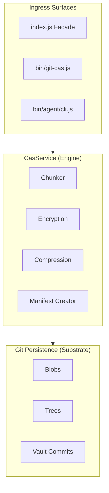

# Architecture: `git-cas`

This document is the high-level map of the shipped `git-cas` system.

It is intentionally not a full API reference. For command and method details,
see [docs/API.md](./docs/API.md). For crypto and security guidance, see
[SECURITY.md](./SECURITY.md). For attacker models, trust boundaries, and
metadata exposure, see [docs/THREAT_MODEL.md](./docs/THREAT_MODEL.md).

## System Model

`git-cas` uses Git as the storage substrate, not as a user-facing abstraction.

At a high level, the system does four things:

1. turns input bytes into chunk blobs stored in Git
2. records how to rebuild those bytes in a manifest
3. emits a Git tree that keeps the manifest and chunk blobs reachable
4. optionally indexes trees by slug through a GC-safe vault ref

The same core supports:

- a library facade in [index.js](./index.js)
- a human CLI and TUI under `bin/`
- a machine-facing agent CLI under `bin/agent/`

Those surfaces are different contracts over one shared core.

## Dependency Direction

```
Facade (index.js)
    │
    ▼
Domain (src/domain/)
    │
    ▼
Ports (src/ports/)         ← abstract interfaces only
    ▲
    │
Infrastructure (src/infrastructure/)   ← concrete adapters
```

Dependencies point inward. Domain depends on ports (abstractions). Infrastructure
implements those ports but is never imported by the domain. The facade wires
adapters to ports at construction time.

`src/helpers/` contains pure utility functions with no domain or infrastructure
dependencies. They may be imported by any layer.

## CAS Pipeline



## Store Pipeline

```
source → compress? → preChunkTransform? (whole/framed) → chunker → postChunkTransform? (convergent) → persistence
```

Encryption placement depends on the scheme:

- **whole/framed** — encrypts _before_ chunking (pre-chunk transform)
- **convergent** — encrypts _after_ chunking (post-chunk transform), using a
  deterministic per-chunk nonce derived from chunk content

## Restore Pipeline

```
persistence → verify chunks → postChunkRestore? (convergent) → preChunkRestore? (whole/framed) → decompress? → output
```

Transforms are unwound in reverse order. Chunk integrity is verified by SHA-256
digest before any decryption or decompression.

## Layer Model

### Facade (`index.js`)

The public entrypoint is [index.js](./index.js).

`ContentAddressableStore` is a high-level facade that:

- lazily initializes the underlying services
- selects the appropriate crypto adapter for the current runtime
- resolves chunking strategy configuration
- wires persistence, ref, codec, crypto, chunking, compression, and
  observability adapters
- exposes convenience methods like `storeFile()` and `restoreFile()`

The facade is orchestration glue. It is not the storage engine itself.

### Domain (`src/domain/`)

#### Services (`src/domain/services/`)

- **`CasService`** — primary domain service. Orchestrates the store and restore
  pipelines, manifest and tree creation, inspection, and recipient/key
  operations. Delegates key resolution to `KeyResolver` and per-chunk encryption
  to `ConvergentEncryption`.

- **`VaultService`** — manages the GC-safe vault ref (`refs/cas/vault`). Owns
  slug validation, vault initialization, add/update/list/resolve/remove, privacy
  mode, history-oriented state reads, and compare-and-swap ref updates with
  retry on conflict.

- **`KeyResolver`** — resolves key sources: passphrase-derived keys via KDF,
  envelope recipient DEK wrapping and unwrapping. `CasService` delegates all key
  material resolution through `this.keyResolver`.

- **`ConvergentEncryption`** — per-chunk deterministic encryption and
  decryption. Uses content-derived nonces so identical plaintext chunks produce
  identical ciphertext, preserving deduplication across chunked assets.

- **`ManifestDiff`** — pure function for chunk-level manifest comparison.
  Reports added, removed, and unchanged chunks between two manifests.

- **`PrefetchWindow`** — sliding window that drives ordered parallel chunk reads
  during restore, keeping downstream consumers fed without unbounded memory
  growth.

- **`Semaphore`** — concurrency limiter for parallel chunk writes during store.

- **`rotateVaultPassphrase`** — coordinates vault-wide passphrase rotation
  across all existing entries.

#### Encryption (`src/domain/encryption/`)

- **`schemes.js`** — single source of truth for encryption scheme identifiers:
  `whole`, `framed`, `convergent`. Legacy scheme identifiers are recognized
  solely to produce actionable migration error messages.

#### Value Objects (`src/domain/value-objects/`)

- **`Manifest`** — immutable, deep-frozen, schema-validated representation of a
  stored asset's chunk list and metadata.
- **`Chunk`** — immutable, schema-validated representation of a single chunk's
  digest, size, and blob OID.

#### Schemas (`src/domain/schemas/`)

- **`ManifestSchema`** — Zod schemas for manifest and chunk validation. Used by
  the value objects and codec layers.

#### Errors (`src/domain/errors/`)

- **`CasError`** — structured error type with a stable `code` string and
  arbitrary `metadata` object. All domain errors flow through this type.

#### Helpers (`src/domain/helpers/`)

- **`buildKdfMetadata`** — assembles KDF parameter metadata for manifest
  storage.
- **`scryptMaxmem`** — computes the scrypt memory ceiling for the current
  platform.

### Ports (`src/ports/`)

Ports define the abstract interfaces the domain depends on. Each port is a class
with methods that throw "not implemented" by default.

- **`CryptoPort`** — SHA-256 hashing, AES-256-GCM encrypt/decrypt, KDF
  (scrypt), HMAC, random bytes, and deterministic encryption for convergent
  mode.
- **`GitPersistencePort`** — blob read/write, tree read/write, and
  `readBlobStream` for streaming chunk retrieval.
- **`GitRefPort`** — ref resolution, commit creation, and compare-and-swap ref
  updates.
- **`ChunkingPort`** — strategy interface for fixed-size and content-defined
  chunking.
- **`CodecPort`** — manifest serialization and deserialization.
- **`CompressionPort`** — compress/decompress for both buffers and streams.
- **`ObservabilityPort`** — metrics, logs, and spans without binding the domain
  to any runtime event API.

### Infrastructure (`src/infrastructure/`)

#### Adapters (`src/infrastructure/adapters/`)

Crypto:
- **`NodeCryptoAdapter`** — `CryptoPort` backed by `node:crypto`.
- **`BunCryptoAdapter`** — `CryptoPort` optimized for Bun's native crypto.
- **`WebCryptoAdapter`** — `CryptoPort` backed by the Web Crypto API (used by
  Deno and other Web Crypto-capable runtimes).
- **`createCryptoAdapter`** — factory that selects the appropriate crypto
  adapter for the detected runtime.

Git:
- **`GitPersistenceAdapter`** — `GitPersistencePort` implementation using
  `@git-stunts/plumbing` to shell out to the `git` CLI.
- **`GitRefAdapter`** — `GitRefPort` implementation using
  `@git-stunts/plumbing`.

Compression:
- **`NodeCompressionAdapter`** — `CompressionPort` backed by `node:zlib`.

Observability:
- **`SilentObserver`** — no-op `ObservabilityPort` (default).
- **`EventEmitterObserver`** — `ObservabilityPort` that emits Node
  `EventEmitter` events.
- **`StatsCollector`** — `ObservabilityPort` that accumulates operation
  statistics.

File I/O:
- **`FileIOHelper`** — file-backed convenience helpers (`storeFile`,
  `restoreFile`) used by the facade.

#### Codecs (`src/infrastructure/codecs/`)

- **`JsonCodec`** — `CodecPort` using JSON serialization (default).
- **`CborCodec`** — `CodecPort` using CBOR serialization.

#### Chunkers (`src/infrastructure/chunkers/`)

- **`FixedChunker`** — `ChunkingPort` that splits input into fixed-size chunks.
- **`CdcChunker`** — `ChunkingPort` using content-defined chunking with FastCDC
  normalization.
- **`resolveChunker`** — factory that constructs a chunker from configuration.

#### Git Plumbing (`src/infrastructure/createGitPlumbing.js`)

- **`createGitPlumbing`** — creates a configured `@git-stunts/plumbing`
  instance. Used by both `GitPersistenceAdapter` and `GitRefAdapter`.

### Helpers (`src/helpers/`)

Pure utility functions with no domain or infrastructure coupling:

- **`kdfPolicy.js`** — KDF parameter validation and sensible defaults.
- **`aesGcmMeta.js`** — AES-GCM metadata validation (IV length, tag length).
- **`canonicalBase64.js`** — base64 encoding round-trip integrity check.

## Storage Model

### Chunks

Stored content is broken into chunks and written as Git blobs.

The manifest records the authoritative ordered chunk list, including:

- chunk index
- chunk size
- SHA-256 digest
- backing blob OID

The manifest, not the tree layout, is the source of truth for reconstruction
order and repeated chunk occurrences.

### Manifests

Manifests are encoded through the configured codec:

- JSON by default
- CBOR when configured

Small and medium assets use a single manifest blob.

Large assets already use Merkle-style manifests. When chunk count exceeds
`merkleThreshold`, `createTree()` writes:

- a root manifest with `version: 2`
- an empty top-level `chunks` array
- `subManifests` references pointing at additional manifest blobs

`readManifest()` resolves those sub-manifests transparently and reconstructs the
flat logical chunk list for callers.

Merkle manifests are shipped behavior, not future work.

### Trees

`createTree()` emits a Git tree that keeps the asset reachable.

For non-Merkle assets the tree contains:

- `manifest.<ext>`
- one blob entry per unique chunk digest, in first-seen order

For Merkle assets the tree contains:

- `manifest.<ext>`
- `sub-manifest-<n>.<ext>` blobs
- one blob entry per unique chunk digest, in first-seen order

Chunk blobs are deduplicated at the tree-entry level by digest. The manifest
still remains authoritative for repeated-chunk order and multiplicity.

### Vault

The vault is a GC-safe slug index rooted at `refs/cas/vault`.

It is implemented as a commit chain. Each vault commit points to a tree
containing:

- one tree entry per stored slug, mapped to that asset's tree OID
- `.vault.json` metadata for vault configuration

`VaultService` owns:

- slug validation
- vault initialization
- add, update, list, resolve, remove, and history-oriented state reads
- compare-and-swap ref updates with retry on conflict
- vault metadata validation
- privacy mode

Vault metadata can include passphrase-derived encryption configuration and
related counters, but the vault still fundamentally acts as the durable
slug-to-tree index for stored assets.

## Runtime Model

`git-cas` targets multiple JavaScript runtimes.

The core architecture is designed so the domain does not care whether it is
running on Node, Bun, or a Web Crypto-capable environment. Runtime differences
are isolated in the infrastructure adapters and selected by the facade or CLI
bootstrapping code.

The repo enforces this with a real Node, Bun, and Deno test matrix.

## CasService Decomposition Trajectory

The repo has an explicit extraction order for `CasService`. The goal is not to
erase the service as a public entrypoint; the goal is to reduce internal
coupling while preserving the public `CasService` facade.

### 1. Store write coordination

Extract first:

- chunk write scheduling
- backpressure and in-flight orchestration
- source-vs-sink store error normalization

Why first:

- the tests already isolate this behavior well
- the seam is mostly runtime-neutral
- it reduces risk in the highest-churn write path

### 2. Manifest and tree publication

Extract second:

- manifest assembly
- chunk-tree entry construction
- Merkle sub-manifest publication

Why second:

- publication logic is cohesive
- it is mostly independent of restore semantics
- it provides a stable seam for future manifest evolution

### 3. Recipient mutation flows

Extract third:

- recipient add/remove
- key rotation manifest rewriting

Why third:

- `KeyResolver` is already separate
- recipient mutation is a distinct policy surface from byte transport
- it can move without disturbing the store/restore pipeline

### 4. Restore pipeline extraction

Extract last, after platform dependency cleanup:

- chunk read and verify
- buffered vs streaming restore planning
- gzip and stream bridging
- framed vs whole-object decrypt routing

Why last:

- restore still carries the heaviest Node stream and zlib coupling
- platform-port work should land before the restore internals are split apart
- the repo already has a named file-restore seam, so this area is safer than it
  was, but still not the first extraction target

### Non-goals

- no public API split away from `CasService`
- no extraction motivated only by class count
- no restore-platform refactor hidden inside a decomposition cycle

## Reading This With Other Docs

Use this document for the current system shape.

Use these docs for adjacent truth:

- [README.md](./README.md)
  - positioning, feature overview, and release highlights
- [docs/API.md](./docs/API.md)
  - library and CLI reference
- [SECURITY.md](./SECURITY.md)
  - crypto and security guidance
- [docs/THREAT_MODEL.md](./docs/THREAT_MODEL.md)
  - threat model, assets, and trust boundaries
- [WORKFLOW.md](./WORKFLOW.md)
  - current planning and delivery model
