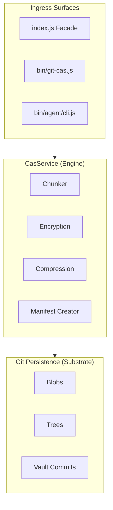
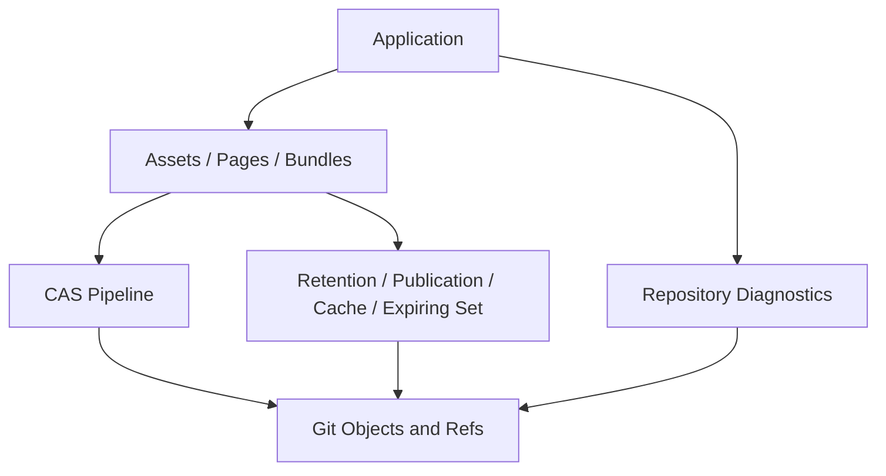

# Architecture: `git-cas`

This document is the high-level map of the shipped `git-cas` system.

It is intentionally not a full API reference. For command and method details,
see [docs/API.md](./docs/API.md). For crypto and security guidance, see
[SECURITY.md](./SECURITY.md). For attacker models, trust boundaries, and
metadata exposure, see [docs/THREAT_MODEL.md](./docs/THREAT_MODEL.md).

## System Model

`git-cas` uses Git as the storage substrate, not as a user-facing abstraction.

At a high level, the system does five things:

1. turns input bytes into chunk blobs stored in Git
2. records how to rebuild those bytes in a manifest
3. exposes assets, pages, and bundles through opaque application handles
4. retains or publishes handle graphs through explicit lifecycle policies
5. inspects repository reachability and managed-storage health without mutation

Low-level blob, manifest, and tree operations remain available. Application
code can use the higher-level capabilities without constructing Git trees,
persisting naked object IDs, or implementing its own cache ref protocol.

The same core supports:

- a library facade in [index.js](./index.js)
- a human CLI and TUI under `bin/`
- a machine-facing agent CLI under `bin/agent/`

Those surfaces are different contracts over one shared core.

## Dependency Direction

```
Facade (index.js)
    │
    ▼
Domain (src/domain/)
    │
    ▼
Ports (src/ports/)         ← abstract interfaces only
    ▲
    │
Infrastructure (src/infrastructure/)   ← concrete adapters
```

Dependencies point inward. Domain depends on ports (abstractions). Infrastructure
implements those ports but is never imported by the domain. The facade wires
adapters to ports at construction time.

`src/helpers/` contains pure utility functions with no domain or infrastructure
dependencies. They may be imported by any layer.

## CAS Pipeline



The machine-facing agent entrypoint is intentionally narrow:
`bin/agent/cli.js` owns command-name resolution, protocol session lifecycle, and
exit-code mapping. Command behavior lives under `bin/agent/commands/`, while
shared request parsing helpers live in `bin/agent/input.js`. CLI and agent
credential resolution share `bin/credentials.js` so raw key files,
passphrase-derived vault keys, and encrypted restore input requirements stay
consistent across human and machine command surfaces.

Application-facing lifecycle capabilities sit above the same CAS and Git
ports:



## Store Pipeline

```
source → compress? → preChunkTransform? (whole/framed) → chunker → postChunkTransform? (convergent) → persistence
```

Encryption placement depends on the scheme:

- **whole/framed** — encrypts _before_ chunking (pre-chunk transform)
- **convergent** — encrypts _after_ chunking (post-chunk transform), using a
  deterministic per-chunk nonce derived from chunk content

## Restore Pipeline

```
persistence → verify chunks → postChunkRestore? (convergent) → preChunkRestore? (whole/framed) → decompress? → output
```

Transforms are unwound in reverse order. Chunk integrity is verified by SHA-256
digest before any decryption or decompression.

## Layer Model

### Facade (`index.js`)

The public entrypoint is [index.js](./index.js).

`ContentAddressableStore` is a high-level facade that:

- lazily initializes the underlying services
- selects the appropriate crypto adapter for the current runtime
- resolves chunking strategy configuration
- wires persistence, ref, codec, crypto, chunking, compression, and
  observability adapters
- exposes convenience methods like `storeFile()` and `restoreFile()`
- exposes `rootSets.open()` for mutable current-generation Git reachability
- exposes opaque `assets`, `pages`, and `bundles` capability groups
- exposes `retention`, `publications`, `caches`, and `expiringSets` for explicit
  reachability and lifecycle policy
- exposes read-only repository evidence through `diagnostics.doctor()`
- owns explicit local resource closure without coupling closure to object or ref
  mutation

The facade is orchestration glue. It is not the storage engine itself.

### Domain (`src/domain/`)

#### Services (`src/domain/services/`)

- **`CasService`** — primary domain facade. It is now a lean orchestrator that
  wires ports and delegates byte-level behavior to runtime strategy entities.
  It keeps the public store, restore, manifest, inspection, and recipient/key
  API stable while delegating key resolution, chunk I/O, manifest/tree I/O,
  compression, integrity verification, recipient mutation, and store/restore
  strategy execution to dedicated domain classes.

- **`VaultService`** — orchestrates GC-safe vault use cases while keeping the
  public vault API stable. It owns initialization, add/update/list/resolve/remove,
  and history-oriented state reads, then delegates vault-head persistence to
  `VaultPersistence`, parse-stable state memoization to `VaultStateCache`, boundary
  formats to `VaultMetadataCodec` and `VaultTreeCodec`, privacy indexing to
  `VaultPrivacyIndex`, vault-key verification to `VaultKeyVerifier`, retry timing
  to `VaultMutationRetryPolicy`, and slug validation to `Slug`.

- **`RootSetRegistry` and `RootSet`** — open and mutate caller-owned refs under
  `refs/cas/rootsets/*`. Root-set mutations retain only the current generation,
  validate target existence and type, and use bounded compare-and-swap retries.
  `RootSetPersistence`, `RootSetMetadataCodec`, and `RootSetTreeCodec` own the
  ref, metadata, and real Git reachability boundaries.

- **`AssetService`, `PageService`, and `BundleService`** — stage application
  payloads behind immutable opaque handles. Pages enforce bounded blob size;
  bundles build deterministic bounded-fanout trees and support targeted member
  traversal without hydrating the complete structure.

- **`StagingWorkspaceRegistry` and `StagingWorkspace`** — own renewable
  temporary RootSet generations for multi-step application construction.
  `WorkspaceCompoundAdmission` and `WorkspaceCompoundScope` serialize an
  explicitly bounded sequence of provisional page and bundle batches through
  one operation-owned persistence view, then install the union of prior and new
  targets in one exact generation. Existing workspace methods retain each
  result independently and remain the boundary when a handle leaves private
  construction code before later writes begin.

- **`RetentionService` and `PublicationService`** — validate complete handle
  graphs, then either retain them in a RootSet with generation-scoped evidence
  or publish them atomically under an allowlisted application ref.

- **`CacheSetRegistry` and `CacheSet`** — own cache index generations,
  compare-and-swap replacement, TTL, entry and logical-byte limits,
  approximate-LRU sweeps, coalesced touches, doctor, and authoritative repair
  under `refs/cas/caches/*`. `CacheAcquisitionRegistry` atomically verifies a
  selected cache generation and creates a scoped anchor under
  `refs/cas/cache-acquisitions/*`; acquisition release is explicit,
  idempotent, and generation-checked.

- **`ExpiringSetRegistry` and `ExpiringSet`** — own digest-only replay markers
  under `refs/cas/expiring/*`. Admission is atomic, membership reads are
  side-effect free, and only expired entries can be released.

- **`RepositoryDoctor`** — streams object, ref, reflog-reachability, and safe
  prune-dry-run evidence to classify repository objects and summarize managed
  CacheSet, RootSet, ExpiringSet, and Vault usage.

- **`KeyResolver`** — resolves key sources: passphrase-derived keys via KDF,
  envelope recipient DEK wrapping and unwrapping. `CasService` delegates all key
  material resolution through `this.keyResolver`.

- **`ConvergentEncryption`** — per-chunk deterministic encryption and
  decryption. Uses content-derived nonces so identical plaintext chunks produce
  identical ciphertext, preserving deduplication across chunked assets.

- **`StorePipeline`** — bounded chunk-write coordinator. Owns semaphore-based
  backpressure, in-flight write tracking, ordered manifest entry append, and
  store-phase error metadata.

- **`ChunkRepository`** — chunk blob write/read boundary. Owns digest
  verification, per-chunk convergent encryption hooks, read-size enforcement,
  and prefetch-backed chunk iteration. It uses `StorePipeline` for bounded
  chunk write scheduling.

- **`CompressionStreams`** — domain compression boundary. Delegates gzip
  compression/decompression to the injected `CompressionPort` and normalizes
  decompression failures into domain errors.

- **`ManifestRepository`** — manifest serialization, tree publication, Merkle
  sub-manifest handling, manifest hash verification, and legacy-scheme readback
  boundary.

- **`RecipientService`** — envelope recipient add/remove/list/rotation policy.
  It depends on `KeyResolver` for DEK wrapping and unwrapping.

- **`IntegrityVerifier`** — verify-only chunk and authentication boundary for
  plaintext, whole, framed, and convergent encrypted manifests.

- **`RestorePipeline`** — retained as the earlier extracted strategy
  classifier/dispatcher and covered by tests. New restore byte execution flows
  use runtime strategy entities in `src/domain/strategies/`.

- **`ManifestDiff`** — pure function for chunk-level manifest comparison.
  Reports added, removed, and unchanged chunks between two manifests.

- **`PrefetchWindow`** — sliding window that drives ordered parallel chunk reads
  during restore, keeping downstream consumers fed without unbounded memory
  growth.

- **`Semaphore`** — concurrency limiter used by `StorePipeline` for parallel
  chunk writes during store.

- **`rotateVaultPassphrase`** — coordinates vault-wide passphrase rotation
  across all existing entries.

#### Value Objects (`src/domain/value-objects/`)

- **`Manifest`** — immutable representation of stored asset metadata.
- **`Chunk`** — immutable representation of one manifest chunk entry.
- **`Oid`** — immutable Git object identifier value with 40- or 64-hex
  validation.
- **`RootSetRef`** — immutable validated ref below `refs/cas/rootsets/`.
- **`AssetHandle`, `PageHandle`, and `BundleHandle`** — canonical repository-
  independent locators for validated application payload graphs.
- **`RetentionWitness`** — immutable evidence naming the generation and real
  Git tree edge that retained or published a handle graph.
- **`CacheKey`, `CachePolicy`, `CacheHit`, and `CacheSetRef`** — validated cache
  identity, policy, lookup evidence, and namespace boundaries.
- **`ExpiringMarker`, `ExpiringSetKey`, and `ExpiringSetRef`** — validated
  replay-marker evidence, domain-separated key identity, and namespace refs.
- **`Slug`** — immutable vault slug representation. It enforces vault slug
  limits and exposes `.toTreePath()` for the percent-encoded Git tree-entry name
  used by plain vault trees.
- **`EncryptionMetadata`** — immutable encryption metadata boundary used by
  strategies before crypto-port calls.
- **`StoreEncryptionConfig`** — immutable store encryption policy resolved from
  public options and key material.

#### Encryption (`src/domain/encryption/`)

- **`schemes.js`** — single source of truth for encryption scheme identifiers:
  `whole`, `framed`, `convergent`. Legacy scheme identifiers are recognized
  solely to produce actionable migration error messages.

#### Schemas (`src/domain/schemas/`)

- **`ManifestSchema`** — Zod schemas for manifest and chunk validation. Used by
  the value objects and codec layers.

#### Errors (`src/domain/errors/`)

- **`CasError`** — structured error type with a stable `code` string and
  arbitrary `metadata` object. All domain errors flow through this type.

#### Helpers (`src/domain/helpers/`)

- **`buildKdfMetadata`** — assembles KDF parameter metadata for manifest
  storage.
- **`scryptMaxmem`** — computes the scrypt memory ceiling for the current
  platform.

### Ports (`src/ports/`)

Ports define the abstract interfaces the domain depends on. Each port is a class
with methods that throw "not implemented" by default.

- **`CryptoPort`** — SHA-256 hashing, AES-256-GCM encrypt/decrypt, KDF
  (scrypt), HMAC, random bytes, and deterministic encryption for convergent
  mode.
- **`GitPersistencePort`** — blob read/write, tree read/write, and
  `readBlobStream` for streaming chunk retrieval.
- **`GitRefPort`** — ref/tree/parent resolution, commit creation, and
  compare-and-swap ref updates.
- **`ChunkingPort`** — strategy interface for fixed-size and content-defined
  chunking.
- **`CodecPort`** — manifest serialization and deserialization.
- **`CompressionPort`** — compress/decompress for both byte arrays and streams.
- **`ObservabilityPort`** — metrics, logs, and spans without binding the domain
  to any runtime event API.
- **`RepositoryInspectionPort`** — non-mutating streams for objects, refs,
  reachable IDs, safe prunable candidates, and reachable physical bytes.

### Infrastructure (`src/infrastructure/`)

#### Adapters (`src/infrastructure/adapters/`)

Crypto:
- **`NodeCryptoAdapter`** — `CryptoPort` backed by `node:crypto`.
- **`BunCryptoAdapter`** — `CryptoPort` optimized for Bun's native crypto.
- **`WebCryptoAdapter`** — `CryptoPort` backed by the Web Crypto API (used by
  Deno and other Web Crypto-capable runtimes).
- **`createCryptoAdapter`** — factory that selects the appropriate crypto
  adapter for the detected runtime.

Git:
- **`GitPersistenceAdapter`** — `GitPersistencePort` implementation using
  `@git-stunts/plumbing` to shell out to the `git` CLI. It reuses typed
  cat-file and mktree sessions, keeps parsed immutable trees count-and-byte
  bounded, uses scoped fast-import only for explicit page batches, preserves
  streaming payload reads, and owns deterministic child-process closure.
- **`GitRefAdapter`** — `GitRefPort` implementation using
  `@git-stunts/plumbing`.
- **`GitRepositoryInspectionAdapter`** — `RepositoryInspectionPort`
  implementation using streamed Git inventories and plumbing's non-mutating
  prunable-object inspection.

Compression:
- **`NodeCompressionAdapter`** — `CompressionPort` backed by `node:zlib`.

Observability:
- **`SilentObserver`** — no-op `ObservabilityPort` (default).
- **`EventEmitterObserver`** — `ObservabilityPort` that emits Node
  `EventEmitter` events.
- **`StatsCollector`** — `ObservabilityPort` that accumulates operation
  statistics.

File I/O:
- **`FileIOHelper`** — file-backed convenience helpers (`storeFile`,
  `restoreFile`) used by the facade.

#### Codecs (`src/infrastructure/codecs/`)

- **`JsonCodec`** — `CodecPort` using JSON serialization (default).
- **`CborCodec`** — `CodecPort` using CBOR serialization.
- **`GitTreeObjectCodec`** — boundary decoder for canonical SHA-1 and SHA-256
  Git tree bytes plus typed mktree session entries.

#### Chunkers (`src/infrastructure/chunkers/`)

- **`FixedChunker`** — `ChunkingPort` that splits input into fixed-size chunks.
- **`CdcChunker`** — `ChunkingPort` using content-defined chunking with FastCDC
  normalization.
- **`resolveChunker`** — factory that constructs a chunker from configuration.

#### Git Plumbing (`src/infrastructure/createGitPlumbing.js`)

- **`createGitPlumbing`** — creates a configured `@git-stunts/plumbing`
  instance. Used by both `GitPersistenceAdapter` and `GitRefAdapter`.

### Helpers (`src/helpers/`)

Pure utility functions with no domain or infrastructure coupling:

- **`kdfPolicy.js`** — KDF parameter validation and sensible defaults.
- **`aesGcmMeta.js`** — AES-GCM metadata validation (IV length, tag length).
- **`canonicalBase64.js`** — base64 encoding round-trip integrity check.
- **`boundedPromiseCache.js`** — fixed-residency LRU coalescing for immutable
  async reads; rejected work is never retained.

## Storage Model

### Chunks

Stored content is broken into chunks and written as Git blobs.

The manifest records the authoritative ordered chunk list, including:

- chunk index
- chunk size
- SHA-256 digest
- backing blob OID

The manifest, not the tree layout, is the source of truth for reconstruction
order and repeated chunk occurrences.

### Manifests

Manifests are encoded through the configured codec:

- JSON by default
- CBOR when configured

Small and medium assets use a single manifest blob.

Large assets already use Merkle-style manifests. When chunk count exceeds
`merkleThreshold`, `createTree()` writes:

- a root manifest with `version: 2`
- an empty top-level `chunks` array
- `subManifests` references pointing at additional manifest blobs

`readManifest()` resolves those sub-manifests transparently and reconstructs the
flat logical chunk list for callers.

Merkle manifests are shipped behavior, not future work.

### Trees

`createTree()` emits a Git tree that keeps the asset reachable.

For non-Merkle assets the tree contains:

- `manifest.<ext>`
- one blob entry per unique chunk digest, in first-seen order

For Merkle assets the tree contains:

- `manifest.<ext>`
- `sub-manifest-<n>.<ext>` blobs
- one blob entry per unique chunk digest, in first-seen order

Chunk blobs are deduplicated at the tree-entry level by digest. The manifest
still remains authoritative for repeated-chunk order and multiplicity.

### Application Handles And Structured Materializations

An opaque handle is a canonical content locator, not a durability claim. Asset
handles identify existing CAS trees. Page handles identify bounded immutable
blobs. Bundle handles identify deterministic descriptor trees whose leaves are
assets, pages, or nested bundles.

Bundle traversal reads only the descriptor path and selected payload required
for a named member. Validation re-enforces persisted path, descriptor-byte,
fanout, and nesting limits before a graph is retained or published.

### Retention And Publication

RootSets, CacheSets, ExpiringSets, application publications, and the Vault all
make objects Git-reachable, but they encode different lifecycle contracts:

| Surface | Ref namespace | Lifecycle |
| --- | --- | --- |
| RootSet | `refs/cas/rootsets/*` | Caller-managed current generation |
| CacheSet | `refs/cas/caches/*` | TTL/capacity/approximate-LRU managed cache |
| Cache acquisition | `refs/cas/cache-acquisitions/*` | Explicit caller scope over one cache generation |
| ExpiringSet | `refs/cas/expiring/*` | Expiry-only replay protection |
| Publication | Caller-allowlisted ref | Application-controlled causal history |
| Vault | `refs/cas/vault` | History-preserving named assets |

High-level retention, CacheSet, cache acquisition, ExpiringSet, and application
publication operations return generation-scoped retention evidence. Replacing
a parentless current-generation head releases old edges when no other ref or
reflog reaches them; Git's normal grace and pruning policy still controls
physical deletion. A cache acquisition temporarily retains the complete
selected generation, not only the requested target, and must be released when
consumption ends.

### Repository Diagnostics

`cas.diagnostics.doctor()` reports total, anchored, orphaned, volatile, and
unreachable object evidence plus managed-storage summaries, including active
cache-acquisition count and age. Ref and reflog reachability defines anchored
objects; volatile objects come only from safe prune dry-run output for the
selected expiry cutoff.

The report names limits Git cannot prove exactly, including per-owner
deduplicated physical bytes and packed-object age. The inspection surface has
no object-write, ref-update, GC, or destructive prune operation.

### Vault

The vault is a GC-safe slug index rooted at `refs/cas/vault`.
For maintainer-level detail on the collaborators, cache rules, and verifier
flow, see [docs/VAULT_INTERNALS.md](./docs/VAULT_INTERNALS.md).

It is implemented as a commit chain. Each vault commit points to a tree
containing:

- one tree entry per stored slug, mapped to that asset's tree OID
- `.vault.json` metadata for vault configuration

`VaultService` orchestrates:

- vault initialization
- add, update, list, resolve, remove, and history-oriented state reads
- retrying optimistic vault mutations after compare-and-swap conflicts

The durable vault boundary is split into cohesive collaborators:

- `VaultPersistence` owns the Git substrate: vault-head resolution, tree/blob
  reads, commit creation, and compare-and-swap updates to `refs/cas/vault`. It is
  stateless and does not cache OIDs.
- `VaultStateCache` owns tree-OID keyed snapshots, parsed entry memoization,
  defensive `VaultState` copies, privacy entry maps by key identity, and
  verified-key memoization.
- `VaultMetadataCodec` and `VaultTreeCodec` are pure boundary codecs. They encode
  and decode `.vault.json`, plain slug tree names, privacy tree names, and mktree
  record lines without performing I/O.
- `VaultPrivacyIndex`, `VaultKeyVerifier`, and `VaultMutationRetryPolicy` own the
  HMAC privacy index, constant-time vault-key verifier checks, and exponential
  backoff with jitter.

Vault slugs are validated and normalized with `Slug`. Plain vault trees encode
slug names through `Slug.toTreePath()`; privacy-enabled vaults keep HMAC tree
entry names and store the slug mapping inside the encrypted privacy index.

Vault metadata can include passphrase-derived encryption configuration and
related counters, but the vault still fundamentally acts as the durable
slug-to-tree index for stored assets.

## Runtime Model

`git-cas` targets multiple JavaScript runtimes.

The core architecture is designed so the domain does not care whether it is
running on Node, Bun, or a Web Crypto-capable environment. Runtime differences
are isolated in the infrastructure adapters and selected by the facade or CLI
bootstrapping code.

The core byte contract is `Uint8Array`. Node's `Buffer` may appear inside Node
adapters because it is a `Uint8Array` subclass, but domain services, ports,
helpers, chunkers, and codecs do not depend on `Buffer` methods or `node:*`
imports. `test/unit/docs/platform-boundary.test.js` enforces that boundary.

The repo enforces this with a real Node, Bun, and Deno test matrix.

## CasService Decomposition Trajectory

The repo has an explicit extraction order for `CasService`. The goal is not to
erase the service as a public entrypoint; the goal is to reduce internal
coupling while preserving the public `CasService` facade.

### 1. Store write coordination

Extracted in v6:

- chunk write scheduling
- backpressure and in-flight orchestration
- source-vs-sink store error normalization
- chunk blob writes and digest verification moved behind `ChunkRepository`

Why first:

- the tests already isolate this behavior well
- the seam is mostly runtime-neutral
- it reduces risk in the highest-churn write path

Current boundary:

- `StorePipeline` owns scheduling and write-phase metadata.
- `ChunkRepository` owns chunk I/O and verification.
- store byte execution lives in `StorePlain`, `StoreConvergent`, `StoreFramed`,
  and `StoreWhole`.
- `CasService` keeps public store policy and manifest finalization.

### 2. Manifest and tree publication

Resolved in v6:

- manifest assembly
- chunk-tree entry construction
- Merkle sub-manifest publication
- manifest hash verification
- legacy manifest scheme mapping

Why second:

- publication logic is cohesive
- it is mostly independent of restore semantics
- it provides a stable seam for future manifest evolution

### 3. Recipient mutation flows

Resolved in v6:

- recipient add/remove
- key rotation manifest rewriting

Why third:

- `KeyResolver` is already separate
- recipient mutation is a distinct policy surface from byte transport
- it can move without disturbing the store/restore pipeline

### 4. Restore pipeline extraction

Resolved in v6:

- restore strategy classification
- restore handler dispatch
- chunk read and verify
- buffered vs streaming restore planning
- gzip and stream bridging
- framed vs whole-object decrypt routing
- convergent, framed, whole, compressed, and plaintext restore byte handlers

Current boundary:

- `RestoreStrategy` selects runtime strategy entities without a scheme switch in
  `CasService`.
- `RestoreWhole` preserves whole-object authentication boundaries for buffered
  restore and file publication.
- `RestoreFramed` owns framed record parsing and authenticated frame streaming.
- `RestoreConvergent` owns per-chunk convergent decrypt/verify flow.
- `IntegrityVerifier` owns verify-only authentication checks.

### Non-goals

- no public API split away from `CasService`
- no extraction motivated only by class count
- no restore-platform refactor hidden inside a decomposition cycle

## Reading This With Other Docs

Use this document for the current system shape.

Use these docs for adjacent truth:

- [README.md](./README.md)
  - positioning, feature overview, and release highlights
- [docs/API.md](./docs/API.md)
  - library and CLI reference
- [SECURITY.md](./SECURITY.md)
  - crypto and security guidance
- [docs/THREAT_MODEL.md](./docs/THREAT_MODEL.md)
  - threat model, assets, and trust boundaries
- [WORKFLOW.md](https://github.com/git-stunts/git-cas/blob/main/WORKFLOW.md)
  - current planning and delivery model
