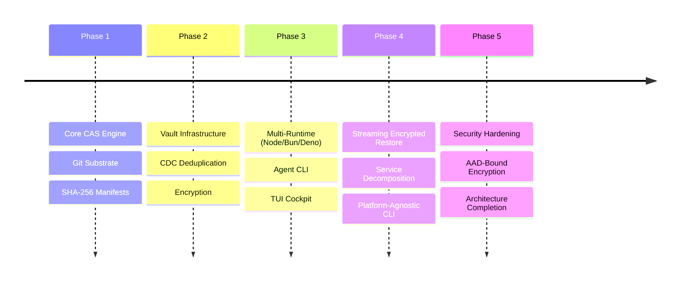

# BEARING

Current direction and active tensions. Historical ship data is in `CHANGELOG.md`.

## Current State

The 20-card backlog is clear. Every queued item from the security audit,
architecture cleanup, and feature work has shipped or been resolved.

What exists now:

- **Fully hexagonal architecture.** All platform dependencies (`node:zlib`,
  `node:crypto`, `node:stream`) are extracted behind abstract ports
  (`CompressionPort`, `CryptoPort`, `ChunkingPort`). `CasService` has zero
  direct platform imports.
- **Hardened security posture.** Eleven audit-driven fixes landed: hex OID
  validation, scrypt memory caps, sub-manifest limits, KDF salt minimums,
  frameBytes caps, concurrency caps, chunk property leak closure, control
  character rejection in slugs, sub-manifest chunkCount verification, recipient
  timing oracle mitigation, and source validation.
- **AAD-bound encryption.** `whole-v2` and `framed-v2` schemes bind manifest
  identity into AES-GCM authenticated data, preventing slug tampering and frame
  reordering after encryption.
- **Vault privacy mode.** HMAC slug masking prevents metadata discovery for
  anyone with bare repo read access.
- **Manifest-level integrity hash.** Manifests carry a top-level integrity
  digest for fast tamper detection without chunk-by-chunk verification.
- **FastCDC dual-mask normalization.** CDC chunking now uses normalized dual
  masks, improving chunk boundary stability across similar content.
- **Sub-manifest chunk schema validation.** Merkle sub-manifests are validated
  at parse time, not just at restore time.
- **All documentation updated.** ARCHITECTURE, CHANGELOG, THREAT_MODEL, API,
  and GUIDE reflect the shipped system.

## Resolved Tensions

These were the active tensions from the previous bearing. All resolved.

- **Encryption vs. Dedupe** — documented as an explicit operational tradeoff in
  THREAT_MODEL and GUIDE. AES-GCM destroys CDC dedup gains by design; operators
  choose one or the other. No code fix possible; the tension is now a documented
  architectural constraint.
- **Runtime Parity** — Web Crypto whole-object restore is now bounded via
  `maxDecryptionBufferSize` on `WebCryptoAdapter`. The buffered path is still
  not mechanically identical to Node/Bun streaming, but the bound is enforced
  and documented.
- **Buffer Limits** — `whole-v1 restoreStream()` enforces actual buffered-read
  and decompression limits. `framed-v1`/`framed-v2` provide true streaming
  restore for callers who need unbounded payloads.
- **Vault Contention** — all vault mutations (`initVault`, `addToVault`,
  `removeFromVault`) now share one unified CAS-conflict retry orchestration
  path.
- **KDF Compatibility Window** — KDF policy enforcement is now strict at both
  the schema layer and runtime stored-KDF path. Legacy metadata rides through a
  bounded compatibility window with explicit policy violations surfaced.
- **Decomposition Order** — the CasService decomposition trajectory is published
  in ARCHITECTURE.md. Platform dependency leaks are closed; extraction order is
  explicit.

## Open Tensions

- **CasService size.** At ~2100 lines, `CasService` is still the largest single
  module. The published decomposition order (store coordination, then manifest
  publication, then recipient flows, then restore pipeline) has not yet been
  executed. The service works, but it concentrates too many responsibilities.
- **No browser/edge runtime.** The architecture is now fully hexagonal and
  platform-agnostic at the port level, but no browser or edge adapter exists.
  `@git-stunts/plumbing` shells out to the `git` CLI, which is fundamentally
  unavailable in browsers and Workers. A browser path would require a pure-JS
  Git object layer or a remote persistence adapter.
- **CDC dedup is ineffective with encryption.** This is a fundamental property
  of authenticated encryption, not a bug. But it means the CDC chunking feature
  provides no dedup benefit when encryption is enabled. Convergent encryption
  could recover dedup at the cost of a different threat model.
- **No formal verification of crypto.** The encryption layer uses standard
  AES-256-GCM primitives through well-tested runtime APIs, but the framing
  protocol, AAD binding scheme, and KDF policy have not been formally audited by
  a third party.
- **Framed encryption overhead.** Per-frame AES-GCM authentication adds 28
  bytes (12-byte nonce + 16-byte tag) per frame. For small `frameBytes` values
  this overhead is non-trivial. There is no adaptive frame sizing.

## Next Horizon

With the backlog clear and the architecture clean, these are candidate
directions — not commitments.

- **CasService decomposition.** Execute the published extraction order: pull
  store write coordination into `StoreCoordinator`, manifest/tree publication
  into `PublicationService`, recipient mutation into `RecipientService`, and
  restore pipeline into `RestoreService`. Each extraction should preserve the
  public facade contract.
- **Browser/edge persistence adapter.** A `FetchPersistenceAdapter` or
  `IsomorphicGitAdapter` could enable browser-side restore (read path) without
  the `git` CLI. Write path is harder — it needs ref updates and tree creation.
- **Formal crypto audit.** Engage a third-party security firm to review the
  framing protocol, AAD binding, KDF policy enforcement, and key derivation
  paths.
- **Performance optimization.** Profiling large-asset store/restore paths,
  particularly CDC chunking throughput and framed encryption overhead. The
  benchmarks baseline exists in `docs/BENCHMARKS.md`.
- **Convergent encryption mode.** An opt-in mode where the DEK is derived from
  content hash, recovering CDC dedup for encrypted vaults at the cost of
  confirming known-plaintext attacks. Requires careful threat model scoping.

---

Ship history: [`CHANGELOG.md`](./CHANGELOG.md)
