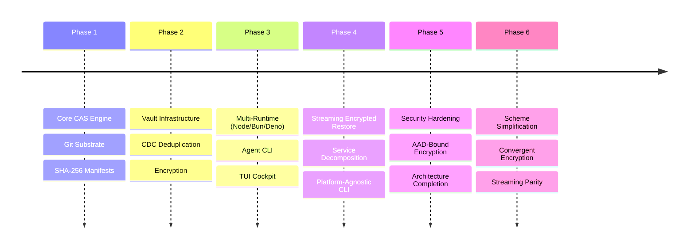

# BEARING

Current direction and active tensions. Historical ship data is in `CHANGELOG.md`.

## Current State

`v6.0.0` shipped on `2026-05-09`. The encryption surface has been simplified,
the dedup-with-encryption gap is closed, and npm plus GitHub Releases are the
active publication surfaces while JSR remains deferred behind the upstream
toolchain blocker.

What exists now:

- **Three encryption schemes.** `whole`, `framed`, `convergent` — no version
  suffixes. Legacy `whole-v1`, `whole-v2`, `framed-v1`, `framed-v2`, and
  `convergent-v1` scheme strings explode at `readManifest()` time with a
  `LEGACY_SCHEME` error pointing to the migration script. Scheme truth is
  centralized in `src/domain/encryption/schemes.js`.
- **AAD always on.** `whole` and `framed` encryption always bind slug-based AAD
  into the GCM tag. The v1 no-AAD path is removed entirely. Legacy manifests
  cannot be read without migration.
- **Convergent encryption.** Per-chunk deterministic encryption that preserves
  CDC deduplication across encrypted stores. Each chunk's key and nonce are
  derived from its plaintext content hash via HMAC-SHA256, so identical
  plaintext chunks produce identical ciphertext blobs that Git deduplicates at
  the object level. Default when CDC chunking and encryption are both active.
  `ConvergentEncryption` is extracted as its own service.
- **`formatVersion` in manifests.** New manifests carry a `formatVersion` field
  with the package semver at store time. Optional on read for backward
  compatibility.
- **Manifest diffing.** Shipped for comparing manifest state across versions.
- **Parallel chunk restore.** `PrefetchWindow` enables parallel chunk fetch
  during restore, improving throughput for large chunked assets.
- **Plaintext + gzip streaming.** Compressed unencrypted data now uses
  `_restoreCompressedStreaming` instead of the buffered path, eliminating the
  `maxRestoreBufferSize` constraint for this case.
- **Fully hexagonal architecture.** Domain services, ports, helpers, chunkers,
  and codecs use `Uint8Array` as the byte contract and are guarded against
  platform APIs (`node:*`, `Buffer` runtime methods, runtime globals, Node
  streams). Runtime dependencies live in adapters such as `NodeCryptoAdapter`,
  `NodeCompressionAdapter`, Git/file I/O adapters, and the CLI.
- **Hardened security posture.** Eleven audit-driven fixes plus KDF salt
  validation hardening, store write failure normalization, and unified vault
  mutation retry.
- **Vault privacy mode.** HMAC slug masking prevents metadata discovery for
  anyone with bare repo read access.
- **Manifest-level integrity hash.** Manifests carry a top-level integrity
  digest for fast tamper detection without chunk-by-chunk verification.
- **Migration script.** `scripts/migrate-encryption.js` upgrades legacy v1/v2
  manifests to the current scheme identifiers.

## Resolved Tensions

These were the active tensions from the previous bearing. All resolved.

- **Encryption vs. Dedupe** — resolved by convergent encryption. The `convergent`
  scheme derives per-chunk keys and nonces from plaintext content hashes, so
  identical chunks produce identical ciphertext that Git deduplicates at the
  object level. Operators no longer choose one or the other; CDC dedup works
  with encryption enabled. The threat model tradeoff (confirming known-plaintext
  attacks) is documented in THREAT_MODEL and GUIDE.
- **Runtime Parity** — Web Crypto whole-object restore is now bounded via
  `maxDecryptionBufferSize` on `WebCryptoAdapter`. The buffered path is still
  not mechanically identical to Node/Bun streaming, but the bound is enforced
  and documented.
- **Buffered Restore Limits** — `whole restoreStream()` enforces actual buffered-read
  and decompression limits. `framed` provides true streaming restore for callers
  who need unbounded payloads.
- **Vault Contention** — all vault mutations (`initVault`, `addToVault`,
  `removeFromVault`) now share one unified CAS-conflict retry orchestration
  path.
- **KDF Compatibility Window** — KDF policy enforcement is now strict at both
  the schema layer and runtime stored-KDF path. Legacy metadata rides through a
  bounded compatibility window with explicit policy violations surfaced.
- **Decomposition Order** — the CasService decomposition trajectory is published
  in ARCHITECTURE.md. Platform dependency leaks are closed; extraction order is
  explicit.
- **Scheme Proliferation** — collapsed from five scheme identifiers to three.
  AAD is always on, version suffixes are gone, and legacy strings are rejected
  at the boundary with migration guidance. Scheme truth lives in one file
  (`schemes.js`).

## Open Tensions

- **TUI modernization.** The cockpit is useful and the Store Wizard now executes
  the encryption, compression, and chunking plan it presents. The remaining TUI
  work is broader operator ergonomics, discoverability, and long-lived workflow
  polish rather than a store-plan correctness blocker.
- **No browser/edge runtime.** The architecture is now fully hexagonal and
  platform-agnostic at the port level, but no browser or edge adapter exists.
  `@git-stunts/plumbing` shells out to the `git` CLI, which is fundamentally
  unavailable in browsers and Workers. A browser path would require a pure-JS
  Git object layer or a remote persistence adapter.
- **No formal verification of crypto.** The encryption layer uses standard
  AES-256-GCM primitives through well-tested runtime APIs, but the framing
  protocol, AAD binding scheme, convergent derivation, and KDF policy have not
  been formally audited by a third party.
- **Framed encryption overhead.** Per-frame AES-GCM authentication adds 32
  bytes (4-byte length + 12-byte nonce + 16-byte tag) per frame. For small `frameBytes` values
  this overhead is non-trivial. There is no adaptive frame sizing.

## Next Horizon

With v6.0.0 shipped, active work is tracked in GitHub Issues and Milestones.
Repo docs hold design and evidence records, not the active queue.

The next selected design record is
[0045-v6-1-bounded-residency](./docs/design/0045-v6-1-bounded-residency/bounded-residency.md).
It targets large-vault and large-blob residency hardening for
[#38](https://github.com/git-stunts/git-cas/issues/38) in the
[`v6.1.0` milestone](https://github.com/git-stunts/git-cas/milestone/2).

The broader horizon remains:

- **TUI modernization.** Track
  [#39](https://github.com/git-stunts/git-cas/issues/39). Keep dashboard and
  wizard actions sharing executable
  option-building truth while improving operator ergonomics around long-lived
  store, restore, vault, and diagnostics workflows.
- **Browser/edge persistence adapter.** Track
  [#41](https://github.com/git-stunts/git-cas/issues/41). A
  `FetchPersistenceAdapter` or
  `IsomorphicGitAdapter` could enable browser-side restore (read path) without
  the `git` CLI. Write path is harder — it needs ref updates and tree creation.
- **Formal crypto audit.** Track
  [#42](https://github.com/git-stunts/git-cas/issues/42). Engage a third-party
  security firm to review the
  framing protocol, AAD binding, convergent key derivation, KDF policy
  enforcement, and key derivation paths.
- **Adaptive frame sizing.** Investigate dynamic `frameBytes` selection based on
  payload characteristics to reduce per-frame overhead for small assets while
  maintaining streaming properties for large ones.

---

Ship history: [`CHANGELOG.md`](./CHANGELOG.md)
