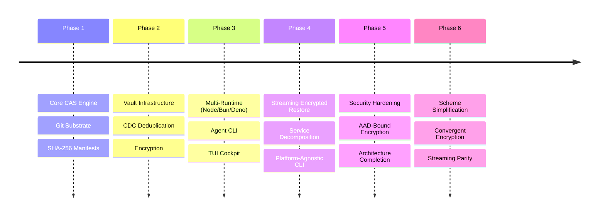

# BEARING

Current direction and active tensions. Historical ship data is in `CHANGELOG.md`.

## Current State

`v6.5.9` shipped on `2026-08-24`, and `v6.5.10` is under release review.
Application asset, bundle, page, cache,
expiry, witness, and repository-diagnostics APIs sit above mutable root sets
and the low-level CAS pipeline. Direct bundle-reference reads and bounded
immutable metadata/page reuse, bounded Git object sessions, page batches, and
deterministic resource closure are published. Internal commits are independent
of ambient Git identity. The coherent Bijou family is at 7.2.0, the interactive
cockpit runs on Bijou's hosted framed-app boundary, and failed checked ref
mutations are classified from structured post-failure posture instead of Git
diagnostics. v6.5.7 reuses the persistent `cat-file`
session for streaming blob reads at or below a fixed 10 MiB ceiling while
preserving genuine one-shot streaming above that ceiling. npm plus GitHub
Releases are the active publication surfaces. JSR validation is healthy, but
JSR publication remains outside the release workflow.

What exists now:

- **Three encryption schemes.** `whole`, `framed`, `convergent` — no version
  suffixes. Legacy `whole-v1`, `whole-v2`, `framed-v1`, `framed-v2`, and
  `convergent-v1` scheme strings explode at `readManifest()` time with a
  `LEGACY_SCHEME` error pointing to the migration script. Scheme truth is
  centralized in `src/domain/encryption/schemes.js`.
- **AAD always on.** `whole` and `framed` encryption always bind slug-based AAD
  into the GCM tag. The v1 no-AAD path is removed entirely. Legacy manifests
  cannot be read without migration.
- **Convergent encryption.** Per-chunk deterministic encryption that preserves
  CDC deduplication across encrypted stores. Each chunk's key and nonce are
  derived from its plaintext content hash via HMAC-SHA256, so identical
  plaintext chunks produce identical ciphertext blobs that Git deduplicates at
  the object level. Default when CDC chunking and encryption are both active.
  `ConvergentEncryption` is extracted as its own service.
- **`formatVersion` in manifests.** New manifests carry a `formatVersion` field
  with the package semver at store time. Optional on read for backward
  compatibility.
- **Manifest diffing.** Shipped for comparing manifest state across versions.
- **Parallel chunk restore.** `PrefetchWindow` enables parallel chunk fetch
  during restore, improving throughput for large chunked assets.
- **Plaintext + gzip streaming.** Compressed unencrypted data now uses
  `_restoreCompressedStreaming` instead of the buffered path, eliminating the
  `maxRestoreBufferSize` constraint for this case.
- **Fully hexagonal architecture.** Domain services, ports, helpers, chunkers,
  and codecs use `Uint8Array` as the byte contract and are guarded against
  platform APIs (`node:*`, `Buffer` runtime methods, runtime globals, Node
  streams). Runtime dependencies live in adapters such as `NodeCryptoAdapter`,
  `NodeCompressionAdapter`, Git/file I/O adapters, and the CLI.
- **Hardened security posture.** Eleven audit-driven fixes plus KDF salt
  validation hardening, store write failure normalization, and unified vault
  mutation retry.
- **Vault privacy mode.** HMAC slug masking prevents metadata discovery for
  anyone with bare repo read access.
- **Manifest-level integrity hash.** Manifests carry a top-level integrity
  digest for fast tamper detection without chunk-by-chunk verification.
- **Mutable root sets.** `ContentAddressableStore.rootSets.open()` anchors
  current cache and derived-state objects under `refs/cas/rootsets/*`. Updates
  use parentless commits and compare-and-swap ref writes so removed entries can
  become prunable instead of staying reachable through storage history.
- **Opaque application assets.** `ContentAddressableStore.assets`, `retention`,
  and `publications` now compose streaming asset storage, canonical handles,
  current-generation retention, and allowlisted compare-and-swap application
  refs. Staged results and immutable witnesses keep content identity separate
  from retention claims.
- **Persistent bounded Git object sessions.** v6.5.2 reuses typed `cat-file`
  and `mktree` processes behind `GitPersistenceAdapter`, uses one scoped
  `fast-import` process for an explicit page batch, and keeps individual blob
  writes one-shot so external pruning cannot poison duplicate writes.
- **Coherent session reuse.** v6.5.3 preserves `cat-file` across
  successful immutable writes and preserves `mktree` across loose writes. It
  still retires `mktree` after a bounded bulk write because Git's quick lookup
  cannot discover a pack created after that process prepared its object
  database.
- **Bounded stream-session reads.** v6.5.7 routes blobs at or below a
  fixed 10 MiB ceiling through the persistent `cat-file` session and returns one
  bounded chunk. Larger objects are metadata-inspected but enter exactly one
  genuine content stream; no session content read is attempted for them.
- **Bounded application-write waves.** v6.5.8 adds input-ordered asset and
  ordered-bundle batches, mirrors them through scoped workspaces, and anchors
  each successful workspace batch under one exact generation. Published
  Plumbing 3.3.0 sessions pipeline independent blob, tree, metadata, and
  successful checked-ref waves while one-shot and older-capability fallbacks
  remain intact.
- **Compound workspace admission.** v6.5.9 adds one bounded
  `workspace.batch()` callback for dependency-ordered page and bundle waves.
  One private persistence scope stages every operation and one exact final
  generation retains their union. A 33-operation witness reduced 200 Git
  children to 23 and 33 retained generations to one in both SHA-1 and SHA-256
  repositories without changing any application handle.
- **Compound workspace assets and exact roots.** The v6.5.10 candidate adds
  bounded asset waves to the same compound persistence scope and optionally
  retains a canonical, nonempty, deduplicated selection of handles staged by
  that exact admission. Prior workspace roots and v6.5.9 retain-all behavior
  remain intact. A controlled downstream git-warp prototype reduced cold Git
  commands from 139 to 50 and incremental commands from 149 to 60; those
  consumer numbers remain provisional until repeated against the public
  registry artifact.
- **Batched workspace page retention.** v6.5.4 adds
  `workspace.pages.putBatch()` so one bounded ordered page group is written and
  retained under one exact workspace generation instead of rewriting a growing
  root set for every page.
- **Self-contained internal commit identity.** v6.5.5 supplies a
  stable git-cas author and committer for root-set, publication, and vault
  commits without mutating repository or global Git configuration.
- **Bijou 7 framed cockpit.** v6.5.6 updates the complete Bijou family and
  makes the frame the sole owner of terminal lifecycle, outer chrome, help,
  command/search palettes, settings, notifications, performance telemetry, and
  quit confirmation.
- **Deterministic checked-ref conflicts.** Failed checked updates,
  atomic anchors, and checked deletes inspect direct, symbolic, or absent
  post-failure ref posture. Only disproved compare-and-swap preconditions become
  the existing conflict result; unrelated operational failures remain original.
- **Migration script.** `scripts/migrate-encryption.js` upgrades legacy v1/v2
  manifests to the current scheme identifiers.

## Resolved Tensions

These were the active tensions from the previous bearing. All resolved.

- **Encryption vs. Dedupe** — resolved by convergent encryption. The `convergent`
  scheme derives per-chunk keys and nonces from plaintext content hashes, so
  identical chunks produce identical ciphertext that Git deduplicates at the
  object level. Operators no longer choose one or the other; CDC dedup works
  with encryption enabled. The threat model tradeoff (confirming known-plaintext
  attacks) is documented in THREAT_MODEL and GUIDE.
- **Runtime Parity** — Web Crypto whole-object restore is now bounded via
  `maxDecryptionBufferSize` on `WebCryptoAdapter`. The buffered path is still
  not mechanically identical to Node/Bun streaming, but the bound is enforced
  and documented.
- **Buffered Restore Limits** — `whole restoreStream()` enforces actual buffered-read
  and decompression limits. `framed` provides true streaming restore for callers
  who need unbounded payloads.
- **Vault Contention** — all vault mutations (`initVault`, `addToVault`,
  `removeFromVault`) now share one unified CAS-conflict retry orchestration
  path.
- **KDF Compatibility Window** — KDF policy enforcement is now strict at both
  the schema layer and runtime stored-KDF path. Legacy metadata rides through a
  bounded compatibility window with explicit policy violations surfaced.
- **Decomposition Order** — the CasService decomposition trajectory is published
  in ARCHITECTURE.md. Platform dependency leaks are closed; extraction order is
  explicit.
- **Scheme Proliferation** — collapsed from five scheme identifiers to three.
  AAD is always on, version suffixes are gone, and legacy strings are rejected
  at the boundary with migration guidance. Scheme truth lives in one file
  (`schemes.js`).

## Open Tensions

- **TUI modernization.** The cockpit is useful and the Store Wizard now executes
  the encryption, compression, and chunking plan it presents. The remaining TUI
  work is broader operator ergonomics, discoverability, and long-lived workflow
  polish rather than a store-plan correctness blocker.
- **No browser/edge runtime.** The architecture is now fully hexagonal and
  platform-agnostic at the port level, but no browser or edge adapter exists.
  `@git-stunts/plumbing` shells out to the `git` CLI, which is fundamentally
  unavailable in browsers and Workers. A browser path would require a pure-JS
  Git object layer or a remote persistence adapter.
- **No formal verification of crypto.** The encryption layer uses standard
  AES-256-GCM primitives through well-tested runtime APIs, but the framing
  protocol, AAD binding scheme, convergent derivation, and KDF policy have not
  been formally audited by a third party.
- **Framed encryption overhead.** Per-frame AES-GCM authentication adds 32
  bytes (4-byte length + 12-byte nonce + 16-byte tag) per frame. For small `frameBytes` values
  this overhead is non-trivial. There is no adaptive frame sizing.

## Next Horizon

With v6.5.9 shipped and the v6.5.10 candidate under release review, active work
is tracked in GitHub Issues and Milestones. Repo docs hold design and evidence
records, not the active queue. The candidate design is:

- [#127](https://github.com/git-stunts/git-cas/issues/127)
- [0061-compound-workspace-assets](./docs/design/0061-compound-workspace-assets/compound-workspace-assets.md)

Its release evidence remains owned by
[#127](https://github.com/git-stunts/git-cas/issues/127) under the
[`v6.5.10` milestone](https://github.com/git-stunts/git-cas/milestone/20).

The broader horizon remains:

- **TUI modernization.** Carried forward to `v6.6.0`; track
  [#39](https://github.com/git-stunts/git-cas/issues/39). Keep dashboard and
  wizard actions sharing executable
  option-building truth while improving operator ergonomics around long-lived
  store, restore, vault, and diagnostics workflows.
- **Browser/edge persistence adapter.** Track
  [#41](https://github.com/git-stunts/git-cas/issues/41). A
  `FetchPersistenceAdapter` or
  `IsomorphicGitAdapter` could enable browser-side restore (read path) without
  the `git` CLI. Write path is harder — it needs ref updates and tree creation.
- **Formal crypto audit.** Track
  [#42](https://github.com/git-stunts/git-cas/issues/42). Engage a third-party
  security firm to review the
  framing protocol, AAD binding, convergent key derivation, KDF policy
  enforcement, and key derivation paths.
- **Adaptive frame sizing.** Investigate dynamic `frameBytes` selection based on
  payload characteristics to reduce per-frame overhead for small assets while
  maintaining streaming properties for large ones.

---

Ship history: [`CHANGELOG.md`](./CHANGELOG.md)
