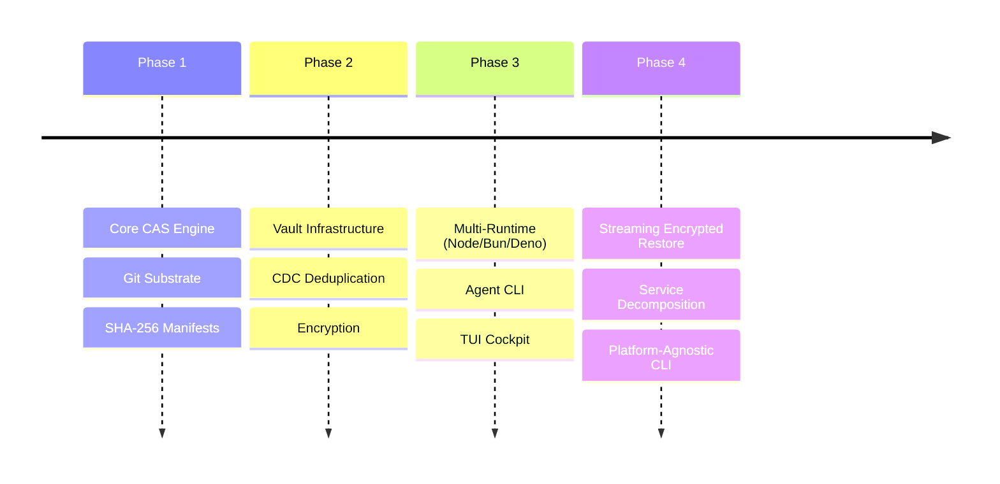

# BEARING

Current direction and active tensions. Historical ship data is in `CHANGELOG.md`.

## Active Gravity

### 1. Performance & Scale
- Implementation of streaming encrypted and compressed restores.
- Optimization of Merkle-style manifest resolution for giant assets.
- Hardening the memory-guarded buffered paths for large-asset decryption.

### 2. Operational Truth
- Refinement of the "Doctor" diagnostic engine to surface integrity issues.
- Keeping the documented streaming and encryption boundaries honest for operators.
- Maturation of the machine-facing agent CLI for full parity with human commands.

### 3. Architectural Decomposition
- Moving toward a more modular `CasService` to reduce orchestration bloat.
- Finalizing the platform-agnostic CLI structure to simplify cross-runtime binaries.

## Tensions

- **Encryption vs. Dedupe**: AES-256-GCM removes the benefits of CDC; we need clearer documentation on this tradeoff for operators.
- **Runtime Parity**: Web Crypto whole-object restore is now bounded instead of unbounded, but it is still not mechanically identical to the stronger Node/Bun path.
- **Buffer Limits**: `whole-v1 restoreStream()` now enforces actual buffered-read and decompression limits, but it is still a bounded in-memory compatibility path rather than a true streaming surface.
- **Vault Contention**: Concurrent vault updates in high-frequency CI environments require robust CAS retry logic.
- **KDF Compatibility Window**: New passphrase defaults are stronger now, but legacy encrypted metadata still rides through a bounded compatibility policy instead of a hard migration cutoff.
- **Schema vs. Crypto Policy**: Encrypted manifest shapes are stricter now, but KDF salt shape is still looser than the rest of the crypto metadata contract.

## Next Target

The immediate focus is **platform dependency leaks, service decomposition, and
restore-boundary cleanup** now that the two queued up-next CLI cards are
cleared and the AES-GCM adapter-boundary debt is closed.
