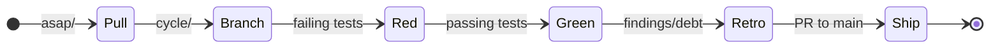

# METHOD

The `git-cas` work doctrine: A backlog, a loop, and honest bookkeeping.

## Principles

- **The agent and the human sit at the same table.** Both matter. Both are named in every design.
- **Git is the substrate, not the product.** We use Git's object database for its engineering properties, not as a user-facing constraint.
- **The filesystem is the coordination layer.** For meta-work (this repo), directories are priorities; filenames are identities; moves are decisions.
- **Tests are the executable spec.** Design names the problem; tests prove the answer.
- **Zero tolerance for failing tests.** Pre-existing failures are not acceptable on any supported runtime.

## Structure

| Signpost | Role |
| :--- | :--- |
| **`README.md`** | Public front door and project identity. |
| **`GUIDE.md`** | Orientation and productive-fast path. |
| **`BEARING.md`** | Current direction and active tensions. |
| **`VISION.md`** | Core tenets and the CAS mission. |
| **`ARCHITECTURE.md`** | Authoritative system map and layer model. |
| **`AGENTS.md`** | Context recovery protocol for AI and humans. |
| **`METHOD.md`** | Repo work doctrine (this document). |

## Backlog Lanes

| Lane | Purpose |
| :--- | :--- |
| **`asap/`** | Imminent work; pull into the next cycle. |
| **`up-next/`** | Queued after `asap/`. |
| **`cool-ideas/`** | Uncommitted experiments. |
| **`bad-code/`** | Technical debt that must be addressed. |
| **`inbox/`** | Raw ideas. |

## The Cycle Loop

1. **Pull**: Move an item from `asap/` to `docs/design/`.
2. **Branch**: Create `cycle/<cycle_name>`.
3. **Red**: Write failing tests based on the design's playback questions.
4. **Green**: Implement the solution until tests pass.
5. **Retro**: Document findings and follow-on debt in the cycle doc.
6. **Ship**: Open a PR to `main`. Update `BEARING.md` and `CHANGELOG.md` after merge.

## Naming Convention
Backlog and cycle files follow: `<LEGEND>_<slug>.md`
Example: `TR_streaming-encrypted-restore.md`
