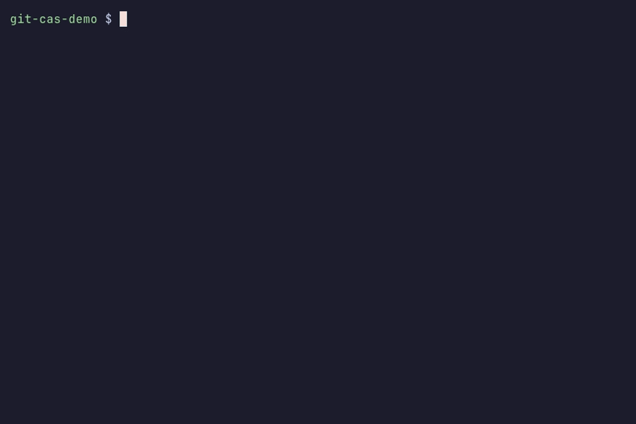

# git-cas

> Modern open-source systems still rely on centralized infrastructure to distribute binary artifacts, even when their source code is fully decentralized. This creates a fragile dependency: if hosting endpoints are blocked, degraded, or removed, critical artifacts become unavailable or unverifiable.
>
> `git-cas` addresses this by making artifact distribution inherit Git’s existing replication model, allowing binaries to be stored, verified, and transported anywhere Git can operate, including mirrored networks, constrained environments, or fully offline contexts.

`git-cas` is an industrial-grade Content-Addressable Storage (CAS) engine backed by Git’s object database. Its Security First posture makes explicit restore boundaries, bounded metadata reads, authenticated encryption, and legacy-scheme rejection the default. Stored content is chunked, deduplicated, and optionally encrypted — keeping high-fidelity assets and security-sensitive files directly within your repository history.

`git-cas` is designed for the architect who demands mathematical certainty and the operator who needs a stable foundation for artifact storage. It scales from simple binary blob management to multi-recipient envelope-encrypted vaults with key rotation, privacy-mode slug hashing, and Merkle-style manifests for assets of any size.

[](https://www.npmjs.com/package/@git-stunts/git-cas)
[](./LICENSE)



## Why git-cas?

Unlike traditional LFS which moves files to external servers, `git-cas` treats the Git object database as a first-class storage substrate.

- **Deduplication by Default**: Content-defined chunking (CDC) with Buzhash rolling hash identifies repeated patterns across files and versions, minimizing repository growth.
- **Cryptographic Trust**: Every chunk is verified against a SHA-256 digest. Optional AES-256-GCM encryption with multi-recipient envelope support ensures privacy at rest, and `framed` binds per-frame AAD to prevent cross-manifest blob swaps.
- **GC-Safe Vault**: Named assets are indexed through a stable ref (`refs/cas/vault`) with optimistic concurrency, preventing Git garbage collection from reclaiming referenced blobs.
- **Mutable Root Sets**: Cache and derived-state trees can be anchored under
  `refs/cas/rootsets/*` while live, then become collectible after eviction,
  without vault history retaining every prior generation.
- **Managed Cache Sets**: Applications can store handles under
  `refs/cas/caches/*` with TTL, entry and logical-byte limits, approximate LRU
  eviction, immutable retention evidence, bounded inspection, repair, and
  scoped acquisitions that keep a selected generation reachable during use.
  Cache indexes and object reachability remain git-cas responsibilities.
- **Expiry-Safe Replay Sets**: Security-sensitive markers can live under
  `refs/cas/expiring/*` with atomic add-if-absent, digest-only metadata, and
  expiry-only release. Live markers have no remove, repair, capacity, or LRU
  path that could shorten their acceptance window.
- **Opaque Application Handles**: Applications stage assets, immutable pages,
  and deterministic structured bundles through validated handles, then retain
  or publish them with generation-scoped evidence instead of managing Git
  objects, trees, or payload OIDs directly.
- **Bounded Git Process Reuse**: Immutable object metadata and tree reads reuse
  typed Git sessions behind the adapter. On session-capable adapters, streaming
  blob reads at or below a fixed 10 MiB ceiling use one bounded session read;
  larger payloads retain the genuine one-shot streaming path. Explicitly
  bounded page, asset, and ordered-bundle batches pipeline independent Git
  writes. `workspace.batch()` can compose dependent page and bundle waves in
  one private persistence scope and retain their union under one exact final
  generation without changing content identity.
- **Key Lifecycle**: Envelope encryption separates DEKs from KEKs. Rotate passphrases across an entire vault without re-encrypting data blobs. Privacy mode HMAC-hashes slug names to prevent metadata discovery.
- **Runtime-Adaptive**: A single core supports Node.js 22+, Bun, and Deno through a strict hexagonal port architecture with runtime-specific crypto adapters.

## Quick Start

Existing v5 users should read [UPGRADING.md](./UPGRADING.md) and run
`npm run upgrade` in dry-run mode before restoring old encrypted vault entries.
For the release overview, see the
[v6.5.9 Release Notes](./docs/releases/v6.5.9.md).

### 1. CLI Usage

Initialize a vault and store your first asset.

```bash
git init
git-cas vault init
git-cas store data.bin --slug assets/v1 --tree
git-cas restore --slug assets/v1 --out data-restored.bin
```

### 2. TUI Cockpit

Navigate your stored assets through the reader-first interactive dashboard.

```bash
git-cas vault dashboard
```

The framed cockpit keeps Explorer, Atlas, and Operations in one shared session.
Use `/` to search assets, `Ctrl+P` for the command palette, `?` for keyboard
help, `F2` for session settings, and `q` for a confirmed exit. Noninteractive
invocations retain the plain tab-separated listing.

### 3. Library Ingress

Integrate managed blob storage directly into your TypeScript or JavaScript application.

```js
import { createReadStream } from 'node:fs';
import ContentAddressableStore from '@git-stunts/git-cas';

const cas = await ContentAddressableStore.open({ cwd: '.' });
const staged = await cas.assets.put({
  source: createReadStream('./asset.bin'),
  slug: 'app/asset',
  filename: 'asset.bin',
});
const retained = await cas.retention.retain({
  handle: staged.handle,
  root: { ref: 'refs/cas/rootsets/my-app', name: 'app/asset' },
  policy: 'pinned',
});
await cas.close();
```

`staged.handle` is a content locator, not a durability promise. The returned
retention witness identifies the exact Git generation and tree edge that made
the asset reachable. `close()` releases local resources only; it never deletes
objects, updates refs, or changes retention.

## Capability Map

The README is the front door. Detailed mechanics live in the guide set:

| Need                                                    | Start Here                                                           |
| ------------------------------------------------------- | -------------------------------------------------------------------- |
| Productive library and CLI workflows                    | [Developer Guide](./GUIDE.md)                                        |
| Restore memory behavior                                 | [Streaming and restore matrix](./GUIDE.md#streaming-surface)         |
| Encryption scheme selection                             | [Encryption Modes](./docs/ENCRYPTION_MODES.md)                       |
| CDC internals, Merkle manifests, KDF policy, and tuning | [Advanced Guide](./ADVANCED_GUIDE.md)                                |
| Ports, adapters, and collaborator boundaries            | [Architecture](./ARCHITECTURE.md)                                    |
| Assets, pages, bundles, retention, and publication      | [Application storage](./docs/API.md#application-storage)             |
| Temporary retention during multi-step composition       | [Scoped staging workspaces](./docs/API.md#scoped-staging-workspaces) |
| GC retention for caches and derived state               | [Root Sets](./docs/API.md#root-sets)                                 |
| Managed TTL and capacity caches                         | [Cache Sets](./docs/API.md#cache-sets)                               |
| Scoped protection while consuming a cache hit           | [Cache acquisitions](./docs/API.md#acquire-and-release)              |
| Durable replay markers with expiry-only release         | [Expiring Sets](./docs/API.md#expiring-sets)                         |
| Repository reachability and git-cas usage evidence      | [Repository Diagnostics](./docs/API.md#repository-diagnostics)       |
| v5 to v6 migration                                      | [Upgrading](./UPGRADING.md)                                          |

Core capabilities:

- **Content-addressed storage**: chunks are addressed by SHA-256 digest and
  integrity-verified on read.
- **Deduplication**: fixed chunking and content-defined chunking (CDC) support
  predictable or shift-resistant chunk boundaries.
- **Encryption**: AES-256-GCM with authenticated metadata. `whole` and
  `framed` use fresh random 96-bit nonces; `convergent` derives per-chunk keys
  and nonces deterministically from the plaintext content hash to preserve
  deduplication.
- **Vault indexing**: named assets live under `refs/cas/vault` so Git garbage
  collection does not reclaim referenced blobs.
- **Root-set retention**: current cache entries live under caller-owned
  `refs/cas/rootsets/*` refs. Entries are Git-reachable while present, and old
  set generations are not retained as commit history.
- **Managed cache lifecycle**: `caches.open()` owns immutable cache indexes,
  compare-and-swap replacement, expiry, capacity eviction, retention
  witnesses, diagnostics, and repair. Reads do not write access metadata;
  callers opt into coalesced access updates with `touch()`.
- **Scoped cache acquisitions**: `cache.acquire()` performs a reference-only
  lookup and atomically anchors the selected cache generation for the caller's
  explicit lifetime. `release()` is idempotent, while inspection and checked
  cleanup make abandoned acquisition refs observable and recoverable.
- **Expiry-safe replay lifecycle**: `expiringSets.open()` atomically retains
  digest-only replay markers through their declared window. `contains()` is
  read-only, and `sweep()` can release only markers whose expiry has passed.
- **Application storage**: `assets`, `pages`, `bundles`, `retention`, and
  `publications` compose streaming CAS writes, bounded structured
  materializations, explicitly bounded asset/page/bundle batches,
  direct-reference or complete-validation member reads, reachability roots,
  compare-and-swap refs, and immutable lifecycle evidence.
- **Scoped staging workspaces**: `workspaces.open()` mirrors application writes
  behind one renewable temporary RootSet, supports one-generation bounded
  asset/page/bundle batches plus compound dependent page/bundle admission,
  returns only after each public result is anchored, promotes destination-first,
  and exposes bounded age, expiry, logical-content, and direct-root diagnostics
  with opaque cleanup pagination.
- **Envelope recipients**: multi-recipient key wrapping and recipient rotation
  avoid re-encrypting data blobs.
- **Operational diagnostics**: `cas.diagnostics.doctor()` streams repository
  object/ref evidence, classifies anchored, orphaned, and volatile objects,
  and summarizes workspaces, cache acquisitions, CacheSet, RootSet,
  ExpiringSet, and Vault usage without mutating Git. The `git-cas doctor` CLI
  continues to validate vault health.

## Safety Snapshot

The v6 line is Security First by default:

- `restoreFile()` requires `baseDirectory` and refuses output paths that escape
  it.
- Manifest and sub-manifest blob reads default to a 10 MiB `maxBlobSize` safety
  limit.
- Legacy encryption scheme identifiers throw `LEGACY_SCHEME` with migration
  guidance.
- KDF parameters, salts, frame sizes, restore buffers, and concurrency are
  policy-bounded.
- Recipient trial decryption and vault verifier checks use constant-time
  comparisons.

For the full hardening table, see
[Advanced Guide: Security Hardening Summary](./ADVANCED_GUIDE.md#security-hardening-summary).

## Runtime Support

| Runtime     | Version | Crypto Backend       | Status                                               |
| ----------- | ------- | -------------------- | ---------------------------------------------------- |
| **Node.js** | 22+     | `node:crypto`        | Primary — full streaming support                     |
| **Bun**     | Latest  | `node:crypto` compat | Tested via Docker                                    |
| **Deno**    | Latest  | Web Crypto API       | Tested via Docker; `whole` decrypt is bounded-buffer |

All three runtimes are tested in CI on every push. The hexagonal architecture isolates runtime differences behind the `CryptoPort` boundary, so the domain core is runtime-agnostic.

## Documentation

- **[Guide](./GUIDE.md)**: Productive path, library/CLI usage, vault workflows, and the feature coverage map.
- **[Advanced Guide](./ADVANCED_GUIDE.md)**: CDC internals, direct service contracts, security limits, operational tooling, and performance baselines.
- **[Architecture](./ARCHITECTURE.md)**: The authoritative system map — Facade, Domain, Ports, and Adapters.
- **[Extending](./docs/EXTENDING.md)**: Custom adapter contracts and extension-point checklist.
- **[Store/Restore Pipeline](./docs/STORE_RESTORE_PIPELINE.md)**: Maintainer state machines for byte storage, restore, tree publication, and vault boundaries.
- **[Vault Internals](./docs/VAULT_INTERNALS.md)**: Maintainer map for vault persistence, caching, codecs, privacy indexing, key verification, and retry policy.
- **[Security](./SECURITY.md)**: Threat models, trust boundaries, and encryption internals.
- **[Agent API](./docs/API.md)**: JSONL agent protocol for CI/CD automation.
- **[Workflow](https://github.com/git-stunts/git-cas/blob/main/WORKFLOW.md)**: Repo work doctrine, cycles, and invariants.
- **[Contributing](https://github.com/git-stunts/git-cas/blob/main/CONTRIBUTING.md)**, **[Code of Conduct](./CODE_OF_CONDUCT.md)**, and **[Support](./SUPPORT.md)**: Project participation and help paths.
- **[v6.0.0 Release Notes](./docs/releases/v6.0.0.md)**: Major-release summary, upgrade call-to-action, and publication notes.
- **[v6.1.0 Release Notes](./docs/releases/v6.1.0.md)**: Root-set retention,
  doctor/repair, and GC-policy guidance.
- **[v6.2.0 Release Notes](./docs/releases/v6.2.0.md)**: Opaque application
  storage, managed cache and replay lifecycles, retention evidence, and
  repository diagnostics.
- **[v6.3.0 Release Notes](./docs/releases/v6.3.0.md)**: Lifetime-safe,
  reference-only cache acquisitions with explicit release and doctor evidence.
- **[v6.4.0 Release Notes](./docs/releases/v6.4.0.md)**: Scoped staging
  workspaces for temporary multi-object reachability, promotion, and cleanup.
- **[v6.5.0 Release Notes](./docs/releases/v6.5.0.md)**: Bounded direct bundle
  references, immutable metadata reuse, and corrected concurrency settlement.
- **[v6.5.1 Release Notes](./docs/releases/v6.5.1.md)**: Bounded immutable page
  payload reuse with zero-command warm reads.
- **[v6.5.2 Release Notes](./docs/releases/v6.5.2.md)**: Persistent bounded Git
  object sessions, scoped page batches, and deterministic resource closure.
- **[v6.5.3 Release Notes](./docs/releases/v6.5.3.md)**: Coherent reuse of
  persistent Git object sessions across compatible immutable writes.
- **[v6.5.4 Release Notes](./docs/releases/v6.5.4.md)**: Ordered page batches
  retained under one exact staging-workspace generation.
- **[v6.5.5 Release Notes](./docs/releases/v6.5.5.md)**: Self-contained
  identity for git-cas-owned commits in unconfigured bare repositories.
- **[v6.5.6 Release Notes](./docs/releases/v6.5.6.md)**: Bijou 7 hosted
  cockpit ownership and deterministic checked-ref conflict classification.
- **[v6.5.7 Release Notes](./docs/releases/v6.5.7.md)**: Bounded persistent
  sessions for small streaming blob reads while large payloads remain streamed.
- **[v6.5.8 Release Notes](./docs/releases/v6.5.8.md)**: Bounded application
  write waves, one-generation workspace batches, and reusable ref sessions.
- **[v6.5.9 Release Notes](./docs/releases/v6.5.9.md)**: Compound dependent
  write waves retained under one exact staging-workspace generation.
- **[Upgrading](./UPGRADING.md)**: Migration guide for v5 → v6.
- **[Changelog](./CHANGELOG.md)**: Version history and migration notes.

---

Built with terminal ambition by [FLYING ROBOTS](https://github.com/flyingrobots)
