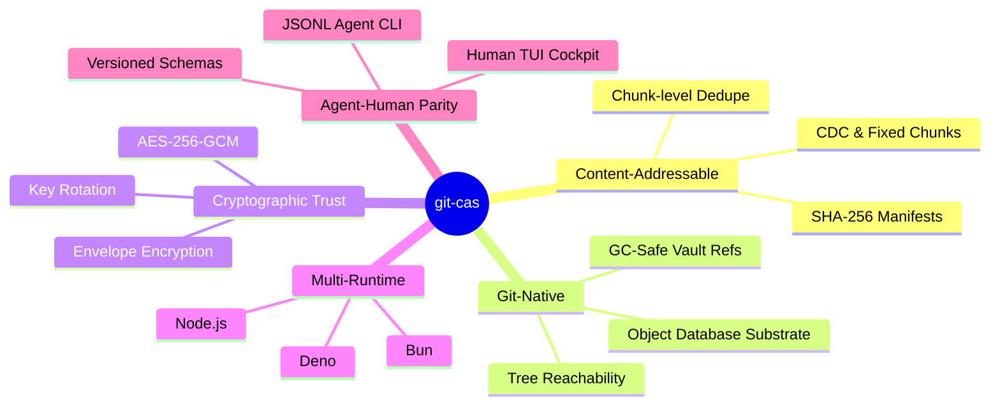

# VISION

`git-cas` is an industrial-grade Content-Addressable Storage engine where data integrity and Git-native reachability are unified.

## Core Tenets

### 1. The Substrate is Sufficient
Git is not just for source code. Its object database is a world-class, replicated, and secure blob store. `git-cas` uses this substrate without inventing new storage formats or protocols.

### 2. Integrity is Non-Negotiable
Every byte stored is verified against a SHA-256 manifest. Corruption is detected at the chunk level, and re-assembly is a deterministic process governed by immutable receipts.

### 3. Privacy by Design
Encryption is a first-class citizen, not an addon. Envelope encryption allows for flexible multi-party access control and rotation without re-encrypting the underlying data bedrock.

### 4. Machine-First, Human-Enhanced
The system is built for automation. Agentic CLI surfaces and JSONL protocols ensure that `git-cas` can be a reliable part of a high-fidelity CI/CD or agentic workflow.

---
**The goal is inevitably. Git, freebased: pure CAS that stays in your repository.**
