# Technical Teardown: `git-cas`

This document is a zero-to-hero technical teardown of `git-cas`, an
ES module package that stores, verifies, encrypts, restores, and indexes binary
artifacts inside Git.

The explanation starts at the exact executable entry points, then descends
through bootstrapping, the public facade, domain services, byte pipelines, Git
persistence, security boundaries, and failure behavior. The goal is to make the
system understandable to a reader who has never seen this project or this
domain before.

Primary code landmarks:

| Landmark | File |
| --- | --- |
| Package definition and executable registration | [package.json](../package.json) |
| Library facade and public API | [index.js](../index.js) |
| Human CLI process entry | [bin/git-cas.js](../bin/git-cas.js) |
| Agent CLI process entry | [bin/agent/cli.js](../bin/agent/cli.js) |
| CAS domain orchestrator | [src/domain/services/CasService.js](../src/domain/services/CasService.js) |
| Vault domain orchestrator | [src/domain/services/VaultService.js](../src/domain/services/VaultService.js) |
| Git blob/tree adapter | [src/infrastructure/adapters/GitPersistenceAdapter.js](../src/infrastructure/adapters/GitPersistenceAdapter.js) |
| Git ref adapter | [src/infrastructure/adapters/GitRefAdapter.js](../src/infrastructure/adapters/GitRefAdapter.js) |
| Manifest schema | [src/domain/schemas/ManifestSchema.js](../src/domain/schemas/ManifestSchema.js) |
| Architecture map | [ARCHITECTURE.md](../ARCHITECTURE.md) |

## Table of Contents

- [Domain Dictionary](#domain-dictionary)
- [The Entry Point](#the-entry-point)
- [Bootstrapping vs. Runtime](#bootstrapping-vs-runtime)
- [The System Model](#the-system-model)
- [Source of Truth](#source-of-truth)
- [Golden Path 1: Library Store, Publish, Vault, Restore](#golden-path-1-library-store-publish-vault-restore)
- [Golden Path 2: Human CLI Store and Restore](#golden-path-2-human-cli-store-and-restore)
- [Golden Path 3: Agent JSONL Automation](#golden-path-3-agent-jsonl-automation)
- [Store Pipeline Internals](#store-pipeline-internals)
- [Restore Pipeline Internals](#restore-pipeline-internals)
- [Vault Pipeline Internals](#vault-pipeline-internals)
- [Anatomy of Payloads](#anatomy-of-payloads)
- [Concurrency and Asynchronous Flows](#concurrency-and-asynchronous-flows)
- [Security Boundaries and Auth Flows](#security-boundaries-and-auth-flows)
- [External Dependencies and Borders](#external-dependencies-and-borders)
- [Configuration and Environment Tuning](#configuration-and-environment-tuning)
- [Unhappy Paths and Error Handling](#unhappy-paths-and-error-handling)
- [Design Highlights](#design-highlights)
- [Trade-Offs](#trade-offs)
- [Testing and Verification Posture](#testing-and-verification-posture)
- [Reading Map](#reading-map)

## Domain Dictionary

Before reading the code paths, learn the vocabulary. The project is small
enough to fit in one repository, but it is built from several storage,
cryptography, Git, and runtime concepts.

| Term | Meaning in `git-cas` | Why it matters |
| --- | --- | --- |
| CAS | Content-addressable storage. Data is addressed by a digest of its contents rather than by a mutable name. | The system can verify that restored bytes match what was stored. |
| Git object database | The `.git/objects` store that holds Git blobs, trees, and commits. | This is the durable storage backend. There is no external artifact server. |
| Blob | A Git object containing raw bytes. | Stored chunks, manifests, vault metadata, and privacy indexes are persisted as blobs. |
| Tree | A Git object mapping names to blobs or nested trees. | Each published asset is a tree containing a manifest and reachable chunk blobs. |
| Commit | A Git object pointing at a tree and optional parent commit. | The vault is a commit chain, so vault history is normal Git history. |
| Ref | A named Git pointer, such as `refs/cas/vault`. | The vault ref keeps named asset trees reachable and GC-safe. |
| OID | Git object identifier, accepted as lowercase 40-hex SHA-1 or 64-hex SHA-256. | Blobs, trees, commits, and manifest chunk references are all OIDs. |
| Chunk | A contiguous byte slice of an asset. | Chunking enables deduplication, verification, and parallel restore. |
| Fixed chunking | Splitting input into fixed byte sizes. | Predictable, simple, and stable when bytes change near the end of a file. |
| CDC | Content-defined chunking. Boundaries are chosen by rolling hash over content. | Insertions near the front of a file do not shift every later chunk boundary. |
| Buzhash | The rolling hash used by the CDC chunker. | It lets the chunker scan for boundaries without hashing each window from scratch. |
| Manifest | Metadata describing how to rebuild an asset. | It is the source of truth for chunk order, digest, compression, encryption, and format. |
| Merkle manifest | A two-level manifest layout for large chunk lists. | It bounds root manifest size by moving chunk groups into sub-manifest blobs. |
| Slug | A user-facing logical name such as `assets/logo/v1`. | Vault commands resolve slugs to asset tree OIDs. |
| Vault | The slug-to-tree index rooted at `refs/cas/vault`. | It gives named assets a stable, Git-native reachability anchor. |
| GCM | AES-GCM authenticated encryption. | `git-cas` gets confidentiality and tamper detection in one primitive. |
| AAD | Additional Authenticated Data. It is authenticated but not encrypted. | Whole and framed encryption bind ciphertext to a slug, and framed mode also binds frame index. |
| DEK | Data encryption key. | Envelope encryption uses one DEK for the content. |
| KEK | Key encryption key. | A recipient's key wraps or unwraps the DEK. |
| KDF | Key derivation function. | Passphrases become 32-byte AES keys through PBKDF2 or scrypt. |
| Envelope encryption | Store data under a DEK, then wrap that DEK for each recipient. | Recipients can be added or rotated without re-encrypting all chunk blobs. |
| Convergent encryption | Deterministic per-chunk encryption derived from plaintext digest. | It preserves deduplication for encrypted CDC stores, with known equality-leakage trade-offs. |
| Port | Abstract interface that the domain layer depends on. | Ports keep domain code free of Node, Git shelling, zlib, and runtime globals. |
| Adapter | Concrete implementation of a port. | Adapters connect the domain to Git CLI, crypto runtime, filesystem, compression, and observability. |

## The Entry Point

`git-cas` has three entry surfaces over one shared core.

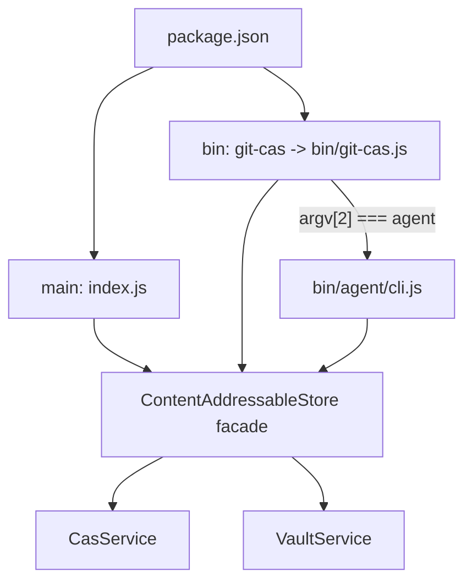
```mermaid
flowchart TD
    P["package.json"] --> E1["main: index.js"]
    P --> E2["bin: git-cas -> bin/git-cas.js"]
    E2 -->|"argv[2] === agent"| E3["bin/agent/cli.js"]

    E1 --> F["ContentAddressableStore facade"]
    E2 --> F
    E3 --> F

    F --> C["CasService"]
    F --> V["VaultService"]
```

### Package Execution Contract

The package declares:

```json
{
  "type": "module",
  "main": "index.js",
  "bin": {
    "git-cas": "bin/git-cas.js"
  },
  "exports": {
    ".": "./index.js",
    "./service": "./src/domain/services/CasService.js",
    "./schema": "./src/domain/schemas/ManifestSchema.js"
  }
}
```

That creates three practical execution starts:

1. A library caller imports `@git-stunts/git-cas`, which loads `index.js`.
2. A human runs `git-cas ...`, which starts `bin/git-cas.js`.
3. An automation system runs `git-cas agent ...`, which is detected by
   `bin/git-cas.js` and delegated to `bin/agent/cli.js`.

### Library Entry: `index.js`

For library usage, the first meaningful project code is the facade:

```js
import ContentAddressableStore from '@git-stunts/git-cas';

const cas = await ContentAddressableStore.open({ cwd: '.' });
```

`ContentAddressableStore.open()` creates Git plumbing for a working directory
and returns a facade instance. The heavy services are not constructed
immediately. They are created lazily when the caller first invokes a method that
needs them.

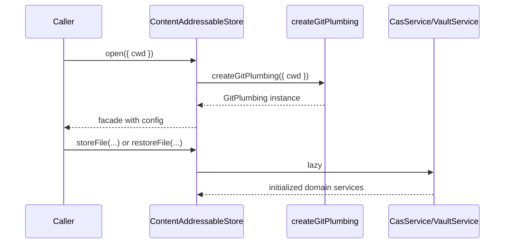
```mermaid
sequenceDiagram
    participant App as Caller
    participant Facade as ContentAddressableStore
    participant Plumbing as createGitPlumbing
    participant Service as CasService/VaultService

    App->>Facade: open({ cwd })
    Facade->>Plumbing: createGitPlumbing({ cwd })
    Plumbing-->>Facade: GitPlumbing instance
    Facade-->>App: facade with config
    App->>Facade: storeFile(...) or restoreFile(...)
    Facade->>Service: lazy #getService()
    Service-->>Facade: initialized domain services
```

The lazy service promise is important. Adapter discovery can be asynchronous,
especially when selecting runtime-specific crypto adapters. Lazy boot also
means a caller can construct a facade without paying for Git, crypto, vault,
and compression objects until an operation needs them.

### Human CLI Entry: `bin/git-cas.js`

The human CLI starts at the shebang:

```js
#!/usr/bin/env node
```

Then it:

1. reads package version information
2. installs broken-pipe handlers
3. checks whether the first command is `agent`
4. configures Commander commands for human usage
5. calls `program.parseAsync()`
6. flushes stdio before exit

The branch for automation happens before Commander owns the process:

```js
if (process.argv[2] === 'agent') {
  await runAgentCli(process.argv.slice(3));
  await flushStdioAndExit();
}
```

The rest of `bin/git-cas.js` is the human command surface:

| Command family | Purpose |
| --- | --- |
| `store` | Store bytes, optionally publish a tree and add it to the vault. |
| `restore` | Resolve by slug or tree OID and write bytes to disk. |
| `tree` | Turn a manifest file into a Git tree. |
| `inspect` | Read and render a manifest. |
| `verify` | Check chunk digests and, when credentials are supplied, encryption auth. |
| `doctor` | Inspect vault health and deduplication state. |
| `vault ...` | Initialize, list, inspect, mutate, rotate, and dashboard the vault. |
| `recipient ...` | Manage envelope-encryption recipients. |

### Agent Entry: `bin/agent/cli.js`

The agent entry is narrower and more explicit. It turns argv into a command
name, opens a JSONL session, executes the command, and always emits structured
end state.

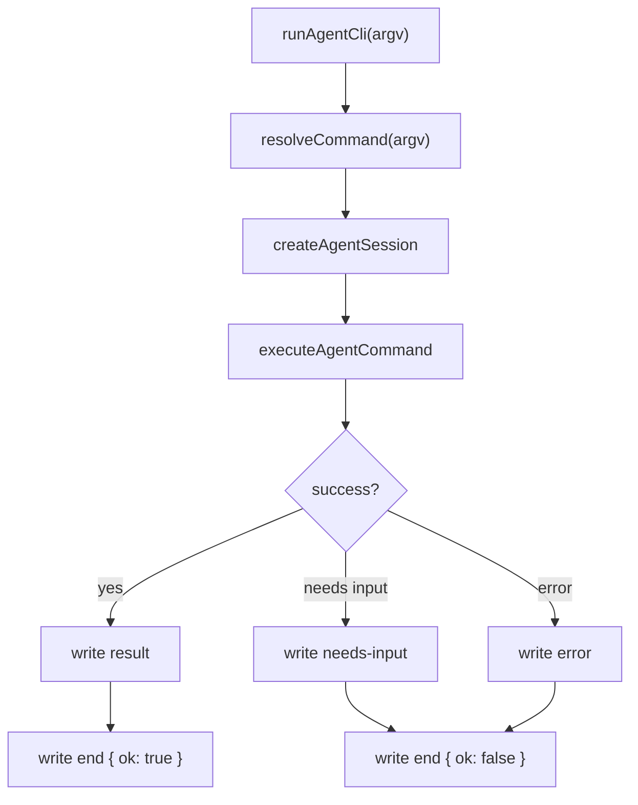
```mermaid
flowchart TD
    A["runAgentCli(argv)"] --> B["resolveCommand(argv)"]
    B --> C["createAgentSession"]
    C --> D["executeAgentCommand"]
    D --> E{"success?"}
    E -->|"yes"| F["write result"]
    F --> G["write end { ok: true }"]
    E -->|"needs input"| H["write needs-input"]
    H --> I["write end { ok: false }"]
    E -->|"error"| J["write error"]
    J --> I
```

The agent protocol uses:

- stable command names
- `start`, `progress`, `result`, `warning`, `error`, `needs-input`, and `end`
  records
- explicit exit codes
- redacted start payloads for secrets

This is not just a CLI with `--json`. It is a session protocol designed for
automation.

## Bootstrapping vs. Runtime

Bootstrapping is the setup phase. Runtime is the operation phase.

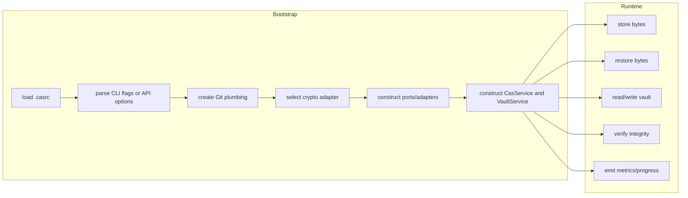
```mermaid
flowchart LR
    subgraph Bootstrap
        A["load .casrc"]
        B["parse CLI flags or API options"]
        C["create Git plumbing"]
        D["select crypto adapter"]
        E["construct ports/adapters"]
        F["construct CasService and VaultService"]
    end

    subgraph Runtime
        G["store bytes"]
        H["restore bytes"]
        I["read/write vault"]
        J["verify integrity"]
        K["emit metrics/progress"]
    end

    A --> B --> C --> D --> E --> F --> G
    F --> H
    F --> I
    F --> J
    F --> K
```

### Bootstrap Responsibilities

The facade owns composition, not storage logic.

During `#initService()`, `index.js`:

1. creates `GitPersistenceAdapter`
2. creates or accepts a `CryptoPort`
3. chooses a chunker
4. creates `CasService`
5. creates `GitRefAdapter`
6. creates `VaultService`

The domain receives ready-to-use collaborators. It does not discover runtimes or
open Git repositories by itself.

### Runtime Responsibilities

Once bootstrapped, runtime operations are domain use cases:

- `CasService.store()` validates options, transforms bytes, writes chunks, and
  returns an immutable `Manifest`.
- `CasService.createTree()` serializes the manifest and writes a Git tree.
- `VaultService.addToVault()` mutates `refs/cas/vault` with optimistic
  concurrency.
- `CasService.restoreStream()` verifies, decrypts, decompresses, and yields
  bytes.
- `FileIOHelper.restoreFile()` turns restored bytes into a safe filesystem
  write.

The separation matters because it keeps platform details at the edge. A browser
adapter, remote adapter, or custom crypto adapter can be introduced at the port
boundary without rewriting manifest or vault rules.

## The System Model

At the highest level, `git-cas` stores bytes in Git and stores enough metadata
to reconstruct those bytes later.

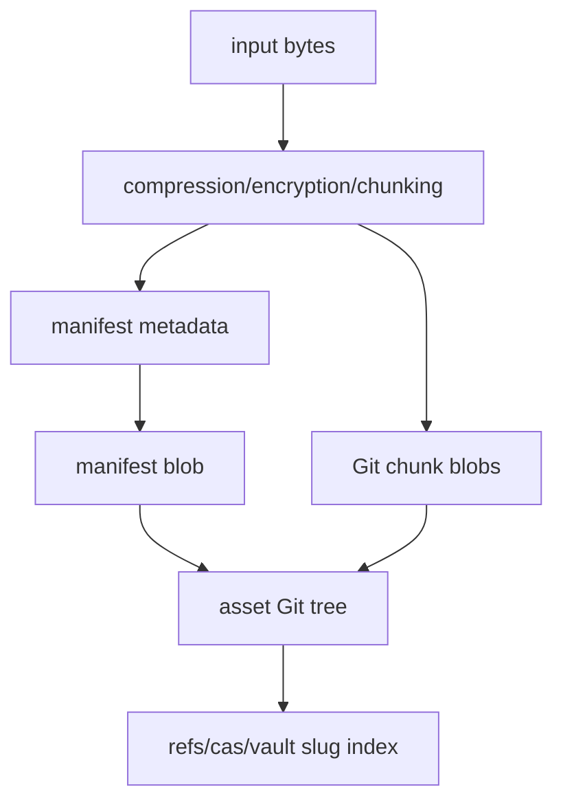
```mermaid
flowchart TD
    Source["input bytes"] --> Transform["compression/encryption/chunking"]
    Transform --> Blobs["Git chunk blobs"]
    Transform --> Manifest["manifest metadata"]
    Manifest --> ManifestBlob["manifest blob"]
    ManifestBlob --> Tree["asset Git tree"]
    Blobs --> Tree
    Tree --> Vault["refs/cas/vault slug index"]
```

The system has two related but distinct stores:

1. The asset store: chunk blobs plus a manifest tree.
2. The vault store: a ref-backed index from slugs to asset tree OIDs.

The asset tree can exist without the vault. A caller can store data and keep the
manifest JSON or tree OID themselves. The vault is the managed name index.

### Layer Diagram

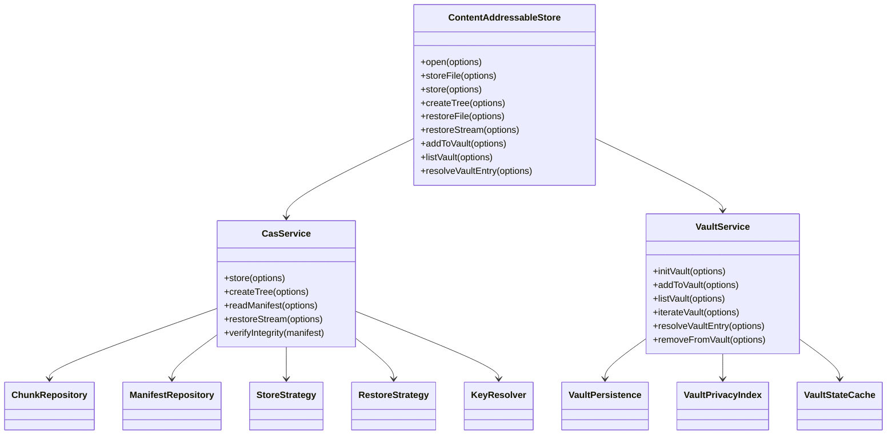
```mermaid
classDiagram
    class ContentAddressableStore {
      +open(options)
      +storeFile(options)
      +store(options)
      +createTree(options)
      +restoreFile(options)
      +restoreStream(options)
      +addToVault(options)
      +listVault(options)
      +resolveVaultEntry(options)
    }

    class CasService {
      +store(options)
      +createTree(options)
      +readManifest(options)
      +restoreStream(options)
      +verifyIntegrity(manifest)
    }

    class VaultService {
      +initVault(options)
      +addToVault(options)
      +listVault(options)
      +iterateVault(options)
      +resolveVaultEntry(options)
      +removeFromVault(options)
    }

    class ChunkRepository
    class ManifestRepository
    class StoreStrategy
    class RestoreStrategy
    class KeyResolver
    class VaultPersistence
    class VaultPrivacyIndex
    class VaultStateCache

    ContentAddressableStore --> CasService
    ContentAddressableStore --> VaultService
    CasService --> ChunkRepository
    CasService --> ManifestRepository
    CasService --> StoreStrategy
    CasService --> RestoreStrategy
    CasService --> KeyResolver
    VaultService --> VaultPersistence
    VaultService --> VaultPrivacyIndex
    VaultService --> VaultStateCache
```

### Port and Adapter Diagram

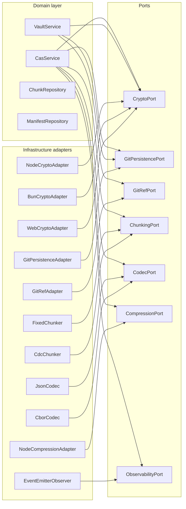
```mermaid
flowchart LR
    subgraph Domain["Domain layer"]
        C["CasService"]
        V["VaultService"]
        CR["ChunkRepository"]
        MR["ManifestRepository"]
    end

    subgraph Ports["Ports"]
        CP["CryptoPort"]
        GP["GitPersistencePort"]
        RP["GitRefPort"]
        CHP["ChunkingPort"]
        CODEC["CodecPort"]
        COMP["CompressionPort"]
        OBS["ObservabilityPort"]
    end

    subgraph Adapters["Infrastructure adapters"]
        NC["NodeCryptoAdapter"]
        BC["BunCryptoAdapter"]
        WC["WebCryptoAdapter"]
        GIT["GitPersistenceAdapter"]
        REF["GitRefAdapter"]
        FIX["FixedChunker"]
        CDC["CdcChunker"]
        JSON["JsonCodec"]
        CBOR["CborCodec"]
        GZIP["NodeCompressionAdapter"]
        EVENTS["EventEmitterObserver"]
    end

    C --> CP
    C --> GP
    C --> CHP
    C --> CODEC
    C --> COMP
    C --> OBS
    V --> GP
    V --> RP
    V --> CP
    NC --> CP
    BC --> CP
    WC --> CP
    GIT --> GP
    REF --> RP
    FIX --> CHP
    CDC --> CHP
    JSON --> CODEC
    CBOR --> CODEC
    GZIP --> COMP
    EVENTS --> OBS
```

The dependency direction is deliberately one-way. Domain code imports ports and
value objects. Infrastructure imports domain abstractions and implements them.

## Source of Truth

State moves through several places. The key to understanding `git-cas` is to
know which place is authoritative at each moment.

| State | Source of truth | Lifetime |
| --- | --- | --- |
| Package version | `package.json` and generated `src/package-version.js` | Release lifetime |
| Runtime configuration | API options, CLI flags, `.casrc`, environment variables | Process lifetime |
| Active facade configuration | Private `#config` in `ContentAddressableStore` | Facade instance lifetime |
| Chunk bytes during store | Async iterable stream | Operation lifetime |
| Chunk blobs | Git object database | Durable |
| Chunk order and digests | Manifest object and serialized manifest blob | Durable after tree publication |
| Asset reachability | Asset Git tree | Durable while reachable |
| Named asset lookup | `refs/cas/vault` commit chain | Durable and GC-safe |
| Vault metadata | `.vault.json` blob in the vault tree | Durable |
| Privacy slug reverse map | encrypted `.privacy-index` blob in the vault tree | Durable |
| Cached vault parse results | `VaultStateCache` keyed by tree OID | Process memory |
| Human CLI progress | `EventEmitterObserver` and progress renderers | Operation lifetime |
| Agent automation state | JSONL session records | Process output |

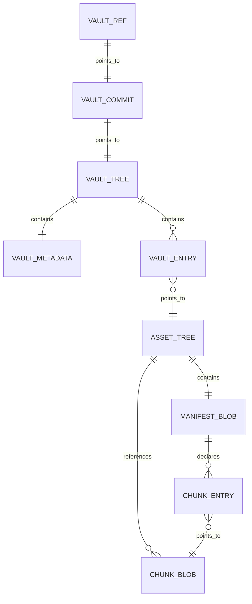
```mermaid
erDiagram
    ASSET_TREE ||--|| MANIFEST_BLOB : contains
    ASSET_TREE ||--o{ CHUNK_BLOB : references
    MANIFEST_BLOB ||--o{ CHUNK_ENTRY : declares
    CHUNK_ENTRY }o--|| CHUNK_BLOB : points_to
    VAULT_REF ||--|| VAULT_COMMIT : points_to
    VAULT_COMMIT ||--|| VAULT_TREE : points_to
    VAULT_TREE ||--|| VAULT_METADATA : contains
    VAULT_TREE ||--o{ VAULT_ENTRY : contains
    VAULT_ENTRY }o--|| ASSET_TREE : points_to
```

There is no SQLite database, Redis cache, service API, or daemon. Git is the
durable database. In-memory structures are performance helpers or operation
drafts, not authoritative storage.

## Golden Path 1: Library Store, Publish, Vault, Restore

This is the core successful path:

1. Store a file.
2. Publish a Git tree.
3. Add the tree to the vault under a slug.
4. Resolve the slug later.
5. Restore the file safely.

### Caller Code

```js
import ContentAddressableStore from '@git-stunts/git-cas';

const cas = await ContentAddressableStore.open({ cwd: '.' });

const manifest = await cas.storeFile({
  filePath: './data.bin',
  slug: 'assets/data/v1',
});

const treeOid = await cas.createTree({ manifest });
await cas.addToVault({ slug: 'assets/data/v1', treeOid });

const resolvedTreeOid = await cas.resolveVaultEntry({ slug: 'assets/data/v1' });
const restoredManifest = await cas.readManifest({ treeOid: resolvedTreeOid });

await cas.restoreFile({
  manifest: restoredManifest,
  outputPath: './restored/data.bin',
  baseDirectory: process.cwd(),
});
```

### End-to-End Sequence

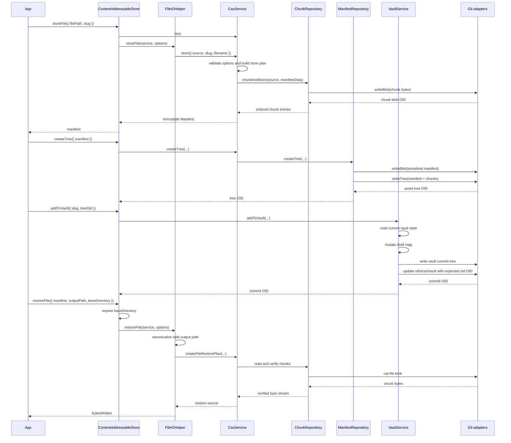
```mermaid
sequenceDiagram
    participant App as App
    participant Facade as ContentAddressableStore
    participant FileIO as FileIOHelper
    participant Cas as CasService
    participant Chunks as ChunkRepository
    participant ManifestRepo as ManifestRepository
    participant Vault as VaultService
    participant Git as Git adapters

    App->>Facade: storeFile({ filePath, slug })
    Facade->>Cas: lazy #getService()
    Facade->>FileIO: storeFile(service, options)
    FileIO->>Cas: store({ source, slug, filename })
    Cas->>Cas: validate options and build store plan
    Cas->>Chunks: chunkAndStore(source, manifestData)
    Chunks->>Git: writeBlob(chunk bytes)
    Git-->>Chunks: chunk blob OID
    Chunks-->>Cas: ordered chunk entries
    Cas-->>Facade: immutable Manifest
    Facade-->>App: manifest

    App->>Facade: createTree({ manifest })
    Facade->>Cas: createTree(...)
    Cas->>ManifestRepo: createTree(...)
    ManifestRepo->>Git: writeBlob(serialized manifest)
    ManifestRepo->>Git: writeTree(manifest + chunks)
    Git-->>ManifestRepo: asset tree OID
    ManifestRepo-->>Facade: tree OID

    App->>Facade: addToVault({ slug, treeOid })
    Facade->>Vault: addToVault(...)
    Vault->>Vault: read current vault state
    Vault->>Vault: mutate draft map
    Vault->>Git: write vault commit tree
    Vault->>Git: update refs/cas/vault with expected old OID
    Git-->>Vault: commit OID
    Vault-->>Facade: commit OID

    App->>Facade: restoreFile({ manifest, outputPath, baseDirectory })
    Facade->>Facade: require baseDirectory
    Facade->>FileIO: restoreFile(service, options)
    FileIO->>FileIO: canonicalize safe output path
    FileIO->>Cas: createFileRestorePlan(...)
    Cas->>Chunks: read and verify chunks
    Chunks->>Git: cat-file blob
    Git-->>Chunks: chunk bytes
    Chunks-->>Cas: verified byte stream
    Cas-->>FileIO: restore source
    FileIO-->>App: bytesWritten
```

### Step 1: The Facade Resolves Per-Operation Chunking

`ContentAddressableStore.storeFile()` first calls `withOperationChunker()`.

That helper exists because chunking can be configured at two levels:

- constructor or `.open()` defaults
- per-operation overrides

Per-operation configuration is converted into a `ChunkingPort` instance before
control reaches `CasService`.

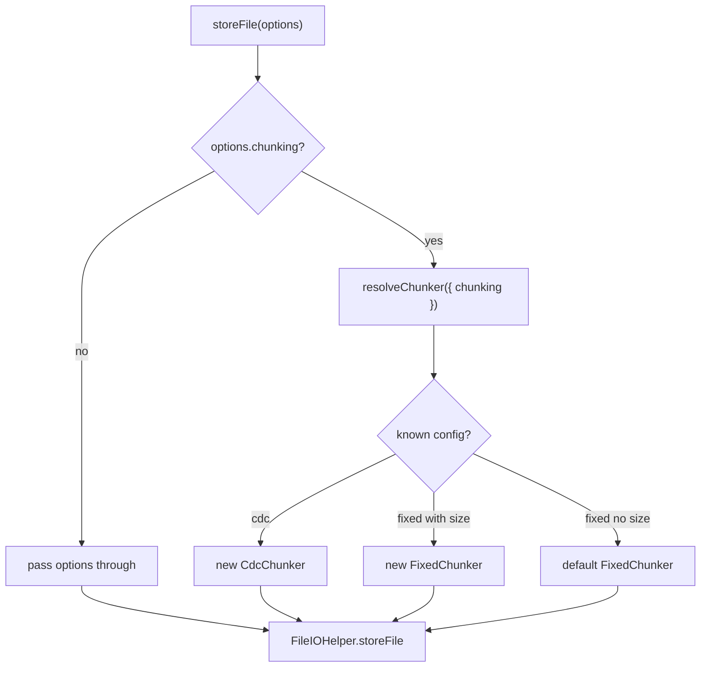
```mermaid
flowchart TD
    A["storeFile(options)"] --> B{"options.chunking?"}
    B -->|"no"| C["pass options through"]
    B -->|"yes"| D["resolveChunker({ chunking })"]
    D --> E{"known config?"}
    E -->|"cdc"| F["new CdcChunker"]
    E -->|"fixed with size"| G["new FixedChunker"]
    E -->|"fixed no size"| H["default FixedChunker"]
    C --> I["FileIOHelper.storeFile"]
    F --> I
    G --> I
    H --> I
```

The source of truth for this phase is still the caller's input. No bytes have
been written.

### Step 2: File I/O Becomes an Async Byte Source

`FileIOHelper.storeFile()` converts a filesystem path into a Node read stream
and calls `CasService.store()`.

At this boundary:

- the filename defaults to `path.basename(filePath)`
- the source becomes an `AsyncIterable<Uint8Array>`
- the domain receives bytes, not a filesystem path

This is an important architectural boundary. The domain service stores byte
streams. The filesystem helper adapts local files to that domain contract.

### Step 3: `CasService.store()` Validates and Plans

`CasService.store()` validates:

- `source` must be async iterable
- recipients cannot be combined with direct keys or passphrases
- direct key and passphrase cannot both be supplied
- compression must be gzip if present
- Merkle threshold must be a positive integer

Then it builds a store plan:

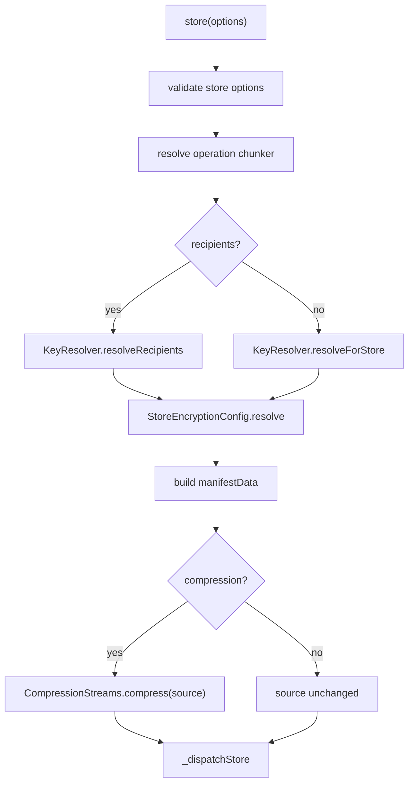
```mermaid
flowchart TD
    A["store(options)"] --> B["validate store options"]
    B --> C["resolve operation chunker"]
    C --> D{"recipients?"}
    D -->|"yes"| E["KeyResolver.resolveRecipients"]
    D -->|"no"| F["KeyResolver.resolveForStore"]
    E --> G["StoreEncryptionConfig.resolve"]
    F --> G
    G --> H["build manifestData"]
    H --> I{"compression?"}
    I -->|"yes"| J["CompressionStreams.compress(source)"]
    I -->|"no"| K["source unchanged"]
    J --> L["_dispatchStore"]
    K --> L
```

At this point, state lives in memory:

- `keyInfo` contains the encryption key or wrapped-recipient metadata
- `encryptionConfig` contains the chosen scheme
- `manifestData` is a mutable draft object
- source bytes are still streaming

### Step 4: Strategy Selection Chooses the Byte Transform

`StoreStrategy.for()` selects one of four strategy objects.

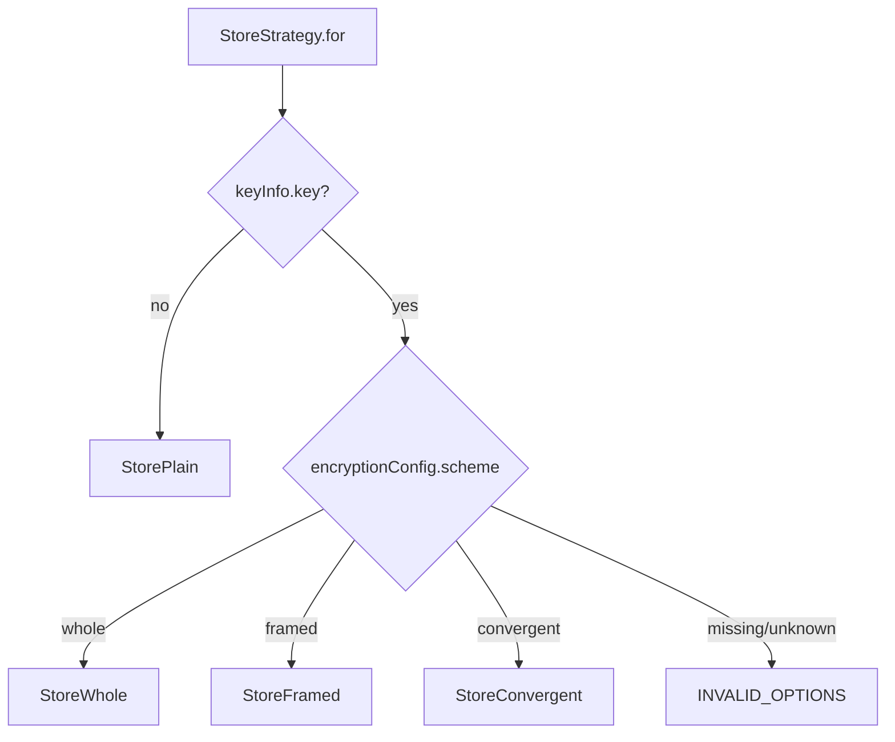
```mermaid
flowchart TD
    A["StoreStrategy.for"] --> B{"keyInfo.key?"}
    B -->|"no"| P["StorePlain"]
    B -->|"yes"| C{"encryptionConfig.scheme"}
    C -->|"whole"| W["StoreWhole"]
    C -->|"framed"| F["StoreFramed"]
    C -->|"convergent"| G["StoreConvergent"]
    C -->|"missing/unknown"| E["INVALID_OPTIONS"]
```

This design avoids burying encryption behavior inside one large branch. The
byte pipeline is explicit:

| Strategy | Transform position | Main property |
| --- | --- | --- |
| `StorePlain` | no encryption | stores verified plaintext chunks |
| `StoreWhole` | before chunking | one AES-GCM nonce/tag for the full stream |
| `StoreFramed` | before chunking | independent encrypted records with per-frame AAD |
| `StoreConvergent` | after chunking | deterministic per-chunk encryption that preserves dedupe |

### Step 5: Chunk Write Creates Durable Git Blobs

`ChunkRepository.storeChunk()` does the core persistence work:

1. compute SHA-256 digest of the plaintext chunk
2. optionally convergent-encrypt the chunk
3. write the blob to Git
4. return a manifest chunk entry

For non-convergent modes, the digest is over the actual blob bytes because
encryption already happened before chunking. For convergent mode, the digest is
over plaintext and the blob is ciphertext plus tag.

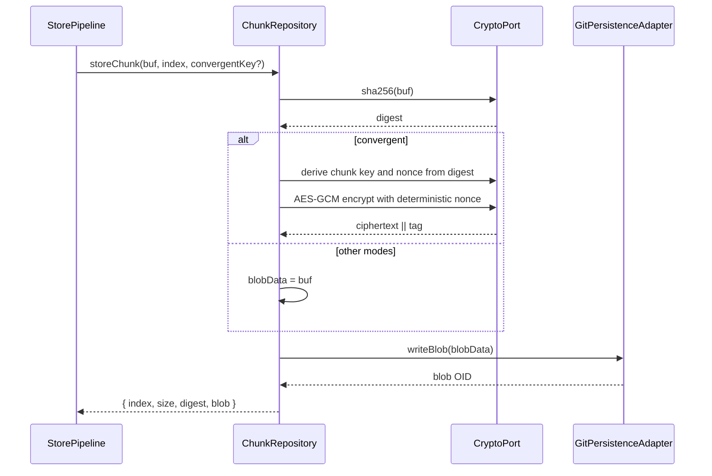
```mermaid
sequenceDiagram
    participant Pipe as StorePipeline
    participant Repo as ChunkRepository
    participant Crypto as CryptoPort
    participant Git as GitPersistenceAdapter

    Pipe->>Repo: storeChunk(buf, index, convergentKey?)
    Repo->>Crypto: sha256(buf)
    Crypto-->>Repo: digest
    alt convergent
        Repo->>Crypto: derive chunk key and nonce from digest
        Repo->>Crypto: AES-GCM encrypt with deterministic nonce
        Crypto-->>Repo: ciphertext || tag
    else other modes
        Repo->>Repo: blobData = buf
    end
    Repo->>Git: writeBlob(blobData)
    Git-->>Repo: blob OID
    Repo-->>Pipe: { index, size, digest, blob }
```

Durable state appears for the first time here: chunk blobs are now in the Git
object database.

### Step 6: The Manifest Freezes the Reconstruction Contract

After all chunk entries are appended, `CasService` creates a `Manifest` value
object.

The manifest is:

- validated through Zod schemas
- converted into immutable `Chunk` objects
- deep-frozen so callers cannot mutate it accidentally
- stamped with `formatVersion` when the service has one

At this moment, the in-memory `Manifest` is the authoritative reconstruction
contract, but it is not durable until `createTree()` serializes it and writes a
Git tree.

### Step 7: `createTree()` Publishes the Asset

`ManifestRepository.createTree()` writes a manifest blob and a tree that points
to the manifest and chunk blobs.

For small chunk counts:

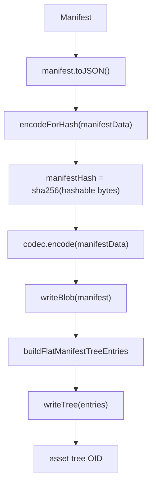
```mermaid
flowchart TD
    A["Manifest"] --> B["manifest.toJSON()"]
    B --> C["encodeForHash(manifestData)"]
    C --> D["manifestHash = sha256(hashable bytes)"]
    D --> E["codec.encode(manifestData)"]
    E --> F["writeBlob(manifest)"]
    F --> G["buildFlatManifestTreeEntries"]
    G --> H["writeTree(entries)"]
    H --> I["asset tree OID"]
```

For large chunk counts, the repository writes sub-manifest blobs and a root
manifest with `version: 2` and `subManifests`.

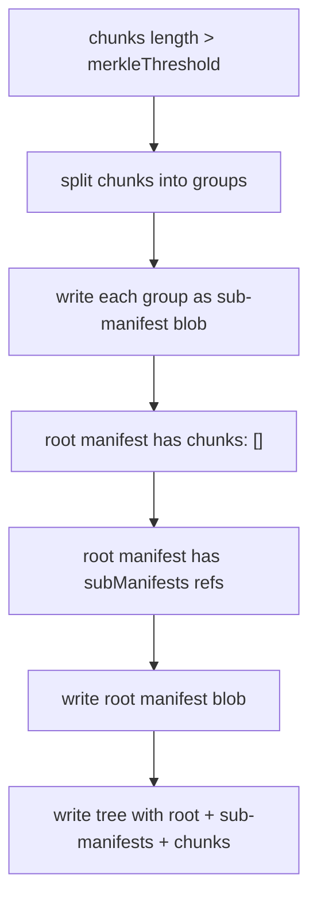
```mermaid
flowchart TD
    A["chunks length > merkleThreshold"] --> B["split chunks into groups"]
    B --> C["write each group as sub-manifest blob"]
    C --> D["root manifest has chunks: []"]
    D --> E["root manifest has subManifests refs"]
    E --> F["write root manifest blob"]
    F --> G["write tree with root + sub-manifests + chunks"]
```

Now the asset tree OID is a durable, shareable pointer to the asset.

### Step 8: `addToVault()` Gives the Tree a Name

The vault maps `slug -> treeOid`.

`VaultService.addToVault()`:

1. validates the slug
2. reads current vault state from `refs/cas/vault`
3. clones a mutable draft
4. checks whether overwrite is allowed
5. writes a new vault tree and commit
6. updates `refs/cas/vault` using compare-and-swap semantics

The source of truth after success is `refs/cas/vault`, not the process memory.

### Step 9: Restore Starts by Reading the Manifest

Later, restore begins from either:

- a direct tree OID
- a vault slug resolved to a tree OID

`ManifestRepository.readManifest()`:

1. reads the tree
2. finds `manifest.json` or `manifest.cbor`
3. decodes it
4. verifies `manifestHash` if present
5. rejects legacy encryption schemes unless legacy migration mode is enabled
6. resolves sub-manifest chunks if `version: 2`
7. constructs an immutable `Manifest`

The source of truth moves from Git object database into an immutable in-memory
manifest for this restore operation.

### Step 10: `restoreFile()` Enforces the Filesystem Boundary

`ContentAddressableStore.restoreFile()` refuses to proceed unless
`baseDirectory` is supplied. Then `FileIOHelper.restoreFile()` canonicalizes the
destination path.

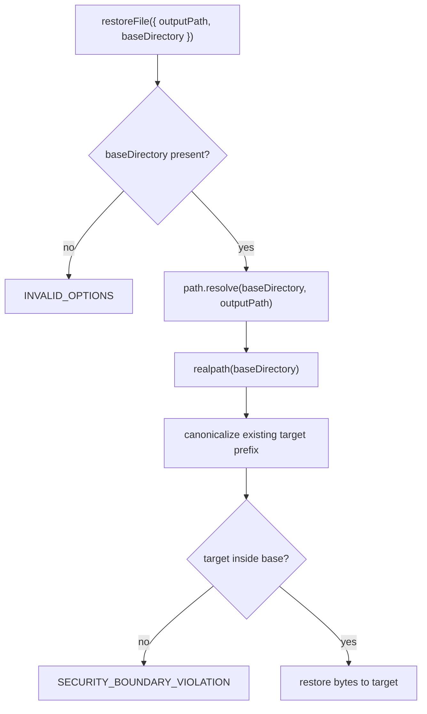
```mermaid
flowchart TD
    A["restoreFile({ outputPath, baseDirectory })"] --> B{"baseDirectory present?"}
    B -->|"no"| C["INVALID_OPTIONS"]
    B -->|"yes"| D["path.resolve(baseDirectory, outputPath)"]
    D --> E["realpath(baseDirectory)"]
    E --> F["canonicalize existing target prefix"]
    F --> G{"target inside base?"}
    G -->|"no"| H["SECURITY_BOUNDARY_VIOLATION"]
    G -->|"yes"| I["restore bytes to target"]
```

Whole-object encrypted file restores are special. They can use a temp-file path
so authentication failure does not leave a partial output file behind.

## Golden Path 2: Human CLI Store and Restore

The human CLI path starts in `bin/git-cas.js` and converges on the same facade.

### CLI Store Command

Example:

```bash
git-cas store data.bin --slug assets/data/v1 --tree
```

Command flow:

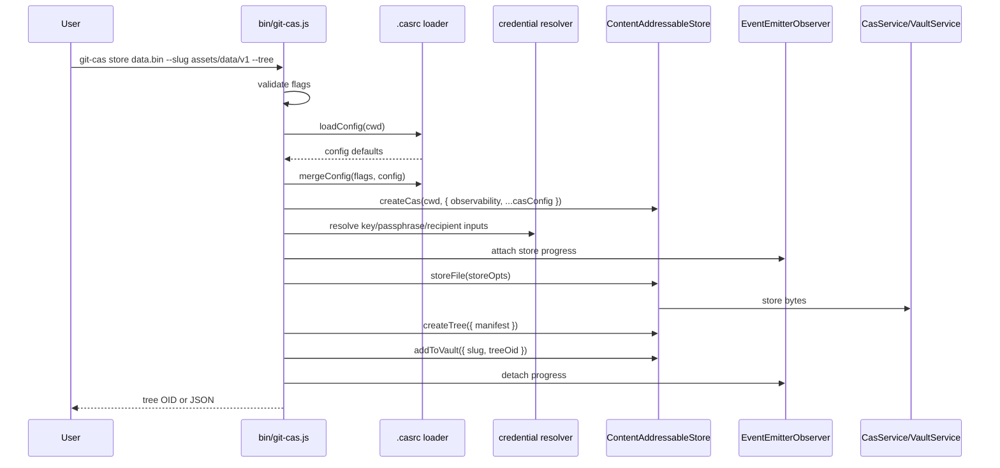
```mermaid
sequenceDiagram
    participant User as User
    participant CLI as bin/git-cas.js
    participant Config as .casrc loader
    participant Creds as credential resolver
    participant Facade as ContentAddressableStore
    participant Progress as EventEmitterObserver
    participant Domain as CasService/VaultService

    User->>CLI: git-cas store data.bin --slug assets/data/v1 --tree
    CLI->>CLI: validate flags
    CLI->>Config: loadConfig(cwd)
    Config-->>CLI: config defaults
    CLI->>Config: mergeConfig(flags, config)
    CLI->>Facade: createCas(cwd, { observability, ...casConfig })
    CLI->>Creds: resolve key/passphrase/recipient inputs
    CLI->>Progress: attach store progress
    CLI->>Facade: storeFile(storeOpts)
    Facade->>Domain: store bytes
    CLI->>Facade: createTree({ manifest })
    CLI->>Facade: addToVault({ slug, treeOid })
    CLI->>Progress: detach progress
    CLI-->>User: tree OID or JSON
```

The command adds human behaviors around the domain:

- inline passphrase warnings
- `.casrc` defaults
- flag parsing and validation
- progress rendering
- text or JSON output
- vault insertion when `--tree` is supplied

The actual storage rules are still domain rules.

### CLI Restore Command

Example:

```bash
git-cas restore --slug assets/data/v1 --out data-restored.bin
```

Command flow:

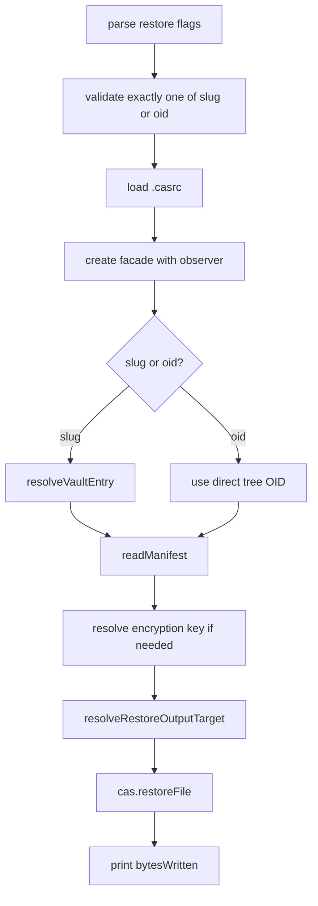
```mermaid
flowchart TD
    A["parse restore flags"] --> B["validate exactly one of slug or oid"]
    B --> C["load .casrc"]
    C --> D["create facade with observer"]
    D --> E{"slug or oid?"}
    E -->|"slug"| F["resolveVaultEntry"]
    E -->|"oid"| G["use direct tree OID"]
    F --> H["readManifest"]
    G --> H
    H --> I["resolve encryption key if needed"]
    I --> J["resolveRestoreOutputTarget"]
    J --> K["cas.restoreFile"]
    K --> L["print bytesWritten"]
```

`resolveRestoreOutputTarget()` chooses the parent directory of the output as the
restore authority boundary. The facade then passes that boundary into
`restoreFile()`.

## Golden Path 3: Agent JSONL Automation

The agent path exists for programs that need machine-stable behavior rather
than terminal formatting.

Example:

```bash
git-cas agent store data.bin --slug assets/data/v1 --tree
```

### Agent Command Resolution

`bin/agent/cli.js` maps argv to a canonical command name:

| Input | Canonical command |
| --- | --- |
| `store` | `store` |
| `vault list` | `vault.list` |
| `vault init` | `vault.init` |
| `recipient add` | `recipient.add` |

Then `executeAgentCommand()` dispatches to a handler.

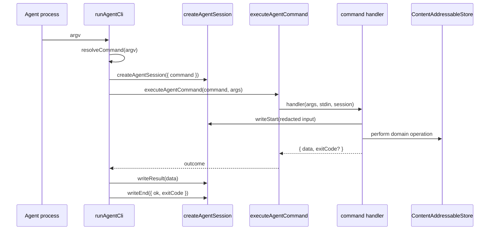
```mermaid
sequenceDiagram
    participant Agent as Agent process
    participant CLI as runAgentCli
    participant Session as createAgentSession
    participant Dispatch as executeAgentCommand
    participant Handler as command handler
    participant Facade as ContentAddressableStore

    Agent->>CLI: argv
    CLI->>CLI: resolveCommand(argv)
    CLI->>Session: createAgentSession({ command })
    CLI->>Dispatch: executeAgentCommand(command, args)
    Dispatch->>Handler: handler(args, stdin, session)
    Handler->>Session: writeStart(redacted input)
    Handler->>Facade: perform domain operation
    Handler-->>Dispatch: { data, exitCode? }
    Dispatch-->>CLI: outcome
    CLI->>Session: writeResult(data)
    CLI->>Session: writeEnd({ ok, exitCode })
```

### Agent JSONL Payload

A successful agent session emits one JSON object per line.

```json
{
  "protocol": "git-cas-agent/v1",
  "command": "store",
  "type": "start",
  "seq": 1,
  "ts": "2026-06-30T00:00:00.000Z",
  "data": {
    "input": {
      "cwd": ".",
      "file": "data.bin",
      "slug": "assets/data/v1",
      "tree": true
    }
  }
}
```

```json
{
  "protocol": "git-cas-agent/v1",
  "command": "store",
  "type": "result",
  "seq": 2,
  "ts": "2026-06-30T00:00:00.100Z",
  "data": {
    "slug": "assets/data/v1",
    "treeOid": "0123456789abcdef0123456789abcdef01234567",
    "commitOid": "89abcdef0123456789abcdef0123456789abcdef",
    "addedToVault": true,
    "chunkCount": 4,
    "encrypted": false,
    "compressed": false
  }
}
```

If a command cannot run without more credentials, the agent path can emit
`needs-input`. That is a better automation contract than a prompt.

## Store Pipeline Internals

The store pipeline is the most important runtime path in the project.

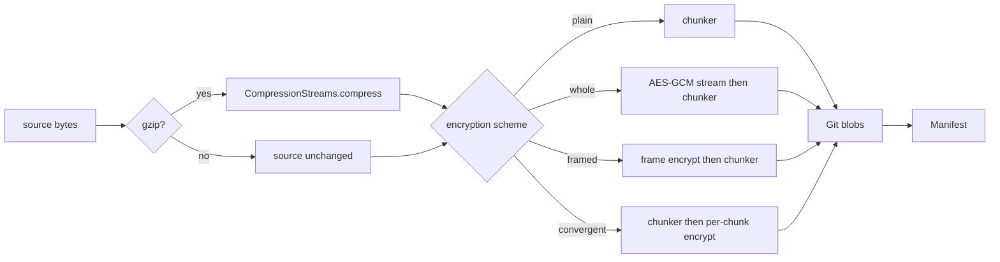
```mermaid
flowchart LR
    A["source bytes"] --> B{"gzip?"}
    B -->|"yes"| C["CompressionStreams.compress"]
    B -->|"no"| D["source unchanged"]
    C --> E{"encryption scheme"}
    D --> E
    E -->|"plain"| F["chunker"]
    E -->|"whole"| G["AES-GCM stream then chunker"]
    E -->|"framed"| H["frame encrypt then chunker"]
    E -->|"convergent"| I["chunker then per-chunk encrypt"]
    F --> J["Git blobs"]
    G --> J
    H --> J
    I --> J
    J --> K["Manifest"]
```

### Fixed Chunking

`FixedChunker` buffers incoming bytes and yields exact `chunkSize` chunks. The
final chunk may be smaller. An empty source yields no chunks.

Default chunk size is 256 KiB.

Fixed chunking is predictable and cheap. Its weakness is edit shifting: insert
one byte near the front and every later fixed boundary moves.

### Content-Defined Chunking

`CdcChunker` uses a Buzhash rolling hash with a 64-byte window. It tracks a
current chunk buffer and decides boundaries only after `minChunkSize`.

```mermaid
stateDiagram-v2
    [*] --> FillWindow
    FillWindow --> PreMin: window has 64 bytes
    PreMin --> ScanBoundary: chunkLen >= min
    ScanBoundary --> EmitChunk: hash matches mask
    ScanBoundary --> EmitChunk: chunkLen >= max
    EmitChunk --> FillWindow: reset state
    ScanBoundary --> FlushFinal: source ended
    FlushFinal --> [*]
```

Normalized mode uses two masks:

- a stricter mask below target size
- a looser mask above target size

That is a FastCDC-style normalization. It concentrates chunk sizes near the
target and improves deduplication shape.

### StorePipeline Backpressure

`StorePipeline` coordinates chunking and writing with a semaphore.

The subtle design point: it acquires write capacity before pulling the next
chunk. That means slow Git writes apply backpressure to the upstream source.
The process does not eagerly read the whole input file into memory just because
the filesystem can produce bytes faster than Git can store them.

```mermaid
flowchart TD
    A["acquire semaphore"] --> B{"previous write error?"}
    B -->|"yes"| C["close source iterator"]
    B -->|"no"| D["iterator.next()"]
    D --> E{"done?"}
    E -->|"yes"| F["await in-flight writes"]
    E -->|"no"| G["launch async chunk write"]
    G --> H["release semaphore when write finishes"]
    H --> A
    F --> I["append ordered entries to manifestData"]
```

The pipeline stores results by chunk index and appends them after all writes
settle, preserving manifest order even if Git writes complete out of order.

### Store Errors Preserve Cleanup Evidence

If the source stream fails or a write fails, `StorePipeline` wraps the failure
with:

- `chunksDispatched`
- `failedIndex` when known
- `orphanedBlobs`, the blobs written before failure
- the original error

That does not automatically delete blobs. Git object cleanup is a substrate
concern. But the error metadata gives operators enough information to diagnose
partial store attempts.

## Restore Pipeline Internals

Restore unwinds store transforms in reverse order.

```mermaid
flowchart LR
    A["Git blobs"] --> B["read and verify chunk digest"]
    B --> C{"scheme"}
    C -->|"plain"| D["yield plaintext"]
    C -->|"compressed only"| E["decompress stream"]
    C -->|"convergent"| F["per-chunk decrypt and verify plaintext digest"]
    C -->|"framed"| G["parse records and decrypt per frame"]
    C -->|"whole"| H["whole-object decrypt with bounded buffering or stream"]
    E --> I["restored bytes"]
    F --> I
    G --> I
    H --> I
    D --> I
```

`RestoreStrategy.for()` selects:

| Manifest condition | Strategy |
| --- | --- |
| `encryption.scheme === "convergent"` | `RestoreConvergent` |
| `encryption.scheme === "framed"` | `RestoreFramed` |
| `encryption.scheme === "whole"` | `RestoreWhole` |
| no encryption but compression present | `RestoreCompressed` |
| neither encryption nor compression | `RestorePlain` |

### Plain Restore

Plain restore is streaming:

1. read each chunk blob
2. hash it
3. compare hash to manifest digest
4. yield bytes in manifest order

When `concurrency > 1`, `ChunkRepository.iterVerifiedChunkBlobs()` uses
`PrefetchWindow` to read ahead while preserving output order.

### Compressed Plaintext Restore

Compressed plaintext restore reads verified chunks and streams them through
`CompressionStreams.decompress()`.

Errors from the compression adapter are normalized into `INTEGRITY_ERROR`
because corrupted compressed bytes are a data integrity failure from the
caller's perspective.

### Convergent Restore

Convergent restore reads ciphertext chunks, then calls
`ConvergentEncryption.decryptAndVerifyChunk()`.

That method:

1. splits the blob into ciphertext and 16-byte GCM tag
2. derives the chunk key from the expected plaintext digest
3. derives the nonce from the expected plaintext digest
4. decrypts
5. hashes plaintext
6. compares plaintext hash to the manifest digest

This double check is central to the design. The manifest digest remains a
plaintext identity even though the Git blob stores ciphertext.

### Framed Restore

Framed restore parses a byte stream of records. Each record layout is:

```text
4 bytes ciphertext length
12 bytes AES-GCM nonce
16 bytes AES-GCM tag
N bytes ciphertext
```

AAD is:

```text
UTF-8 slug + NUL + uint32_be(frameIndex)
```

That means a frame cannot be silently copied to a different slug or frame
position without failing authentication.

### Whole Restore

Whole encryption authenticates the entire encrypted object with one tag.
Because AES-GCM final authentication is at stream end, whole-object restore has
two behaviors:

- `restoreStream()` buffers up to `maxRestoreBufferSize` for encrypted or
  compressed paths.
- `restoreFile()` can use a bounded source and a temp file path to avoid
  publishing partial output before authentication completes.

This is a deliberate security trade-off: whole-object auth is simple and strong,
but it is less memory-friendly than framed mode for very large payloads.

## Vault Pipeline Internals

The vault is not an external database. It is a Git ref:

```text
refs/cas/vault -> vault commit -> vault tree
```

Each vault tree contains:

- `.vault.json`, always
- one asset entry per slug, either plain encoded slug names or HMAC names
- `.privacy-index` when privacy mode is enabled

### Vault State Machine

```mermaid
stateDiagram-v2
    [*] --> NoVault
    NoVault --> PlainVault: initVault()
    NoVault --> EncryptedVault: initVault(passphrase)
    EncryptedVault --> PrivateVault: initVault(passphrase, privacy=true)
    PlainVault --> PlainVault: add/remove/update
    EncryptedVault --> EncryptedVault: add/remove/update/rotate
    PrivateVault --> PrivateVault: add/remove/update/rotate
```

### Optimistic Concurrency

All vault mutations use the same retry shape.

```mermaid
sequenceDiagram
    participant Caller as Caller
    participant Vault as VaultService
    participant Persist as VaultPersistence
    participant Ref as GitRefAdapter

    Caller->>Vault: addToVault/remove/init
    loop up to maxAttempts
        Vault->>Persist: resolveHead()
        Persist-->>Vault: current commit/tree or null
        Vault->>Vault: create isolated draft
        Vault->>Vault: mutate draft
        Vault->>Persist: writeCommit(entries, metadata, parentCommitOid)
        Persist->>Ref: updateRef(ref, newOid, expectedOldOid)
        alt ref unchanged
            Ref-->>Persist: success
            Persist-->>Vault: commitOid
            Vault-->>Caller: commitOid
        else concurrent update
            Ref-->>Persist: CAS mismatch
            Persist-->>Vault: VAULT_CONFLICT
            Vault->>Vault: wait with retry policy
        end
    end
```

The source of truth is always the current ref. Each retry rereads it and builds
a new draft, so concurrent writes do not merge stale in-memory state.

### Plain Vault Tree

In plain mode, tree entry names are encoded slugs.

```text
.vault.json
assets%2Fdata%2Fv1 -> <asset tree oid>
```

The plain tree exposes slug names to anyone who can read the repository.

### Privacy Vault Tree

In privacy mode, tree entry names are HMACs.

```text
.vault.json
.privacy-index
4c7f...64hex -> <asset tree oid>
```

The encrypted privacy index maps real slugs back to HMAC names.

```mermaid
flowchart TD
    A["slug"] --> B["derive privacy key from vault key"]
    B --> C["HMAC-SHA256(slug)"]
    C --> D["tree entry name"]
    A --> E["slug -> hmac map"]
    E --> F["encrypt map with vault key"]
    F --> G[".privacy-index blob"]
```

Privacy mode trades operational complexity for metadata confidentiality. The
vault can still resolve one slug directly by computing its HMAC name, but list
operations need the encrypted index.

## Anatomy of Payloads

This section pauses the execution narrative and shows what the data looks like.

### Manifest Payload

A simple plaintext manifest looks like this:

```json
{
  "version": 1,
  "formatVersion": "6.0.1",
  "slug": "assets/data/v1",
  "filename": "data.bin",
  "size": 524288,
  "chunks": [
    {
      "index": 0,
      "size": 262144,
      "digest": "aaaaaaaaaaaaaaaaaaaaaaaaaaaaaaaaaaaaaaaaaaaaaaaaaaaaaaaaaaaaaaaa",
      "blob": "0123456789abcdef0123456789abcdef01234567"
    },
    {
      "index": 1,
      "size": 262144,
      "digest": "bbbbbbbbbbbbbbbbbbbbbbbbbbbbbbbbbbbbbbbbbbbbbbbbbbbbbbbbbbbbbbbb",
      "blob": "89abcdef0123456789abcdef0123456789abcdef"
    }
  ],
  "manifestHash": "cccccccccccccccccccccccccccccccccccccccccccccccccccccccccccccccc"
}
```

The manifest schema accepts:

- `version` 1 or 2
- optional `formatVersion` in semver form
- `manifestHash` as SHA-256 hex
- chunk OIDs as 40-hex or 64-hex Git object IDs
- optional `encryption`
- optional `compression`
- optional `chunking`
- optional `subManifests`

### Encrypted Manifest Metadata

Whole encryption stores nonce and tag at manifest level:

```json
{
  "encryption": {
    "scheme": "whole",
    "algorithm": "aes-256-gcm",
    "encrypted": true,
    "nonce": "base64-12-byte-nonce",
    "tag": "base64-16-byte-tag"
  }
}
```

Framed encryption stores frame size, but nonce and tag live in each framed
record:

```json
{
  "encryption": {
    "scheme": "framed",
    "algorithm": "aes-256-gcm",
    "encrypted": true,
    "frameBytes": 65536
  }
}
```

Convergent encryption stores neither nonce nor tag in the manifest because they
are per-chunk and derived/stored with chunk blobs:

```json
{
  "encryption": {
    "scheme": "convergent",
    "algorithm": "aes-256-gcm",
    "encrypted": true
  }
}
```

Envelope encryption adds recipient-wrapped DEKs:

```json
{
  "encryption": {
    "scheme": "framed",
    "algorithm": "aes-256-gcm",
    "encrypted": true,
    "frameBytes": 65536,
    "recipients": [
      {
        "label": "build-system",
        "wrappedDek": "base64-32-byte-ciphertext",
        "nonce": "base64-12-byte-nonce",
        "tag": "base64-16-byte-tag"
      }
    ]
  }
}
```

### Merkle Manifest Payload

Large manifests use `version: 2`.

```json
{
  "version": 2,
  "formatVersion": "6.0.1",
  "slug": "assets/huge/v1",
  "filename": "huge.bin",
  "size": 1048576000,
  "chunks": [],
  "subManifests": [
    {
      "oid": "0123456789abcdef0123456789abcdef01234567",
      "chunkCount": 1000,
      "startIndex": 0
    },
    {
      "oid": "89abcdef0123456789abcdef0123456789abcdef",
      "chunkCount": 640,
      "startIndex": 1000
    }
  ],
  "manifestHash": "dddddddddddddddddddddddddddddddddddddddddddddddddddddddddddddddd"
}
```

On read, `ManifestRepository` expands `subManifests` back into an ordered
`chunks` array before constructing the immutable `Manifest`.

### Vault Metadata Payload

Plain vault metadata is minimal:

```json
{
  "version": 1
}
```

Encrypted vault metadata includes KDF policy and a verifier:

```json
{
  "version": 1,
  "encryption": {
    "cipher": "aes-256-gcm",
    "kdf": {
      "algorithm": "pbkdf2",
      "salt": "base64-salt",
      "iterations": 310000,
      "keyLength": 32
    },
    "verifier": {
      "version": 1,
      "ciphertext": "base64-ciphertext",
      "meta": {
        "algorithm": "aes-256-gcm",
        "encrypted": true,
        "nonce": "base64-12-byte-nonce",
        "tag": "base64-16-byte-tag"
      }
    }
  },
  "encryptionCount": 12
}
```

Privacy mode adds:

```json
{
  "privacy": {
    "enabled": true,
    "indexMeta": {
      "algorithm": "aes-256-gcm",
      "encrypted": true,
      "nonce": "base64-12-byte-nonce",
      "tag": "base64-16-byte-tag"
    }
  }
}
```

### Structured Error Payload

`CasError` is the common machine-readable error shape:

```json
{
  "name": "CasError",
  "message": "Chunk 3 integrity check failed",
  "code": "INTEGRITY_ERROR",
  "meta": {
    "chunkIndex": 3,
    "expected": "aaaaaaaaaaaaaaaaaaaaaaaaaaaaaaaaaaaaaaaaaaaaaaaaaaaaaaaaaaaaaaaa",
    "actual": "bbbbbbbbbbbbbbbbbbbbbbbbbbbbbbbbbbbbbbbbbbbbbbbbbbbbbbbbbbbbbbbb"
  }
}
```

Human CLI errors become text or JSON. Agent errors become JSONL `error` records
with `retryable`, hints, optional documentation URL, and metadata.

## Concurrency and Asynchronous Flows

The system is asynchronous because every meaningful operation can involve
streams, subprocesses, filesystem writes, or crypto.

### Async Iterable as the Byte Contract

The domain stores and restores `AsyncIterable<Uint8Array>`.

That single abstraction lets the same domain code handle:

- Node file streams
- encrypted transform streams
- gzip streams
- chunkers
- Git blob streams
- synthetic in-memory test sources

### Store Concurrency

`StorePipeline` writes chunks concurrently up to `concurrency`.

```mermaid
flowchart LR
    S["source iterator"] --> Q["semaphore"]
    Q --> W1["write chunk 0"]
    Q --> W2["write chunk 1"]
    Q --> W3["write chunk 2"]
    W1 --> R["results[index]"]
    W2 --> R
    W3 --> R
    R --> M["append in manifest order"]
```

Default concurrency is 1. Constructor validation allows 1 through 64.

Higher concurrency can improve Git subprocess throughput. It also increases
in-flight memory and can increase pressure on the Git object database.

### Restore Concurrency

`PrefetchWindow` reads ahead while yielding in manifest order.

```mermaid
sequenceDiagram
    participant Restore as Restore strategy
    participant Window as PrefetchWindow
    participant Git as Git blob reads

    Restore->>Window: chunks, fetchFn, concurrency=3
    Window->>Git: fetch chunk 0
    Window->>Git: fetch chunk 1
    Window->>Git: fetch chunk 2
    Git-->>Window: chunk 1 ready
    Git-->>Window: chunk 0 ready
    Window-->>Restore: yield chunk 0
    Window->>Git: fetch chunk 3
    Window-->>Restore: yield chunk 1
```

The implementation waits for the slot matching the yield cursor. A later chunk
can finish first, but it cannot be yielded before earlier chunks.

### Vault Retry Concurrency

Vault concurrency is optimistic rather than locked:

- read current ref
- draft a new state
- write a new commit
- update ref with expected old OID
- retry if someone else won the race

This matches Git's native model and avoids a separate lock database.

## Security Boundaries and Auth Flows

`git-cas` does not authenticate users in the web-application sense. There is no
session cookie, JWT, or server-side authorization layer. The security model is:

- Git repository access controls who can read or write objects and refs.
- Possession of keys or passphrases controls encrypted content access.
- Structured validation and authenticated encryption detect tampering.
- Filesystem restore is constrained by an explicit base directory.

### Credential Sources

Human CLI and agent code share credential resolution logic. Supported sources
include:

| Source | Use |
| --- | --- |
| `--key-file` | raw 32-byte AES key |
| `--vault-passphrase-file` | passphrase from file, including `-` for stdin in supported flows |
| `--vault-passphrase` | inline passphrase, warned as unsafe |
| `GIT_CAS_PASSPHRASE` | environment passphrase |
| `--os-keychain-target` | secret loaded through `@git-stunts/vault` |
| envelope recipients | wrapped DEK entries in manifest metadata |

Conflicting sources are rejected. For example, a raw key file cannot be combined
with a passphrase source.

### Passphrase Auth Flow

```mermaid
sequenceDiagram
    participant CLI as CLI or agent
    participant Creds as credentials.js
    participant Facade as ContentAddressableStore
    participant Vault as VaultService
    participant Crypto as CryptoPort

    CLI->>Creds: resolve passphrase source
    Creds->>Facade: getVaultMetadata()
    Facade->>Vault: getVaultMetadata()
    Vault-->>Creds: metadata.encryption.kdf
    Creds->>Crypto: deriveKey(passphrase, stored KDF params)
    Crypto-->>Creds: 32-byte key
    Creds->>Facade: verifyVaultKey({ encryptionKey })
    Facade->>Vault: verifyVaultKey
    Vault-->>Creds: verified
    Creds-->>CLI: encryptionKey
```

The verifier prevents a wrong passphrase from being accepted as a vault key.

### Encryption Scheme Security Boundaries

| Scheme | Boundary | What is authenticated |
| --- | --- | --- |
| `whole` | entire encrypted object | ciphertext plus slug AAD |
| `framed` | each frame | frame ciphertext plus slug and frame index AAD |
| `convergent` | each chunk | ciphertext/tag plus plaintext digest verification |

Legacy scheme identifiers such as `whole-v1` and `framed-v1` are rejected at
read time with `LEGACY_SCHEME`. The only migration path is the migration script,
not compatibility branches hidden in normal runtime.

### Restore Path Boundary

`restoreFile()` requires `baseDirectory`. The helper resolves symlinks in the
existing path prefix and rejects paths escaping the base.

This blocks path traversal mistakes like:

```js
await cas.restoreFile({
  manifest,
  outputPath: '../../outside.bin',
  baseDirectory: '/repo/safe-area'
});
```

### Privacy Boundary

Vault privacy mode hides slugs from bare repository readers by:

1. deriving a privacy key from the vault encryption key
2. HMACing each slug into a persisted tree entry name
3. encrypting the reverse slug-to-HMAC index

Readers without the key can still see the count and object IDs of vault
entries, but not the human slug names.

## External Dependencies and Borders

The project intentionally centralizes external dependencies at boundaries.

```mermaid
flowchart TD
    subgraph OurCode["git-cas code"]
        CLI["bin/"]
        Facade["index.js"]
        Domain["src/domain"]
        Ports["src/ports"]
        Infra["src/infrastructure"]
    end

    subgraph External["external code and OS"]
        Commander["commander"]
        Plumbing["@git-stunts/plumbing"]
        Alfred["@git-stunts/alfred"]
        VaultPkg["@git-stunts/vault"]
        Bijou["@flyingrobots/bijou*"]
        Zod["zod"]
        Cbor["cbor-x"]
        NodeCrypto["node:crypto/WebCrypto"]
        NodeFS["node:fs and streams"]
        GitCLI["git executable"]
    end

    CLI --> Commander
    CLI --> Bijou
    CLI --> VaultPkg
    Infra --> Plumbing
    Infra --> Alfred
    Infra --> Cbor
    Infra --> NodeCrypto
    Infra --> NodeFS
    Domain --> Zod
    Plumbing --> GitCLI
```

### Where Our Code Ends

| Border | Our abstraction | External implementation |
| --- | --- | --- |
| Git object I/O | `GitPersistencePort` | `@git-stunts/plumbing` running `git` commands |
| Git ref I/O | `GitRefPort` | `git rev-parse`, `commit-tree`, `update-ref` |
| Cryptography | `CryptoPort` | Node crypto, Bun adapter, Web Crypto adapter |
| Compression | `CompressionPort` | Node compression adapter |
| Manifest encoding | `CodecPort` | JSON codec or CBOR codec using `cbor-x` |
| CLI parsing | command definitions | `commander` |
| TUI rendering | UI blocks | `@flyingrobots/bijou` packages |
| OS keychain | passphrase resolver | `@git-stunts/vault` |

The domain layer should not know which runtime it is in. That is why
`createCryptoAdapter()` lives under infrastructure and why the facade wires it
into `CasService`.

## Configuration and Environment Tuning

Configuration enters through three routes:

1. API constructor or `ContentAddressableStore.open()` options
2. human CLI flags
3. `.casrc` defaults plus environment variables for passphrases

### `.casrc`

The CLI reads `.casrc` from the working directory. CLI flags override it.

Supported keys include:

```json
{
  "chunkSize": 262144,
  "strategy": "cdc",
  "concurrency": 4,
  "codec": "json",
  "compression": "gzip",
  "merkleThreshold": 1000,
  "maxRestoreBufferSize": 536870912,
  "cdc": {
    "minChunkSize": 65536,
    "targetChunkSize": 262144,
    "maxChunkSize": 1048576
  }
}
```

### Tuning Levers

| Lever | Default | Impact |
| --- | --- | --- |
| `chunkSize` | 256 KiB | Larger chunks reduce manifest size but reduce dedup granularity. |
| `strategy` | `fixed` | `cdc` improves shift-resistant dedupe at higher CPU cost. |
| `concurrency` | 1 | Higher values improve I/O parallelism but increase in-flight memory and Git pressure. |
| `codec` | JSON | CBOR can reduce manifest size but is less human-readable. |
| `compression` | off | Gzip can shrink data before chunking but can reduce dedupe across already-compressed data. |
| `merkleThreshold` | 1000 | Lower values create more sub-manifests; higher values keep a larger root manifest. |
| `maxRestoreBufferSize` | 512 MiB | Bounds whole encrypted or compressed buffered restore. |
| `maxBlobSize` | 10 MiB | Bounds metadata blob reads by default. |
| `encryption.frameBytes` | 64 KiB | Larger frames reduce overhead; smaller frames improve streaming granularity. |
| `GIT_CAS_PASSPHRASE` | unset | Ambient passphrase source for CLI flows. |

### Auto-Selected Convergent Encryption

When encryption is enabled and the chunker is CDC, the default encrypted scheme
becomes `convergent` unless the caller explicitly chooses another scheme.

```mermaid
flowchart TD
    A["has encryption key?"] --> B{"explicit scheme?"}
    B -->|"convergent"| C["convergent"]
    B -->|"whole"| D["whole"]
    B -->|"framed"| E["framed"]
    B -->|"none"| F{"chunker.strategy === cdc?"}
    F -->|"yes"| C
    F -->|"no"| E
```

Why: normal randomized encryption destroys CDC dedupe. Convergent encryption
preserves it, but exposes equality of identical plaintext chunks under the same
key. The code logs a warning when it auto-selects this deterministic mode.

## Unhappy Paths and Error Handling

Systems are defined by their failure behavior. `git-cas` generally fails with a
`CasError` carrying a stable code and metadata.

### Error Flow

```mermaid
flowchart TD
    A["operation"] --> B{"validation failure?"}
    B -->|"yes"| C["INVALID_OPTIONS / INVALID_SLUG / INVALID_OID"]
    B -->|"no"| D{"Git failure?"}
    D -->|"yes"| E["GIT_ERROR / GIT_REF_NOT_FOUND / VAULT_REF_UPDATE_FAILED"]
    D -->|"no"| F{"integrity/auth failure?"}
    F -->|"yes"| G["INTEGRITY_ERROR / MANIFEST_INTEGRITY_ERROR"]
    F -->|"no"| H{"capacity boundary?"}
    H -->|"yes"| I["RESTORE_TOO_LARGE / PERSISTENCE_CAPABILITY_REQUIRED"]
    H -->|"no"| J{"vault conflict?"}
    J -->|"yes"| K["VAULT_CONFLICT and retry if allowed"]
    J -->|"no"| L["success"]
```

### Common Failure Cases

| Scenario | Code or behavior | Why |
| --- | --- | --- |
| Caller passes no async source to `store()` | `INVALID_OPTIONS` | Domain only stores async byte sources. |
| Caller provides both key and passphrase | `INVALID_OPTIONS` | Key source must be unambiguous. |
| Caller combines recipients with a direct key | `INVALID_OPTIONS` | Envelope and direct modes are mutually exclusive. |
| Unknown chunking strategy | `INVALID_CHUNKING_STRATEGY` | Only `fixed` and `cdc` are supported. |
| Manifest tree has no manifest blob | `MANIFEST_NOT_FOUND` | The tree is not a valid CAS asset tree. |
| Manifest hash mismatch | `MANIFEST_INTEGRITY_ERROR` | Serialized manifest metadata was tampered or corrupted. |
| Legacy encryption scheme appears | `LEGACY_SCHEME` | v6 runtime rejects old scheme identifiers at the boundary. |
| Chunk digest mismatch | `INTEGRITY_ERROR` | Git blob bytes do not match manifest digest. |
| Wrong decryption key | `INTEGRITY_ERROR`, `NO_MATCHING_RECIPIENT`, or `DEK_UNWRAP_FAILED` | Authentication or recipient unwrap fails. |
| Whole/compressed restore exceeds buffer limit | `RESTORE_TOO_LARGE` | The configured memory boundary was crossed. |
| Adapter cannot stream blob reads when needed | `PERSISTENCE_CAPABILITY_REQUIRED` | Buffered restore safety requires streamed reads. |
| Restore path escapes base directory | `SECURITY_BOUNDARY_VIOLATION` | Filesystem boundary enforcement. |
| Vault entry exists without force | `VAULT_ENTRY_EXISTS` | Avoids accidental overwrite. |
| Vault privacy read without key | `VAULT_PRIVACY_KEY_REQUIRED` | Slugs are intentionally hidden. |
| Concurrent vault update wins the race | `VAULT_CONFLICT` | Ref compare-and-swap detected stale parent. |
| Vault head points to invalid commit/tree | `VAULT_HEAD_INVALID` | Ref exists but does not resolve to a valid tree. |

### CLI Error Presentation

The human CLI wraps actions with `runAction()`. It:

- catches thrown errors
- delays briefly on `INTEGRITY_ERROR`
- sets exit code 1
- writes either text or JSON
- adds hints for known codes

Example text:

```text
error [INTEGRITY_ERROR]: Decryption failed: Integrity check error
hint: Check that the correct key or passphrase was used
```

### Agent Error Presentation

The agent maps errors to exit codes:

| Error type | Exit code |
| --- | --- |
| success | 0 |
| general failure | 1 |
| invalid input or needs input | 2 |
| integrity verification failure | 3 |

Agent errors are JSONL records, so automation does not need to scrape terminal
text.

## Design Highlights

This section calls out the project features that are most architecturally
interesting.

### 1. Git as the Artifact Database

`git-cas` does not put large artifact bytes in a sidecar server. It writes
chunks directly to Git's object database and uses trees and refs for reachability.

That makes artifact distribution inherit Git's replication model. If a Git
repository is mirrored, the CAS objects mirror with it.

### 2. Strategy Objects Instead of Deep Conditionals

The store and restore pipelines are polymorphic at the domain level:

```mermaid
classDiagram
    class StoreStrategy {
      +for(options)
    }
    class StorePlain {
      +execute(options)
    }
    class StoreWhole {
      +execute(options)
    }
    class StoreFramed {
      +execute(options)
    }
    class StoreConvergent {
      +execute(options)
    }

    StoreStrategy ..> StorePlain
    StoreStrategy ..> StoreWhole
    StoreStrategy ..> StoreFramed
    StoreStrategy ..> StoreConvergent
```

The benefit is local reasoning. Whole-object AES-GCM, framed records, and
convergent per-chunk encryption do not share much implementation. Keeping them
separate prevents one storage method from accumulating every edge case.

### 3. Convergent Encryption Closes the Encryption-vs-Dedupe Gap

Randomized encryption normally makes identical plaintext chunks become
different ciphertext chunks. That destroys dedupe.

Convergent encryption derives per-chunk key and nonce from:

```text
chunkKey   = HMAC-SHA256(masterKey, "git-cas-convergent-key:<digest>")[0..31]
chunkNonce = HMAC-SHA256(masterKey, "git-cas-convergent-nonce:<digest>")[0..11]
```

Identical plaintext chunks under the same master key produce identical
ciphertext blobs, so Git can deduplicate them.

The trade-off is visible and deliberate: an attacker who can guess plaintext can
confirm equality. That is why callers can explicitly choose `framed` or `whole`
instead.

### 4. AAD Binds Ciphertext to Context

Whole encryption authenticates the slug as AAD. Framed encryption authenticates
the slug plus frame index.

That protects against a class of substitution problems where a valid ciphertext
is moved into the wrong manifest position. The bytes may still decrypt under the
same key, but the AAD will not match.

### 5. Vault Privacy Separates Lookup from Disclosure

Plain vaults expose slug names in tree entries. Privacy vaults persist HMAC
names and an encrypted reverse index.

This is a compact design:

- direct lookup computes one HMAC name
- listing decrypts the index
- Git still sees a normal tree
- no separate encrypted database is required

### 6. Manifest Integrity Hash

Chunk digests protect chunk bytes. `manifestHash` protects the manifest metadata
itself. That detects tampering with chunk order, encryption metadata, or other
manifest fields before restore proceeds.

### 7. Hexagonal Architecture with Byte Contracts

Domain services use `Uint8Array`, async iterables, and ports. Infrastructure is
where Node streams, Git subprocesses, CBOR, zlib, and crypto runtimes appear.

That design is why Node, Bun, and Deno can share the same domain core.

## Trade-Offs

Every major design choice carries a cost.

| Choice | Benefit | Cost |
| --- | --- | --- |
| Store objects in Git | offline replication, no artifact server, native reachability | repository growth and Git subprocess dependence |
| Use manifests rather than Git tree alone | rich metadata, encryption and compression fields, chunk ordering | manifest must be validated and protected |
| Use `refs/cas/vault` | GC-safe named assets with history | optimistic concurrency complexity |
| Keep domain runtime-agnostic | Node/Bun/Deno portability | more adapters and constructor wiring |
| Default to fixed chunking | simple and predictable | weaker dedupe after front edits |
| Offer CDC | shift-resistant dedupe | more CPU and more tuning knobs |
| Use whole encryption | simple one-tag authentication | bounded buffering for some restore paths |
| Use framed encryption | streaming auth with bounded records | per-frame overhead |
| Use convergent encryption | encrypted dedupe | plaintext equality leakage |
| Use `.casrc` | reproducible CLI defaults | another config surface to validate |
| Use JSONL agent protocol | automation-friendly session semantics | separate command parsing layer |

## Testing and Verification Posture

The repository treats tests as the executable spec. Current unit validation is
run with:

```bash
npm test
```

Linting is:

```bash
npx eslint .
```

Documentation has regression tests for:

- tracked Markdown links
- planning surfaces pointing to GitHub Issues as the tracker
- release-drift claims

The multi-runtime surface is represented by package scripts for Node, Bun, and
Deno test runs. The domain architecture is designed so those runtimes differ at
adapter boundaries, not inside the storage rules.

## Reading Map

For the fastest path from this teardown into the code:

1. Start with [index.js](../index.js). Read `ContentAddressableStore.open()`,
   `#initService()`, `storeFile()`, `createTree()`, `restoreFile()`, and vault
   delegation methods.
2. Read [bin/git-cas.js](../bin/git-cas.js) to see how the human command
   surface maps flags to facade calls.
3. Read [bin/agent/cli.js](../bin/agent/cli.js) and
   [bin/agent/commands/index.js](../bin/agent/commands/index.js) to see the
   machine protocol.
4. Read [src/domain/services/CasService.js](../src/domain/services/CasService.js)
   for the store and restore orchestration.
5. Read [src/domain/strategies/](../src/domain/strategies/) to understand the
   encryption-specific byte paths.
6. Read [src/domain/services/ChunkRepository.js](../src/domain/services/ChunkRepository.js),
   [src/domain/services/StorePipeline.js](../src/domain/services/StorePipeline.js),
   and [src/domain/services/PrefetchWindow.js](../src/domain/services/PrefetchWindow.js)
   for chunk I/O and concurrency.
7. Read [src/domain/services/ManifestRepository.js](../src/domain/services/ManifestRepository.js)
   and [src/domain/schemas/ManifestSchema.js](../src/domain/schemas/ManifestSchema.js)
   for durable manifest rules.
8. Read [src/domain/services/VaultService.js](../src/domain/services/VaultService.js)
   and [src/domain/services/VaultPersistence.js](../src/domain/services/VaultPersistence.js)
   for the `refs/cas/vault` model.
9. Read [docs/THREAT_MODEL.md](./THREAT_MODEL.md),
   [docs/ENCRYPTION_MODES.md](./ENCRYPTION_MODES.md), and
   [docs/VAULT_INTERNALS.md](./VAULT_INTERNALS.md) for deeper security and vault
   design context.

The mental model to keep: `git-cas` is a set of carefully bounded transforms
from byte streams to Git objects and back. The manifest is the reconstruction
contract. The vault is the name index. Ports keep the domain honest about where
Git, crypto, compression, filesystems, and terminal behavior begin.
