# Table of Contents

| Section | Line |
| :--- | ---: |
| Mind Map | 28 |
| Domain Dictionary | 72 |
| Introduction | 102 |
| The Entry Point | 130 |
| Bootstrapping vs. Runtime | 247 |
| The System Model | 277 |
| The Data Source of Truth | 358 |
| Golden Path 1: Library Store, Publish, Vault, Restore | 388 |
| Golden Path 2: Human CLI Store and Restore | 583 |
| Golden Path 3: Agent JSONL Automation | 640 |
| Store Pipeline Internals | 683 |
| Restore Pipeline Internals | 803 |
| Anatomy of Payloads | 866 |
| Concurrency and Asynchronous Flows | 1039 |
| Security Boundaries and Auth Flows | 1103 |
| External Dependencies and Borders | 1177 |
| Configuration and Environment Tuning | 1197 |
| Unhappy Paths and Error Handling | 1261 |
| Trade-Offs: Why It Is Built This Way | 1326 |
| Testing and Verification Posture | 1343 |
| Current Repository Vault Snapshot | 1363 |
| Reading Map | 1390 |

# Mind Map

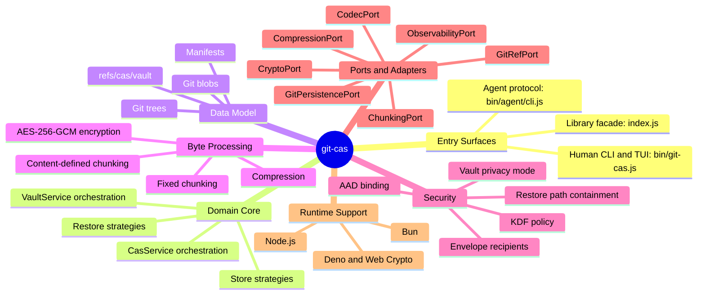

# Domain Dictionary

This project stores and restores bytes, but the code speaks in a precise storage vocabulary. The following terms are the minimum set needed before reading the execution paths.

| Term | Meaning in `git-cas` | Why It Matters |
| :--- | :--- | :--- |
| CAS | Content-addressable storage. Data is addressed by a digest of its content rather than by a mutable filename. | It lets stored bytes be verified and deduplicated. |
| Git object database | The `.git/objects` storage layer used by Git for blobs, trees, and commits. | `git-cas` uses this as the durable storage substrate. |
| Blob | A Git object that stores raw bytes. | Every stored chunk is ultimately written as a Git blob. |
| Tree | A Git object that maps names to blobs or other trees. | `git-cas` publishes a manifest plus chunks as a tree so Git can keep them reachable. |
| Ref | A named pointer inside Git, such as `refs/cas/vault`. | The vault is anchored by a stable ref so Git garbage collection does not discard stored assets. |
| Chunk | A contiguous slice of stored bytes. | Chunking enables deduplication and parallel restore. |
| Fixed chunking | Splitting input into equal-sized chunks, with a smaller final chunk if needed. | It is predictable and simple, but small edits shift all later chunk boundaries. |
| CDC | Content-defined chunking. Boundaries are determined by the byte content using a rolling hash. | It preserves deduplication when bytes are inserted or deleted near the front of a file. |
| Buzhash | The rolling hash algorithm used by the CDC chunker. | It lets the chunker scan for content-defined boundaries without rehashing every window from scratch. |
| Manifest | The structured metadata that describes how to rebuild an asset. | It is the authoritative source of chunk order, digest, encryption, compression, and format metadata. |
| Merkle manifest | A large-manifest layout where a root manifest points to sub-manifest blobs. | It keeps large assets manageable while preserving logical chunk order. |
| Slug | A user-facing logical name for a stored asset, such as `assets/v1`. | Vault operations use slugs to find asset trees. |
| Vault | A Git commit chain rooted at `refs/cas/vault` that maps slugs to asset tree OIDs. | It is the GC-safe index of named assets. |
| OID | A Git object identifier, accepted as 40-hex SHA-1 or 64-hex SHA-256. | All persisted Git objects are referenced by OID. |
| GCM | Galois/Counter Mode, an authenticated encryption mode. | `git-cas` uses AES-256-GCM for confidentiality and integrity. |
| AAD | Additional Authenticated Data. Data authenticated by AES-GCM but not encrypted. | `git-cas` binds ciphertext to slugs and frame indexes so copied ciphertext cannot be silently moved between manifests. |
| DEK | Data encryption key. | Envelope encryption uses a random DEK to encrypt content. |
| KEK | Key encryption key. | Recipient keys wrap and unwrap the DEK. |
| KDF | Key derivation function. | Passphrases become 32-byte AES keys through PBKDF2 or scrypt. |
| Envelope encryption | Encrypting content with a DEK and wrapping that DEK for each recipient. | Recipients can be added or rotated without re-encrypting all data blobs. |
| Convergent encryption | Deterministic per-chunk encryption derived from the plaintext chunk hash. | It preserves deduplication for encrypted CDC stores while exposing content-equality leakage. |
| Port | An abstract dependency interface used by the domain layer. | Ports keep the core runtime-agnostic. |
| Adapter | A concrete implementation of a port. | Adapters isolate Node, Bun, Deno, Git CLI, zlib, and EventEmitter details. |

# Introduction

`git-cas` is a content-addressable storage engine that stores binary artifacts inside Git. Unlike Git LFS, it does not move the bytes to a separate service. It writes chunk blobs directly into Git, records reconstruction metadata in a manifest, publishes a Git tree for reachability, and can index that tree by a human slug through a vault ref.

The project currently presents three user-facing ingress surfaces over one shared core:

| Surface | Entry File | Primary Audience | Contract |
| :--- | :--- | :--- | :--- |
| Library facade | `index.js` | JavaScript and TypeScript callers | Object methods such as `storeFile()`, `createTree()`, `addToVault()`, and `restoreFile()`. |
| Human CLI and TUI | `bin/git-cas.js` | Terminal users and operators | `git-cas store`, `git-cas restore`, `git-cas vault`, `git-cas doctor`, and dashboard commands. |
| Agent CLI | `bin/agent/cli.js` | CI systems and automation agents | JSONL session messages with structured start, result, warning, error, and end events. |

The codebase follows a hexagonal dependency direction. The domain layer does not import Node APIs, Git shelling, zlib, EventEmitter, or runtime globals. It depends on ports. Infrastructure implements those ports. The facade wires everything together.

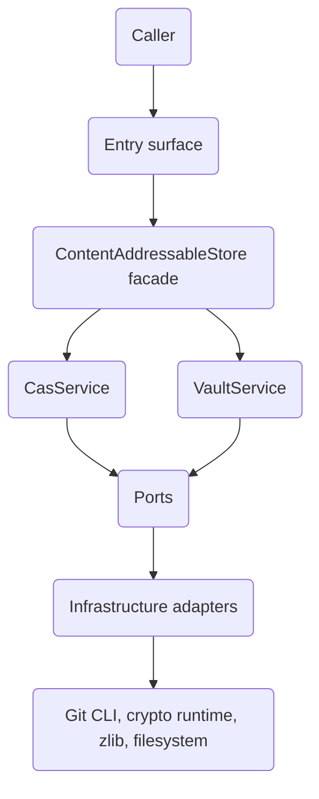

The rest of this document starts at the executable entry points, then progressively descends into storage, byte transforms, encryption, vaulting, failure behavior, and design trade-offs.

# The Entry Point

There are three exact starts depending on how the software is invoked. All three converge on the same domain services.

## Library Entry: `index.js`

For package users, execution starts when an application imports the package and calls a facade factory:

```js
import ContentAddressableStore from '@git-stunts/git-cas';

const cas = await ContentAddressableStore.open({ cwd: '.' });
```

The class `ContentAddressableStore` lives in `index.js`. Its `open()` factory builds Git plumbing for the chosen working directory and returns a facade instance. It does not immediately construct every domain service. The facade lazily initializes the real services through `#getService()` and `#initService()` the first time a method needs them.

The facade is intentionally not the storage engine. Its job is composition:

| Facade Responsibility | Concrete Wiring |
| :--- | :--- |
| Git byte and tree I/O | `GitPersistenceAdapter` |
| Git ref and commit I/O | `GitRefAdapter` |
| Runtime crypto | `createCryptoAdapter()` |
| Manifest codec | `JsonCodec` by default, or `CborCodec` |
| Chunking | `resolveChunker()` or `FixedChunker` |
| Compression | `NodeCompressionAdapter` |
| Observability | `SilentObserver` by default |
| CAS engine | `CasService` |
| Vault engine | `VaultService` |

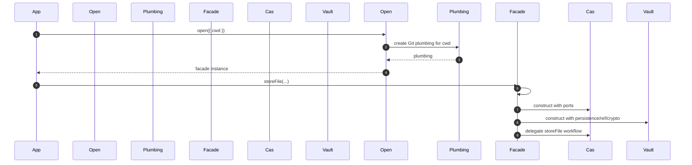

The most important bootstrapping detail is lazy service construction. This lets callers create a facade cheaply, override adapters, and pay runtime discovery only when they perform an operation.

## Human CLI Entry: `bin/git-cas.js`

For terminal users, execution begins at the Node shebang:

```js
#!/usr/bin/env node
```

The CLI imports `commander`, installs broken-pipe handlers, computes its build version, and then checks one special case before registering human commands:

```js
if (process.argv[2] === 'agent') {
  await runAgentCli(process.argv.slice(3));
  await flushStdioAndExit();
}
```

That means `git-cas agent ...` is routed into the machine-facing protocol before the normal Commander command tree is parsed.

For normal human commands, `bin/git-cas.js` builds a Commander program with global `--quiet` and `--json` flags, then registers commands such as `store`, `tree`, `inspect`, `restore`, `verify`, `doctor`, `vault init`, `vault list`, `vault stats`, `vault remove`, `vault info`, `vault history`, `vault rotate`, `vault dashboard`, `rotate`, and `recipient`.

The CLI helper `createCas(cwd, opts)` performs the same composition as the library factory, but from a command context:

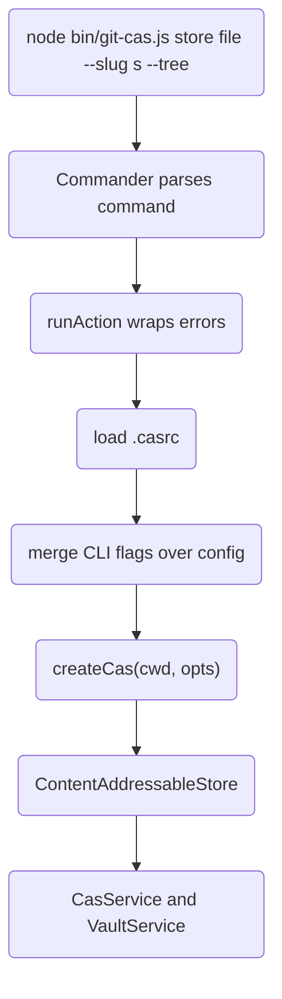

## Agent Entry: `bin/agent/cli.js`

For automation, execution begins either directly through `bin/agent/cli.js` or indirectly through `git-cas agent ...`. The exported `runAgentCli(argv, deps)` function resolves the command name, creates a JSONL protocol session, executes the command, then maps success or failure into structured messages.

The command resolver treats nested nouns specially:

| Input Shape | Resolved Command |
| :--- | :--- |
| No args | `agent` |
| `vault init` | `vault.init` |
| `vault list` | `vault.list` |
| `recipient add` | `recipient.add` |
| `store` | `store` |

The agent session writes rows with a stable protocol name:

```json
{
  "protocol": "git-cas-agent/v1",
  "command": "store",
  "type": "result",
  "seq": 2,
  "ts": "2026-05-25T20:00:00.000Z",
  "data": {
    "slug": "assets/v1",
    "treeOid": "0123456789abcdef0123456789abcdef01234567"
  }
}
```

# Bootstrapping vs. Runtime

Bootstrapping is the phase where the system decides what collaborators exist. Runtime is the phase where a specific asset is stored, restored, verified, or indexed.

| Phase | What Happens | State Source |
| :--- | :--- | :--- |
| Package import | ESM imports are loaded and classes become available. | JavaScript module graph in memory. |
| Facade construction | `ContentAddressableStore` records configuration but may not initialize services yet. | Facade private fields in memory. |
| Service initialization | Ports and adapters are constructed. | Memory, plus runtime detection through globals such as `Bun` and `Deno`. |
| Store runtime | Source bytes are transformed, chunked, hashed, written as blobs, and recorded in a manifest. | Streaming memory plus Git object database. |
| Tree publication runtime | Manifest bytes and chunk references are written into a Git tree. | Git blobs and trees. |
| Vault mutation runtime | Slug-to-tree mapping is committed and `refs/cas/vault` is compare-and-swap updated. | Git commit chain and ref. |
| Restore runtime | Manifest is read, chunks are fetched, integrity is verified, transforms are reversed, and output is emitted. | Git object database, stream buffers, optional output file. |

```mermaid
stateDiagram-v2
    direction LR
    [*] --> "Construct Facade"
    "Construct Facade" --> "Lazy Init Services"
    "Lazy Init Services" --> "Runtime Operation"
    "Runtime Operation" --> "Store"
    "Runtime Operation" --> "Restore"
    "Runtime Operation" --> "Vault Mutation"
    "Runtime Operation" --> "Verify"
    "Store" --> [*]
    "Restore" --> [*]
    "Vault Mutation" --> [*]
    "Verify" --> [*]
```

# The System Model

At the highest level, `git-cas` does four things:

1. It turns input bytes into chunk blobs stored in Git.
2. It records reconstruction instructions in a manifest.
3. It emits a Git tree that keeps the manifest and chunks reachable.
4. It optionally indexes the tree under a slug through `refs/cas/vault`.

The architectural dependency direction is inward:

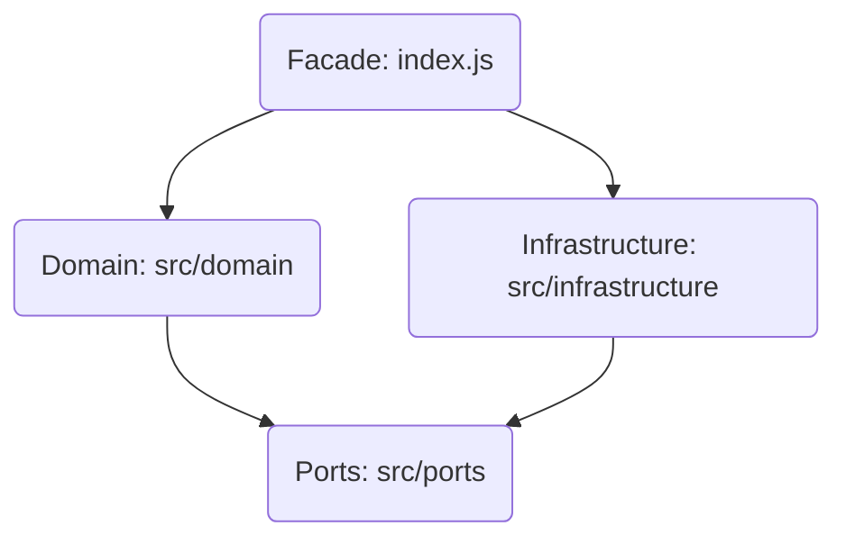

The domain talks in these abstractions:

| Port                 | Responsibility                                                             | Default Adapter                                                 |
| :------------------- | :------------------------------------------------------------------------- | :-------------------------------------------------------------- |
| `CryptoPort`         | SHA-256, random bytes, AES-GCM, HMAC, KDF, deterministic nonce encryption. | `NodeCryptoAdapter`, `BunCryptoAdapter`, or `WebCryptoAdapter`. |
| `GitPersistencePort` | Write/read blobs, write/read trees, stream blob reads.                     | `GitPersistenceAdapter`.                                        |
| `GitRefPort`         | Resolve refs, resolve commit trees, create commits, update refs.           | `GitRefAdapter`.                                                |
| `ChunkingPort`       | Convert an async byte source into chunks.                                  | `FixedChunker` or `CdcChunker`.                                 |
| `CodecPort`          | Encode/decode manifest metadata.                                           | `JsonCodec` or `CborCodec`.                                     |
| `CompressionPort`    | Compress/decompress buffers and streams.                                   | `NodeCompressionAdapter`.                                       |
| `ObservabilityPort`  | Metrics, logs, spans.                                                      | `SilentObserver`, `EventEmitterObserver`, `StatsCollector`.     |

The domain services are cohesive rather than monolithic:

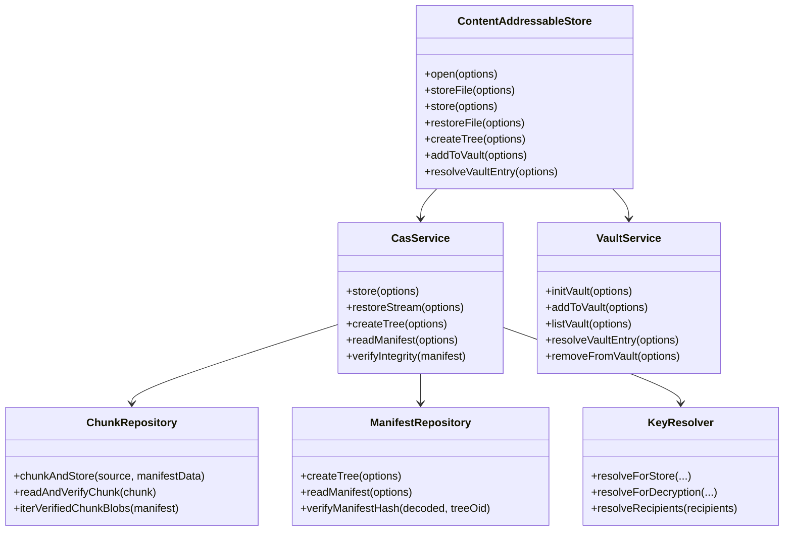

# The Data Source of Truth

The source of truth changes as a payload moves through the system. This is critical: not every intermediate representation is durable.

| Stage | Source of Truth | Durable? | Notes |
| :--- | :--- | :--- | :--- |
| Caller input | File, async iterable, stdin, or generated bytes. | Depends on caller. | `git-cas` has not stored anything yet. |
| Prepared stream | Async iterable in memory. | No. | Compression or encryption may wrap the source. |
| Chunk blob | Git blob object. | Yes, if reachable or retained by Git object database. | Blob reachability is strengthened after tree/vault publication. |
| Manifest object | `Manifest` value object in memory. | No. | It is immutable but not durable until encoded and written. |
| Manifest blob | Git blob named `manifest.json` or `manifest.cbor` in an asset tree. | Yes. | This is the reconstruction authority. |
| Asset tree | Git tree containing manifest and chunk blob entries. | Yes. | The tree keeps the manifest and chunks reachable if referenced. |
| Vault entry | Commit under `refs/cas/vault`. | Yes. | This is the slug-to-tree source of truth. |
| Restore output stream | Async iterable emitted to caller. | No. | Authenticated/verified bytes flow out. |
| Restore file | Filesystem path under caller-approved `baseDirectory`. | Yes, outside Git. | `restoreFile()` enforces path containment. |

The manifest, not the tree layout, is authoritative for reconstruction order. The tree may contain one entry per unique chunk digest, but the manifest records repeated chunks and their exact order.

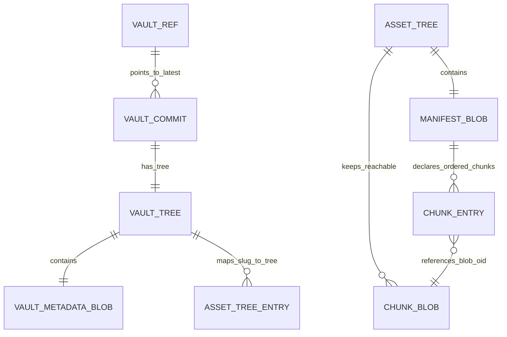

# Golden Path 1: Library Store, Publish, Vault, Restore

The library golden path is the most complete end-to-end flow. It starts with application code and ends with verified restored bytes.

```js
import ContentAddressableStore from '@git-stunts/git-cas';

const cas = await ContentAddressableStore.open({ cwd: '.' });
const manifest = await cas.storeFile({
  filePath: './asset.bin',
  slug: 'assets/v1'
});
const treeOid = await cas.createTree({ manifest });
await cas.addToVault({ slug: 'assets/v1', treeOid });
const readBack = await cas.readManifest({ treeOid });
await cas.restoreFile({
  manifest: readBack,
  outputPath: './asset-restored.bin',
  baseDirectory: process.cwd()
});
```

## Step 1: Open the Facade

`ContentAddressableStore.open({ cwd })` constructs a `@git-stunts/plumbing` instance for the working tree. The state lives in memory as facade configuration. No Git objects are written.

## Step 2: Store the File

`storeFile()` is a file convenience wrapper. It creates a Node read stream, chooses a filename default from `path.basename(filePath)`, and calls `CasService.store()`.

The source of truth at this moment is still the original file. The source stream is just a transient view of it.

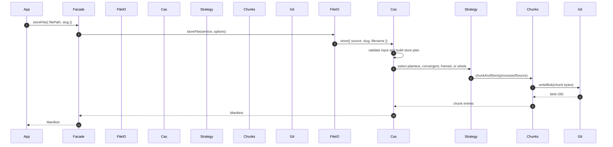

## Step 3: Build the Initial Manifest Data

Before chunking finishes, `CasService` builds mutable manifest data:

```json
{
  "slug": "assets/v1",
  "filename": "asset.bin",
  "formatVersion": "6.0.1",
  "size": 0,
  "chunks": []
}
```

This object is not yet durable and not yet a valid completed manifest. `StorePipeline` appends chunk entries in source order after writes complete.

## Step 4: Chunk and Store

The default chunker is fixed-size chunking with a 256 KiB chunk size. Each chunk is hashed with SHA-256, written to Git as a blob, and appended to the manifest entries.

For a small file, the final manifest may look like this:

```json
{
  "version": 1,
  "formatVersion": "6.0.1",
  "slug": "assets/v1",
  "filename": "asset.bin",
  "size": 27,
  "chunks": [
    {
      "index": 0,
      "size": 27,
      "digest": "4ddf7fd96ffcf749d2f1ee6efb64cc88f94c1f63b65abe8f12f1fdc42180a7d9",
      "blob": "0123456789abcdef0123456789abcdef01234567"
    }
  ]
}
```

The chunk blob is durable after `writeBlob()`, but not yet intentionally reachable through a published asset tree or vault entry. If a later write fails, `StorePipeline` reports orphaned blob metadata so callers can understand partial side effects.

## Step 5: Publish the Tree

`createTree({ manifest })` delegates to `ManifestRepository.createTree()`.

For a normal non-Merkle asset, it:

1. Converts the immutable manifest back to mutable JSON.
2. Computes a `manifestHash` over the hashable encoded manifest.
3. Encodes the manifest as JSON or CBOR.
4. Writes the manifest as a Git blob.
5. Builds tree records for `manifest.<ext>` and the unique chunk blobs.
6. Calls Git `mktree` through the persistence adapter.

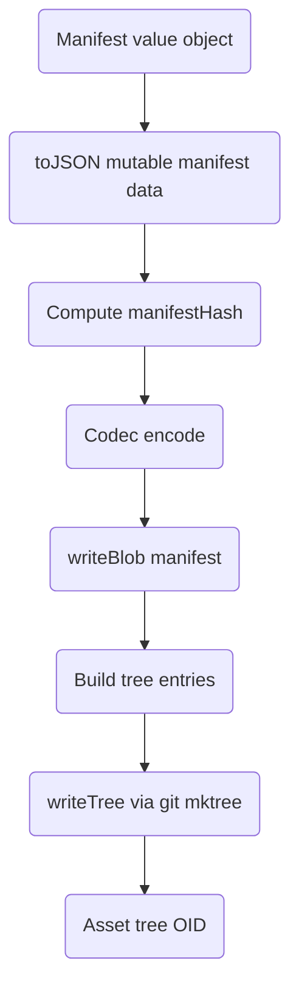

Now the asset tree is durable. Its tree OID can be stored externally, committed elsewhere, or added to the vault.

## Step 6: Add to the Vault

`addToVault({ slug, treeOid })` updates the GC-safe slug index.

The vault is not a database. It is a Git commit chain under `refs/cas/vault`. Each vault commit has a tree containing `.vault.json` and zero or more slug-to-asset tree entries.

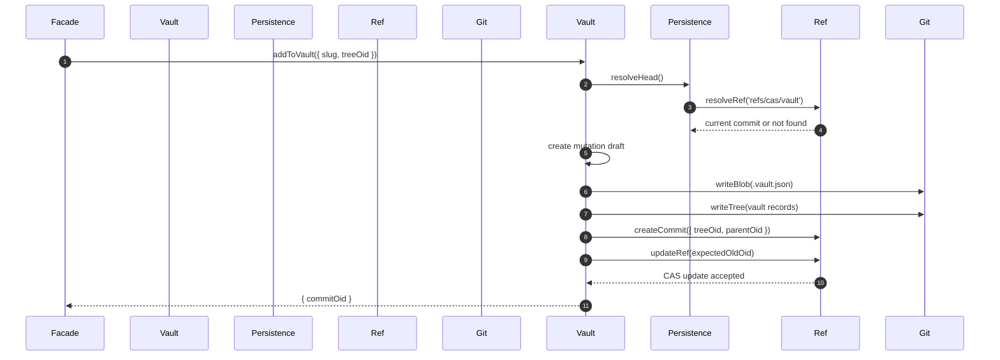

The vault entry is now the durable slug source of truth. Later callers can restore by slug instead of remembering the tree OID.

## Step 7: Read the Manifest

`readManifest({ treeOid })` reads the asset tree, finds `manifest.json` or `manifest.cbor`, decodes it, verifies `manifestHash` if present, rejects legacy encryption schemes in normal mode, resolves Merkle sub-manifests if needed, and constructs an immutable `Manifest`.

## Step 8: Restore the File

`restoreFile()` first requires a `baseDirectory`. It resolves the requested output path against that boundary, canonicalizes symlinks in existing path components, and rejects output paths that escape the base directory.

After path approval, it asks `CasService.createFileRestorePlan()` whether the restore can stream directly or must use a bounded temporary-file path.

For normal plaintext uncompressed data, restore is a stream:

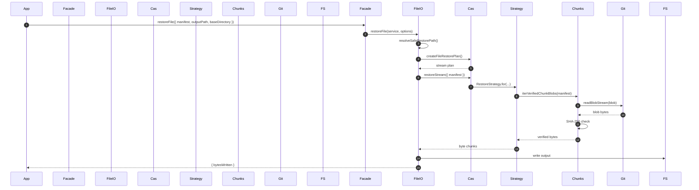

# Golden Path 2: Human CLI Store and Restore

The human CLI golden path wraps the same facade with parsing, config merging, progress UI, and structured error output.

```bash
git-cas store data.bin --slug assets/v1 --tree
git-cas restore --slug assets/v1 --out data-restored.bin
```

## Store Command

When a user runs `git-cas store`, Commander parses the file positional and flags. The command then:

1. Warns if an inline passphrase flag was used.
2. Validates mutually exclusive credential sources.
3. Requires `--force` to be paired with `--tree`.
4. Loads `.casrc` from the working directory if present.
5. Merges CLI flags over config defaults.
6. Constructs `ContentAddressableStore` with an `EventEmitterObserver`.
7. Resolves key or recipient inputs.
8. Attaches a progress renderer to observability events.
9. Calls `cas.storeFile()`.
10. If `--tree` is set, calls `createTree()` and `addToVault()`.
11. Writes either a JSON payload or a plain tree OID.

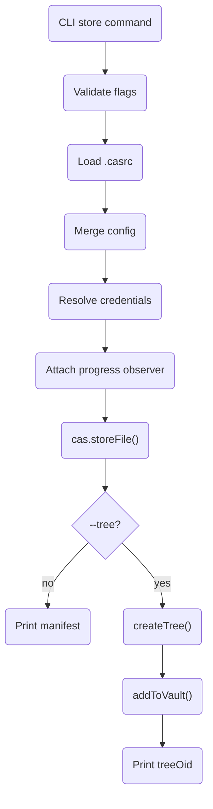

The state of truth follows the same storage model as the library path. The CLI does not maintain a separate database. It is command orchestration over the same facade.

## Restore Command

When a user runs `git-cas restore`, the CLI:

1. Validates that exactly one of `--slug` or `--oid` was provided.
2. Creates the facade.
3. Resolves the tree OID from the vault if a slug was used.
4. Reads the manifest.
5. Resolves the encryption key if needed.
6. Resolves the output target into an absolute output path and containing base directory.
7. Calls `restoreFile()`.
8. Prints `bytesWritten`.

The CLI restore path intentionally passes the output file's directory as the restore boundary. Library callers can choose a broader boundary such as a job workspace or tenant directory.

# Golden Path 3: Agent JSONL Automation

The agent CLI exists for automation that needs structured status instead of human prose. Its protocol is line-oriented JSON. That lets CI systems and agent runtimes consume progress and errors incrementally.

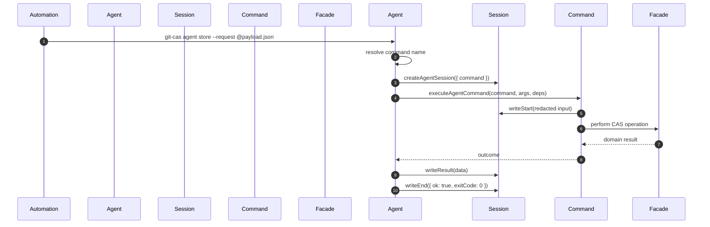

Agent errors are normalized with a stable code, retryability, optional documentation URL, optional hint, and metadata. `INTEGRITY_ERROR` maps to the verification-failed exit code. Invalid input and needs-input branches map to the invalid-input exit code.

```json
{
  "protocol": "git-cas-agent/v1",
  "command": "restore",
  "type": "error",
  "seq": 3,
  "ts": "2026-05-25T20:00:00.000Z",
  "data": {
    "code": "MISSING_KEY",
    "message": "Encryption key required to restore encrypted content",
    "retryable": false,
    "hint": "Provide --key-file, --vault-passphrase, --vault-passphrase-file, or --os-keychain-target"
  }
}
```

# Store Pipeline Internals

`CasService.store()` is the core store entry. It does not publish a Git tree and does not mutate the vault. It returns a manifest value object.

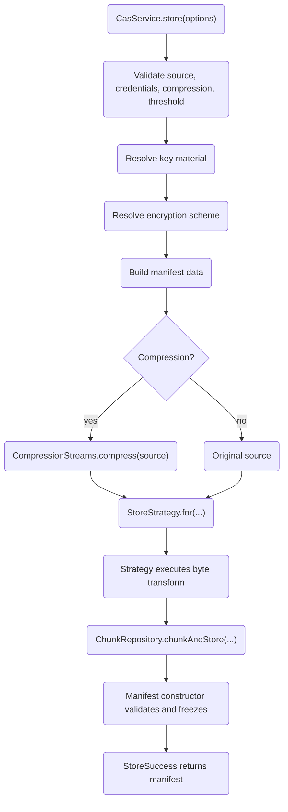

## Validation

The first state is side-effect free. `CasService` verifies that the source is async-iterable, encryption key and passphrase are not both present, recipients are not mixed with direct key/passphrase input, compression is supported, and the Merkle threshold is valid.

This matters because no Git object should be written for obviously malformed requests.

## Key Resolution

`KeyResolver` owns key policy:

| Input | Result |
| :--- | :--- |
| No key, no passphrase, no recipients | Plaintext store. |
| Raw `encryptionKey` | Direct AES key after 32-byte validation. |
| `passphrase` | Derived 32-byte key plus KDF metadata. |
| `recipients` | Random DEK plus wrapped DEK entries for each recipient. |

For passphrases, KDF parameters are normalized and checked against policy before deriving. PBKDF2 defaults to 600,000 SHA-512 iterations. scrypt defaults to `N=131072`, `r=8`, `p=1`, with policy bounds.

## Scheme Resolution

`StoreEncryptionConfig` decides how encryption enters the byte pipeline.

| Condition | Scheme |
| :--- | :--- |
| No key material | No encryption. |
| Explicit `whole` | Whole-object AES-GCM. |
| Explicit `framed` | Framed AES-GCM. |
| Explicit `convergent` | Per-chunk deterministic encryption. |
| CDC plus encryption, no explicit opt-out | `convergent`. |
| Fixed chunking plus encryption | `framed`. |

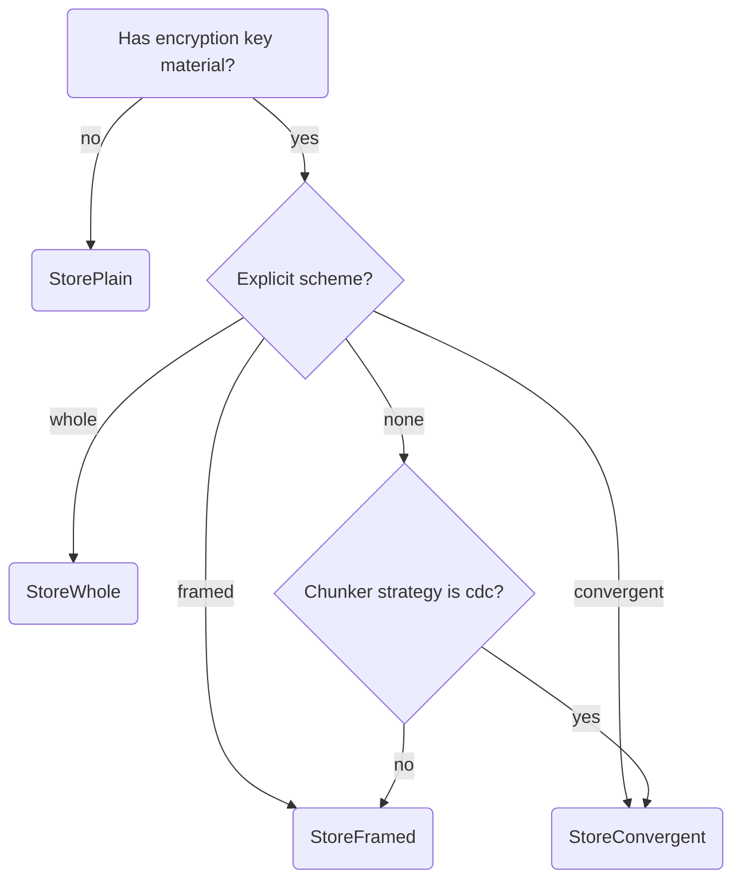

The notable design choice is the CDC default. Normal encryption makes ciphertext pseudorandom, which destroys CDC deduplication. Convergent encryption preserves deduplication by encrypting each chunk deterministically from its plaintext digest. That trades confidentiality of content equality for storage efficiency.

## Plain Store

`StorePlain` passes the prepared source directly to `ChunkRepository.chunkAndStore()`.

The chunk repository hashes the plaintext chunk, writes the plaintext chunk as a Git blob, and records:

```json
{
  "index": 0,
  "size": 262144,
  "digest": "64-char-sha256-of-stored-bytes",
  "blob": "40-or-64-char-git-oid"
}
```

## Framed Store

`StoreFramed` encrypts frames before chunking. Each plaintext frame becomes a serialized record:

```text
[4-byte ciphertext length][12-byte nonce][16-byte tag][ciphertext]
```

The record stream is then chunked and written. The manifest records `scheme: "framed"` and `frameBytes`.

Framed AAD is:

```text
UTF-8(slug) || 0x00 || uint32_be(frameIndex)
```

This binds each frame to both the manifest slug and the frame position.

## Whole Store

`StoreWhole` creates an AES-GCM encryption stream around the entire prepared source. The encrypted stream is chunked afterward. The manifest stores one nonce and one tag for the whole ciphertext.

Whole encryption has a clean authentication model, but restore must respect the whole-object authentication boundary. For file restore, the implementation uses a bounded temporary-file strategy where needed so partial unauthenticated output is not published as final output.

## Convergent Store

`StoreConvergent` chunks first, then encrypts each plaintext chunk after calculating its plaintext digest.

For each chunk:

```text
chunkKey = HMAC-SHA256(masterKey, "git-cas-convergent-key:<digest>")[0..31]
chunkNonce = HMAC-SHA256(masterKey, "git-cas-convergent-nonce:<digest>")[0..11]
blob = AES-256-GCM(plaintext, chunkKey, chunkNonce).ciphertext || tag
```

The manifest chunk digest remains the plaintext digest. During restore, the expected digest is used to derive the same key and nonce, decrypt the blob, and verify the plaintext digest.

# Restore Pipeline Internals

`CasService.restoreStream()` is the streaming restore core. `restore()` materializes that stream into memory. `restoreFile()` writes it to disk after path safety checks and strategy planning.

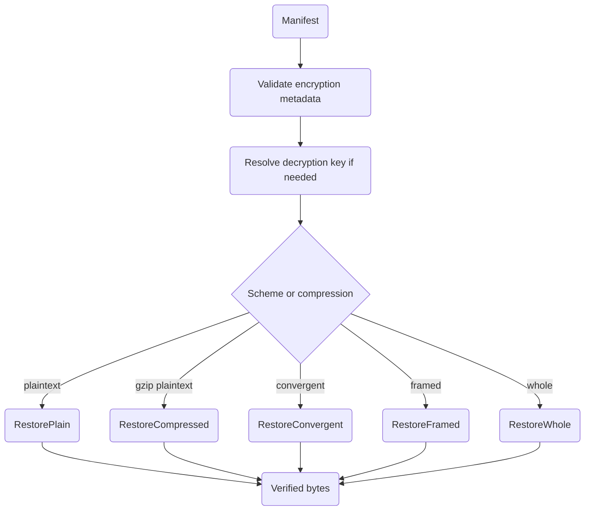

## Restore Plan Selection

`RestoreStrategy.for()` dispatches by encryption metadata first, then compression:

| Manifest Shape | Restore Strategy |
| :--- | :--- |
| `encryption.scheme === "convergent"` | `RestoreConvergent` |
| `encryption.scheme === "framed"` | `RestoreFramed` |
| `encryption.scheme === "whole"` | `RestoreWhole` |
| No encryption, compression present | `RestoreCompressed` |
| No encryption, no compression | `RestorePlain` |

## Plain Restore

`RestorePlain` iterates `ChunkRepository.iterVerifiedChunkBlobs(manifest)`. Every chunk is fetched from Git, hashed, compared against the manifest digest, and only then yielded.

The manifest is the source of ordering truth, so repeated chunks are emitted multiple times even if their blob OID appears once in the tree.

## Compressed Restore

`RestoreCompressed` verifies stored chunk bytes, then streams them through the compression port's decompressor. For gzip on Node, this uses `node:zlib` streaming APIs.

If decompression fails, `CompressionStreams` normalizes the failure into a domain error.

## Framed Restore

`RestoreFramed` first verifies chunk digests over the serialized encrypted record stream. Then `FramedRecordCodec` parses records, reconstructs AES-GCM metadata from each record header, rebuilds the AAD for the slug and frame index, decrypts, and yields plaintext frames.

This means framed restore can authenticate and emit incrementally. It is the preferred encrypted streaming mode for large assets.

## Whole Restore

`RestoreWhole` preserves a single authentication boundary. It may stream decryption through a runtime crypto adapter, but the authentication tag is only final after the complete ciphertext is processed. Buffered whole restore paths enforce `maxRestoreBufferSize`.

If the manifest is compressed and whole-encrypted, restore decrypts the bounded ciphertext first, then decompresses.

## Convergent Restore

`RestoreConvergent` asks `ChunkRepository.iterConvergentChunks(manifest, key)` for plaintext chunks. Each chunk decrypts independently. The tag is stored at the end of each blob, while key and nonce are derived from the expected plaintext digest.

This is both a performance and integrity design: a corrupted chunk fails locally without waiting for the entire asset.

# Anatomy of Payloads

This section shows the shapes that cross module boundaries.

## Store Options

Library callers pass a store request like:

```json
{
  "filePath": "./asset.bin",
  "slug": "assets/v1",
  "chunking": {
    "strategy": "cdc",
    "targetChunkSize": 65536,
    "minChunkSize": 16384,
    "maxChunkSize": 262144
  },
  "compression": {
    "algorithm": "gzip"
  },
  "encryption": {
    "scheme": "convergent"
  }
}
```

At runtime, key material fields such as `encryptionKey`, `passphrase`, and recipient keys are `Uint8Array` or strings, not JSON-safe values. They must not be logged. `RedactingObservability` exists to reduce accidental secret exposure in observability payloads.

## Manifest

The manifest is validated by `ManifestSchema` and wrapped by the immutable `Manifest` value object.

```json
{
  "version": 1,
  "formatVersion": "6.0.1",
  "manifestHash": "64-char-sha256-of-hashable-manifest",
  "slug": "assets/v1",
  "filename": "asset.bin",
  "size": 524288,
  "chunking": {
    "strategy": "cdc",
    "params": {
      "target": 65536,
      "min": 16384,
      "max": 262144,
      "normalized": true
    }
  },
  "compression": {
    "algorithm": "gzip"
  },
  "encryption": {
    "scheme": "convergent",
    "algorithm": "aes-256-gcm",
    "encrypted": true,
    "kdf": {
      "algorithm": "pbkdf2",
      "salt": "base64-salt",
      "iterations": 600000,
      "keyLength": 32
    }
  },
  "chunks": [
    {
      "index": 0,
      "size": 65536,
      "digest": "64-char-sha256",
      "blob": "40-or-64-char-git-oid"
    }
  ]
}
```

## Framed Encrypted Manifest Metadata

```json
{
  "scheme": "framed",
  "algorithm": "aes-256-gcm",
  "encrypted": true,
  "frameBytes": 65536
}
```

Framed metadata must not contain top-level `nonce` or `tag`, because each record carries its own nonce and tag.

## Whole Encrypted Manifest Metadata

```json
{
  "scheme": "whole",
  "algorithm": "aes-256-gcm",
  "encrypted": true,
  "nonce": "12-byte-base64-nonce",
  "tag": "16-byte-base64-tag"
}
```

Whole metadata has one nonce and one tag for the entire encrypted payload.

## Envelope Recipient Entry

```json
{
  "label": "alice",
  "wrappedDek": "32-byte-base64-ciphertext",
  "nonce": "12-byte-base64-nonce",
  "tag": "16-byte-base64-tag"
}
```

The recipient key unwraps the DEK. The DEK decrypts the asset. Adding a recipient rewrites metadata, not the data blobs.

## Vault Metadata

Plain vault metadata is minimal:

```json
{
  "version": 1
}
```

Encrypted vault metadata adds KDF and verifier information:

```json
{
  "version": 1,
  "encryption": {
    "cipher": "aes-256-gcm",
    "kdf": {
      "algorithm": "pbkdf2",
      "salt": "base64-salt",
      "iterations": 600000,
      "keyLength": 32
    },
    "verifier": {
      "version": 1,
      "ciphertext": "base64-ciphertext",
      "meta": {
        "scheme": "whole",
        "algorithm": "aes-256-gcm",
        "nonce": "base64-nonce",
        "tag": "base64-tag",
        "encrypted": true
      }
    }
  },
  "encryptionCount": 42
}
```

Privacy-enabled vaults also store `privacy.enabled` and `privacy.indexMeta`, plus an encrypted `.privacy-index` blob.

## Agent JSONL Row

```json
{
  "protocol": "git-cas-agent/v1",
  "command": "doctor",
  "type": "result",
  "seq": 2,
  "ts": "2026-05-25T20:00:00.000Z",
  "data": {
    "status": "ok",
    "hasVault": true,
    "entryCount": 0
  }
}
```

# Concurrency and Asynchronous Flows

The project uses async iterables as its byte-stream contract. This works across Node streams, generated byte sources, compression streams, encryption streams, and Git blob streams.

## Store-Side Concurrency

`StorePipeline` coordinates chunk writes with a semaphore. It acquires capacity before pulling the next chunk, which applies backpressure all the way upstream. That is important for large files: the source stream should not be consumed faster than Git blob writes can finish.

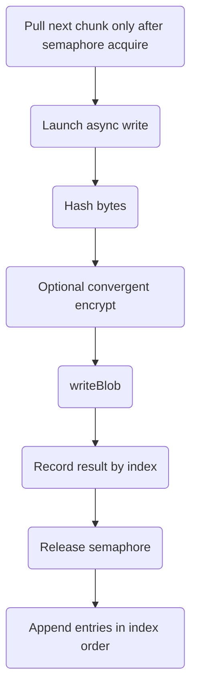

The write tasks may finish out of order, but the manifest entries are appended by chunk index. This preserves deterministic reconstruction order while still allowing parallel Git writes.

If a source read fails, the pipeline closes the async iterator and reports `STREAM_ERROR`. If a write fails, it reports `STORE_ERROR` with `failedIndex`, `chunksDispatched`, and `orphanedBlobs`.

## Restore-Side Prefetch

`PrefetchWindow` reads ahead with a sliding window but yields chunks in manifest order.

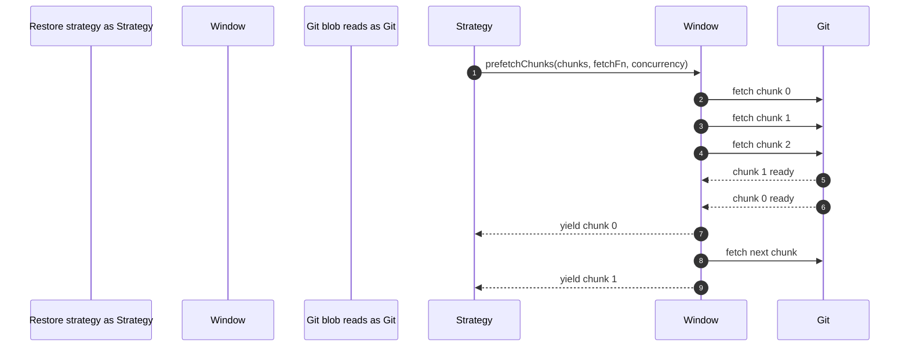

The benefit is higher I/O throughput without unbounded memory growth or reordering.

## Vault Mutation Concurrency

Vault writes use optimistic concurrency. `VaultPersistence` updates `refs/cas/vault` with an expected old OID. If another process changed the ref first, the update is classified as `VAULT_CONFLICT`. `VaultService` retries through `VaultMutationRetryPolicy` with exponential backoff and jitter.

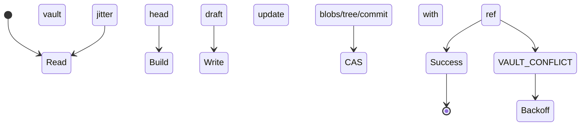

# Security Boundaries and Auth Flows

`git-cas` is not an authorization system. It does not decide who may read a repository. Instead, it provides confidentiality and integrity boundaries for stored content when encryption is used, and it validates restore paths and metadata before trusting repository-controlled bytes.

## AES-GCM Boundaries

All current encryption schemes use AES-256-GCM.

| Scheme | Authentication Boundary | Nonce Source | AAD |
| :--- | :--- | :--- | :--- |
| `whole` | Entire payload | Random 96-bit nonce | UTF-8 slug |
| `framed` | One frame record | Random 96-bit nonce per frame | UTF-8 slug, NUL, frame index |
| `convergent` | One chunk blob | HMAC-derived deterministic nonce | No external AAD; digest-derived key and nonce bind to plaintext digest |

Legacy scheme identifiers such as `whole-v1`, `whole-v2`, `framed-v1`, `framed-v2`, and `convergent-v1` are rejected during manifest read in normal mode with `LEGACY_SCHEME`.

## Passphrase Flow

```mermaid
sequenceDiagram
    autonumber
    participant Caller as Caller
    participant KeyResolver as Resolver
    participant kdfPolicy as Policy
    participant CryptoPort as Crypto
    participant Manifest as Manifest

    Caller->>Resolver: passphrase + kdfOptions
    Resolver->>Policy: prepareKdfOptions()
    Policy-->>Resolver: bounded params
    Resolver->>Crypto: deriveKey(passphrase, params)
    Crypto-->>Resolver: 32-byte key + salt + stored params
    Resolver-->>Manifest: encryption.kdf metadata
```

Stored KDF metadata is validated before derivation during restore. That prevents repository-controlled manifests from forcing extreme KDF costs or malformed salts.

## Envelope Recipient Flow

Envelope encryption separates data encryption from recipient access:

1. Generate a random DEK.
2. Encrypt content with the DEK.
3. Encrypt the DEK once per recipient using that recipient's KEK.
4. Store recipient labels and wrapped DEK metadata in the manifest.

On restore, `KeyResolver` attempts each recipient entry and uses the first successfully unwrapped DEK. It iterates all recipients rather than immediately exposing which entry matched.

## Vault Key Verification

Encrypted vaults store a small AES-GCM verifier in `.vault.json`. When a caller supplies a vault key, `VaultKeyVerifier` decrypts the verifier with fixed AAD and compares the plaintext with a constant-time byte comparison.

This closes an important ambiguity: without a verifier, an empty encrypted vault cannot distinguish "correct key, no entries" from "wrong key, no decryptable privacy index yet."

## Restore Path Boundary

`restoreFile()` requires `baseDirectory`. It resolves the output path under that directory, canonicalizes symlinks in existing path prefixes, and rejects paths that escape the boundary.

```mermaid
flowchart TD
    A("restoreFile outputPath + baseDirectory") --> B("path.resolve(base, output)")
    B --> C("realpath(base)")
    C --> D("canonicalize existing target prefix")
    D --> E{"target inside base?"}
    E -->|"yes"| F("write stream or temp file")
    E -->|"no"| G("SECURITY_BOUNDARY_VIOLATION")
```

## Observability Redaction

`CasService` and `VaultService` wrap observer instances with `RedactingObservability`. This protects common sensitive fields from being emitted accidentally through metrics or logs.

This is not a replacement for careful API design. It is a defense-in-depth layer around observability.

# External Dependencies and Borders

The clean boundary question is: where does `git-cas` code end and someone else's code begin?

| Dependency | Boundary | Used For |
| :--- | :--- | :--- |
| Git CLI | `@git-stunts/plumbing` through Git adapters | `hash-object`, `cat-file`, `mktree`, `ls-tree`, `rev-parse`, `commit-tree`, `update-ref`. |
| `@git-stunts/plumbing` | Infrastructure factory and adapters | Runtime shell execution and stream execution. |
| `@git-stunts/alfred` | Adapter policy | Timeout policy around Git I/O. |
| Node `crypto` | `NodeCryptoAdapter` | SHA-256, random bytes, AES-GCM, PBKDF2, scrypt, HMAC. |
| Web Crypto | `WebCryptoAdapter` | Deno-compatible crypto, with one-shot AES-GCM constraints. |
| Node `zlib` | `NodeCompressionAdapter` | gzip and gunzip buffers/streams. |
| `commander` | `bin/git-cas.js` | Human CLI argument parsing. |
| `zod` | Manifest schemas | Manifest and chunk validation. |
| `cbor-x` | `CborCodec` | Compact binary manifest encoding. |
| `@git-stunts/vault` | Passphrase source helper | OS keychain lookup for passphrase sources. |
| `@flyingrobots/bijou*` | UI rendering | CLI/TUI visual surfaces. |

The domain should not import these directly. The Graft structural map confirms the domain is organized around services, strategies, value objects, schemas, and ports, while runtime dependencies live in infrastructure and CLI modules.

# Configuration and Environment Tuning

`git-cas` behavior changes through constructor options, CLI flags, `.casrc`, environment variables, and runtime detection.

## Facade and Service Options

| Option | Default | Effect |
| :--- | :--- | :--- |
| `chunkSize` | `256 * 1024` | Fixed chunk size when using `FixedChunker`. |
| `chunking.strategy` | `fixed` | Selects fixed or CDC chunking. |
| `merkleThreshold` | `1000` | Chunk count above which `createTree()` writes Merkle sub-manifests. |
| `concurrency` | `1` | Maximum parallel chunk writes and restore prefetch reads. |
| `maxRestoreBufferSize` | `512 MiB` | Maximum buffered encrypted/compressed restore. |
| `maxBlobSize` | `10 MiB` | Maximum metadata blob read size for manifests/sub-manifests by default. |
| `codec` | JSON | Manifest encoding. |
| `compressionAdapter` | Node gzip adapter | Compression implementation. |
| `crypto` | Auto-detected | Runtime crypto backend. |

Increasing `concurrency` improves throughput when Git I/O latency dominates, but it increases in-flight memory and concurrent Git subprocess pressure. Increasing `maxRestoreBufferSize` allows larger whole-object encrypted restores, but raises worst-case memory use.

## `.casrc`

The human CLI loads `.casrc` from the working directory. CLI flags override config values.

```json
{
  "strategy": "cdc",
  "concurrency": 4,
  "compression": "gzip",
  "merkleThreshold": 500,
  "maxRestoreBufferSize": 268435456,
  "cdc": {
    "minChunkSize": 16384,
    "targetChunkSize": 65536,
    "maxChunkSize": 262144
  }
}
```

The config parser validates integer ranges, enum values, CDC ordering, and maximum chunk sizes before it constructs the facade.

## Environment Variables

| Environment Variable | Used By | Effect |
| :--- | :--- | :--- |
| `GIT_CAS_PASSPHRASE` | Human CLI passphrase resolution | Supplies a vault passphrase when no explicit file, inline, or OS keychain source is provided. |

Inline passphrase flags are accepted but warned against because shell history and process listings may expose secrets.

## Runtime Detection

`createCryptoAdapter()` selects crypto by runtime globals:

```mermaid
flowchart TD
    A("createCryptoAdapter()") --> B{"globalThis.Bun?"}
    B -->|"yes"| C("BunCryptoAdapter")
    B -->|"no"| D{"globalThis.Deno?"}
    D -->|"yes"| E("WebCryptoAdapter")
    D -->|"no"| F("NodeCryptoAdapter")
```

Web Crypto AES-GCM is one-shot, so the Web Crypto adapter buffers streaming encryption and decryption up to configured limits. This is why framed encryption is important for large encrypted restore workflows across runtimes.

# Unhappy Paths and Error Handling

Systems are defined by how they fail. `git-cas` uses structured domain errors with stable codes so CLI, agent, and library callers can react predictably.

```mermaid
flowchart TD
    A("Operation") --> B{"Validation error?"}
    B -->|"yes"| C("INVALID_OPTIONS or INVALID_INPUT")
    B -->|"no"| D{"Missing object or ref?"}
    D -->|"yes"| E("MANIFEST_NOT_FOUND, GIT_REF_NOT_FOUND, VAULT_ENTRY_NOT_FOUND")
    D -->|"no"| F{"Integrity/auth failure?"}
    F -->|"yes"| G("INTEGRITY_ERROR or MANIFEST_INTEGRITY_ERROR")
    F -->|"no"| H{"Resource boundary exceeded?"}
    H -->|"yes"| I("RESTORE_TOO_LARGE or capability error")
    H -->|"no"| J{"Vault CAS conflict?"}
    J -->|"yes"| K("VAULT_CONFLICT retry")
    J -->|"no"| L("GIT_ERROR or domain-specific failure")
```

## Malformed Store Request

If the source is not async-iterable, credentials are mutually exclusive, compression is unsupported, or chunking options are invalid, store fails before writing Git objects.

## Stream Failure During Store

If the source iterator throws after some chunks were written, `StorePipeline` reports `STREAM_ERROR` with how many chunks were dispatched and which blob OIDs may have been orphaned.

## Git Blob Write Failure

If a chunk write fails, `StorePipeline` reports `STORE_ERROR` and includes `failedIndex`, `chunksDispatched`, and `orphanedBlobs` where available.

## Legacy Manifest Scheme

If `readManifest()` sees a legacy scheme such as `whole-v1`, normal mode throws `LEGACY_SCHEME` and points operators to the migration script. This failure happens before restore begins.

## Wrong Decryption Key

Wrong direct keys, passphrases, or recipient keys fail as authentication or recipient errors. CLI and agent surfaces add hints such as "Check that the correct key or passphrase was used."

## Corrupt Chunk Blob

For non-convergent chunks, the stored blob is hashed and compared to the manifest digest. A mismatch fails with `INTEGRITY_ERROR`.

For convergent chunks, decryption happens with key and nonce derived from the expected digest, then the plaintext digest is checked. Either bad tag or bad digest fails.

## Malformed Framed Ciphertext

If a frame header is truncated, the record length exceeds `frameBytes`, or AES-GCM authentication fails, restore fails with `INTEGRITY_ERROR`.

## Restore Too Large

Whole encrypted or buffered compression paths enforce `maxRestoreBufferSize`. Metadata blob reads enforce `maxBlobSize`. Persistence adapters used for bounded buffered restore must provide `readBlobStream()` so limits can be enforced during reads.

## Path Escape Attempt

`restoreFile()` rejects output paths that escape `baseDirectory`, including through existing symlinked path components. It fails before publishing output.

## Vault Conflict

Concurrent vault writers may race on `refs/cas/vault`. CAS mismatch becomes `VAULT_CONFLICT`, which `VaultService` retries according to `VaultMutationRetryPolicy`. Permission errors or unrelated ref failures are not treated as retryable conflicts.

## Privacy Index Corruption

Privacy-enabled vault listings fail closed if `.privacy-index` is missing, metadata is missing, or decrypted index entries do not cover all HMAC-named tree entries. Returning a partial listing would hide corruption, so the service refuses.

# Trade-Offs: Why It Is Built This Way

| Decision | Benefit | Cost |
| :--- | :--- | :--- |
| Use Git as the storage substrate | Inherits Git replication, offline workflows, object integrity, and existing transport. | Depends on Git object model and, in the default adapter, the Git CLI. |
| Keep domain behind ports | Supports Node, Bun, and Deno crypto differences without rewriting domain logic. | More classes and explicit wiring than a single script. |
| Manifest as source of truth | Repeated chunks and order are precise and independent of tree layout. | Restore must trust and validate manifest metadata carefully. |
| Tree publication separate from `store()` | Callers can inspect, diff, or discard manifests before publishing. | A store alone leaves blob side effects that are not automatically indexed. |
| Vault as Git commit chain | GC-safe, inspectable, mergeable history with optimistic concurrency. | It is not a low-latency database and requires ref update discipline. |
| CDC chunking | Better dedupe across shifted content. | More CPU and more complex chunk boundary logic. |
| Convergent encryption for encrypted CDC | Preserves dedupe for encrypted chunks. | Reveals equality of known plaintext chunks under the same master key. |
| Framed encryption default for fixed encrypted stores | Streaming authenticated restore without whole-file buffering. | Per-frame overhead of length, nonce, and tag. |
| Whole encryption retained | Simple whole-object authentication and compatibility path. | Bounded buffering constraints for some restore modes. |
| Strict legacy scheme rejection | Avoids silently accepting weaker or ambiguous formats. | Requires migration before old encrypted manifests restore normally. |
| Restore path `baseDirectory` required | Prevents accidental or malicious path escape. | Library callers must be explicit. |
| Agent JSONL protocol | Automation can parse structured progress and errors. | Maintains a second command contract beside the human CLI. |

# Testing and Verification Posture

The repository treats tests as executable specification. The package scripts include unit tests, integration tests, multi-runtime Docker-based tests, linting, release verification, and platform checks.

Graft's structural/reference coverage pass for `src/domain/services` against `test/unit` reported:

| Metric | Value |
| :--- | ---: |
| Source files scanned | 25 |
| Test files scanned | 188 |
| Exported symbols | 63 |
| Structurally referenced exported symbols | 38 |
| Unreferenced exported symbols | 25 |

This is not execution coverage. It is a structural signal. Imports or mentions can count as references, and missing references are review prompts rather than proof of missing behavior.

The notable finding from that pass is that most uncovered exports are declaration interfaces or constants. `ConvergentEncryption` had no direct structural test reference, while convergent behavior is exercised through `CasService` tests. That is an architectural test choice: the behavior is covered through the public service surface, but a direct service-level test could improve localization if convergent derivation regresses.

The repo's own documentation states that full release verification recently passed 12 out of 12 steps with 5,383 observed tests. The current end-of-turn project checklist still requires `npm test` and `npx eslint .` after file changes.

# Current Repository Vault Snapshot

The current working repository also has a git-cas vault. This is a useful dogfood fact when reading the code.

At inspection time:

| Observation | Value |
| :--- | :--- |
| Vault ref | `refs/cas/vault` |
| Current vault commit | `a9fed4ba3ad5389fc0fb799780642cb64741ae4e` |
| Health | `ok` |
| Entry count | `0` |
| Metadata encrypted | `false` |
| Current `.vault.json` | `{ "version": 1 }` |

The recent vault history shows test entries were added and removed:

```text
a9fed4b vault: remove test/vault-entry
5420a7e vault: remove test/hello
37b73a8 vault: add test/vault-entry
2053e29 vault: init
f3d06c3 vault: add test/hello
```

This means the vault structure is present and healthy, but there are no currently indexed assets.

# Reading Map

For a new maintainer, the best progressive reading order is:

| Goal | Files |
| :--- | :--- |
| Understand the product promise | `README.md`, `GUIDE.md`, `docs/WALKTHROUGH.md` |
| Understand architecture | `ARCHITECTURE.md`, `docs/STORE_RESTORE_PIPELINE.md`, `docs/VAULT_INTERNALS.md` |
| Understand entry points | `index.js`, `bin/git-cas.js`, `bin/agent/cli.js` |
| Understand storage runtime | `src/domain/services/CasService.js`, `src/domain/services/ChunkRepository.js`, `src/domain/services/ManifestRepository.js` |
| Understand store/restore strategy | `src/domain/strategies/Store*.js`, `src/domain/strategies/Restore*.js`, `src/domain/strategies/FramedRecordCodec.js` |
| Understand encryption policy | `src/domain/encryption/schemes.js`, `src/domain/value-objects/EncryptionMetadata.js`, `src/domain/value-objects/StoreEncryptionConfig.js`, `src/domain/services/KeyResolver.js` |
| Understand vaults | `src/domain/services/VaultService.js`, `VaultPersistence.js`, `VaultTreeCodec.js`, `VaultMetadataCodec.js`, `VaultPrivacyIndex.js`, `VaultStateCache.js`, `VaultKeyVerifier.js` |
| Understand runtime borders | `src/ports/*.js`, `src/infrastructure/adapters/*.js`, `src/infrastructure/chunkers/*.js`, `src/infrastructure/codecs/*.js` |

The shortest mental model is this: `ContentAddressableStore` wires the runtime, `CasService` moves and verifies bytes, `ManifestRepository` publishes and reads reconstruction metadata, `VaultService` maintains the slug index, and Git is the durable substrate underneath all of it.
