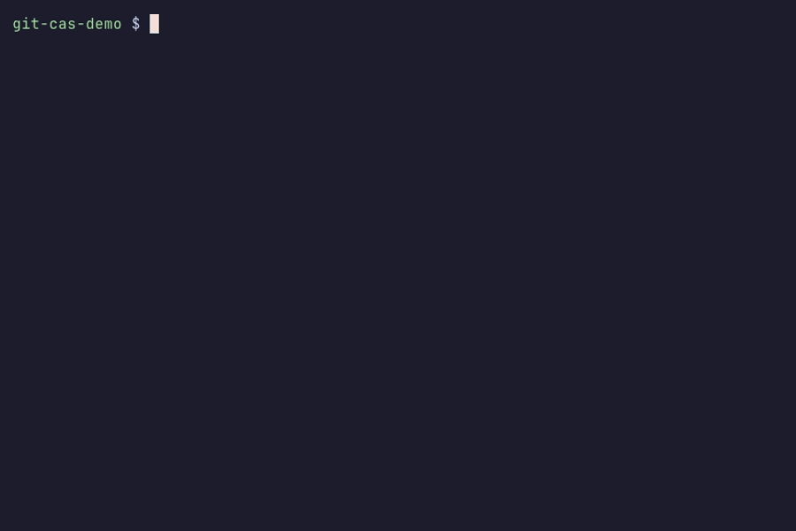
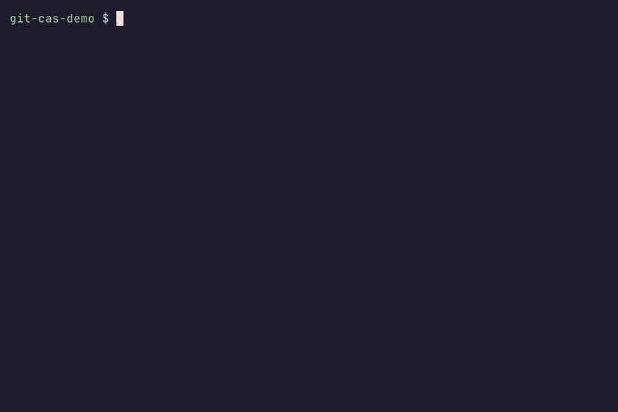

# git-cas: The Complete Guide

A progressive guide to content-addressed storage backed by Git. Every section
builds on the same running example -- storing, managing, and restoring a photo
called `vacation.jpg` under the slug `photos/vacation` -- so you can follow
along from first principles to full mastery.

This is the long-form walkthrough. For the current public API surface and the
canonical architecture and security guidance, see [README.md](../README.md),
[API.md](./API.md), [ARCHITECTURE.md](../ARCHITECTURE.md), [SECURITY.md](../SECURITY.md),
and [THREAT_MODEL.md](./THREAT_MODEL.md).

---

## Table of Contents

1. [What is git-cas?](#1-what-is-git-cas)
2. [Quick Start](#2-quick-start)
3. [Core Concepts](#3-core-concepts)
4. [Storing Files](#4-storing-files)
5. [Restoring Files](#5-restoring-files)
6. [Encryption](#6-encryption)
7. [The CLI](#7-the-cli)
8. [Lifecycle Management](#8-lifecycle-management)
9. [Observability](#9-observability)
10. [Compression](#10-compression)
11. [Passphrase Encryption (KDF)](#11-passphrase-encryption-kdf)
    11b. [Multi-Recipient Encryption & Key Rotation](#11b-multi-recipient-encryption--key-rotation)
12. [Merkle Manifests](#12-merkle-manifests)
13. [Vault](#13-vault)
14. [Architecture](#14-architecture)
15. [Codec System](#15-codec-system)
16. [Error Handling](#16-error-handling)
17. [FAQ / Troubleshooting](#17-faq--troubleshooting)

---

## 1. What is git-cas?

Git is, at its core, a content-addressed object database. Every object --
blob, tree, commit, tag -- is stored by the SHA-1 hash of its content. When
two files share the same bytes, Git stores them once. `git-cas` takes this
property seriously: it turns Git's object database into a general-purpose
content-addressed storage (CAS) system for arbitrary binary files.

The problem `git-cas` solves is straightforward. You have large binary assets
-- images, model weights, data packs, build artifacts, encrypted secret
bundles -- and you want to store them in a way that is deterministic,
deduplicated, integrity-verified, and committable. Git LFS solves this by
moving blobs to an external server, but that introduces a separate
infrastructure dependency and breaks the self-contained nature of a Git
repository. `git-cas` keeps everything inside Git's own object database.

The approach works as follows. A file is split into fixed-size chunks, each
chunk is written as a Git blob via `git hash-object -w`, and a manifest
(a small JSON or CBOR document listing every chunk's hash, size, and blob OID)
is written alongside them into a Git tree via `git mktree`. That tree OID can
then be committed, tagged, or referenced like any other Git object. Restoring
the file means reading the tree, parsing the manifest, fetching each blob,
verifying SHA-256 digests, and concatenating the bytes back together. Optional
AES-256-GCM encryption can be applied before chunking, so ciphertext is what
lands in the object database -- plaintext never touches disk or the ODB.

---

## 2. Quick Start

### Prerequisites

- Node.js >= 22.0.0 (Bun and Deno are also supported)
- A Git repository (bare or working tree)

### Install

```bash
npm install @git-stunts/git-cas @git-stunts/plumbing
```

### Minimal Working Example

```js
import GitPlumbing from '@git-stunts/plumbing';
import ContentAddressableStore from '@git-stunts/git-cas';

// Point at a Git repository
const git = new GitPlumbing({ cwd: './my-repo' });
const cas = new ContentAddressableStore({ plumbing: git });

// Store vacation.jpg under the slug "photos/vacation"
const manifest = await cas.storeFile({
  filePath: './vacation.jpg',
  slug: 'photos/vacation',
});

console.log(manifest.slug); // "photos/vacation"
console.log(manifest.filename); // "vacation.jpg"
console.log(manifest.size); // total bytes stored
console.log(manifest.chunks.length); // number of chunks

// Create a Git tree from the manifest
const treeOid = await cas.createTree({ manifest });
console.log(treeOid); // e.g. "a1b2c3d4..."

// Restore the file later
await cas.restoreFile({ manifest, outputPath: './restored.jpg' });
```

That is the full round-trip: store, tree, restore. The rest of this guide
unpacks what happens at each step.

---

## 3. Core Concepts

### Slugs

A slug is a logical identifier for your asset. It is a freeform, non-empty
string -- typically a path-like name such as `photos/vacation` or
`models/v3-weights`. The slug is stored inside the manifest and is how you
refer to the asset in your application logic. It does not affect where
data lives in Git's object database.

### Chunks

Large files are split into fixed-size pieces called chunks. Each chunk is
stored as a Git blob. A chunk has four properties:

| Field    | Type   | Description                                   |
| -------- | ------ | --------------------------------------------- |
| `index`  | number | Zero-based position in the file               |
| `size`   | number | Byte length of this chunk                     |
| `digest` | string | SHA-256 hex digest of the chunk's raw bytes   |
| `blob`   | string | Git OID (the SHA-1 hash Git uses to store it) |

Because Git is itself content-addressed, if two chunks happen to contain
identical bytes, Git stores them only once. This gives you deduplication
for free.

### Manifests

A manifest is the index that ties everything together. After storing
`vacation.jpg`, the manifest looks like this:

```json
{
  "slug": "photos/vacation",
  "filename": "vacation.jpg",
  "size": 524288,
  "chunks": [
    {
      "index": 0,
      "size": 262144,
      "digest": "e3b0c44298fc1c149afbf4c8996fb924...",
      "blob": "a1b2c3d4e5f6..."
    },
    {
      "index": 1,
      "size": 262144,
      "digest": "d7a8fbb307d7809469ca9abcb0082e4f...",
      "blob": "f6e5d4c3b2a1..."
    }
  ]
}
```

Manifests are immutable value objects validated by a Zod schema at
construction time. If you try to create a `Manifest` with missing or
malformed fields, an error is thrown immediately.

When encryption is used, the manifest gains an additional `encryption` field.
For `whole-v1`, it looks like this:

```json
{
  "slug": "photos/vacation",
  "filename": "vacation.jpg",
  "size": 524288,
  "chunks": [ ... ],
  "encryption": {
    "scheme": "whole-v1",
    "algorithm": "aes-256-gcm",
    "nonce": "base64-encoded-nonce",
    "tag": "base64-encoded-auth-tag",
    "encrypted": true
  }
}
```

### Git Trees

When you call `createTree({ manifest })`, `git-cas` serializes the manifest
using the configured codec (JSON by default), writes it as a blob, then
builds a Git tree that looks like this:

```
100644 blob <oid>    manifest.json
100644 blob <oid>    e3b0c44298fc1c149afbf4c8996fb924...
100644 blob <oid>    d7a8fbb307d7809469ca9abcb0082e4f...
```

The tree contains one entry for the manifest file (named `manifest.json` or
`manifest.cbor` depending on the codec) and one entry per chunk, named by
its SHA-256 digest. This tree OID is a standard Git object -- you can commit
it, tag it, push it, or embed it in a larger tree.

### Codecs

The codec controls how the manifest is serialized before being written to
Git. Two codecs ship with `git-cas`:

- **JsonCodec** -- human-readable, produces `manifest.json`. Default.
- **CborCodec** -- compact binary format, produces `manifest.cbor`. Smaller manifests.

Both implement the same `CodecPort` interface: `encode(data)`, `decode(buffer)`,
and `get extension()`.

---

## 4. Storing Files

### The Store Flow

When you call `cas.storeFile()`, the following happens:

1. The file at `filePath` is opened as a readable stream.
2. The stream is consumed in chunks of `chunkSize` bytes (default: 256 KiB).
3. Each chunk is SHA-256 hashed and written to Git as a blob via
   `git hash-object -w --stdin`.
4. A manifest is assembled from the chunk metadata.
5. The manifest is returned as a frozen `Manifest` value object.

### Configuring Chunk Size

The default chunk size is 256 KiB (262,144 bytes). You can change it at
construction time. The minimum is 1,024 bytes.

```js
const cas = new ContentAddressableStore({
  plumbing: git,
  chunkSize: 1024 * 1024, // 1 MiB chunks
});
```

Larger chunks mean fewer Git objects but coarser deduplication. Smaller chunks
improve deduplication but increase object count and manifest size. For most
use cases, the default is a good balance.

### Storing Our Example File

```js
import GitPlumbing from '@git-stunts/plumbing';
import ContentAddressableStore from '@git-stunts/git-cas';

const git = new GitPlumbing({ cwd: './assets-repo' });
const cas = new ContentAddressableStore({ plumbing: git });

const manifest = await cas.storeFile({
  filePath: './vacation.jpg',
  slug: 'photos/vacation',
});

// Inspect the result
console.log(`Stored ${manifest.filename} (${manifest.size} bytes)`);
console.log(`Split into ${manifest.chunks.length} chunks`);

for (const chunk of manifest.chunks) {
  console.log(`  chunk[${chunk.index}]: ${chunk.size} bytes, blob ${chunk.blob}`);
}
```

For a 500 KiB file with the default 256 KiB chunk size, you would see two
chunks: the first at 262,144 bytes and the second at the remaining bytes.

### Storing from an Async Iterable

If you already have data in memory or coming from a non-file source, use
`store()` directly instead of `storeFile()`:

```js
async function* generateData() {
  yield Buffer.from('first batch of bytes...');
  yield Buffer.from('second batch of bytes...');
}

const manifest = await cas.store({
  source: generateData(),
  slug: 'photos/vacation',
  filename: 'vacation.jpg',
});
```

### Creating a Git Tree

Once you have the manifest, persist it as a Git tree:

```js
const treeOid = await cas.createTree({ manifest });
console.log(`Tree OID: ${treeOid}`);

// You can now commit this tree:
//   git commit-tree <treeOid> -m "Store vacation.jpg"
```

---

## 5. Restoring Files

### Restoring to Disk

Given a manifest, `restoreFile()` restores the asset and writes it to the
specified output path.

For plaintext assets, this uses `restoreStream()` and writes chunk-by-chunk with
bounded memory. When the persistence adapter supports `readBlobStream()`, the
plaintext chunk path prefers that stream-native read seam before falling back
to `readBlob()` for compatibility. For `whole-v1` and compression-buffered
modes, `restoreFile()` now writes through a bounded temp-file path: verified
bytes flow into whole-object decryption and optional gunzip, then the
destination is renamed into place only after the pipeline succeeds. For
generic async byte consumers, `restoreStream()` is still the compatibility
truth surface: `whole-v1` buffers after chunk verification so it can
authenticate the full ciphertext as one unit, while `framed-v1` restores
authenticated plaintext incrementally. If compression is combined with
`framed-v1`, restore streams through gunzip after frame-by-frame decryption.

```js
await cas.restoreFile({
  manifest,
  outputPath: './restored-vacation.jpg',
});
// restored-vacation.jpg is now byte-identical to the original
```

### Restoring to a Buffer

If you need the bytes in memory rather than on disk, use `restore()`:

```js
const { buffer, bytesWritten } = await cas.restore({ manifest });
console.log(`Restored ${bytesWritten} bytes into memory`);
```

### Byte-Level Integrity Verification

During restore, each chunk is re-hashed with SHA-256 and compared against the
digest recorded in the manifest. If any chunk has been corrupted or tampered
with, an `INTEGRITY_ERROR` is thrown immediately:

```
CasError: Chunk 0 integrity check failed
  code: 'INTEGRITY_ERROR'
  meta: { chunkIndex: 0, expected: '...', actual: '...' }
```

You can also verify integrity without restoring:

```js
const isValid = await cas.verifyIntegrity(manifest);
if (isValid) {
  console.log('All chunks intact');
} else {
  console.log('Corruption detected');
}
```

### Restoring from a Tree OID

In many workflows you do not have the manifest object in memory -- you have a
Git tree OID that was committed earlier. Use the public `readManifest()`
helper, then restore from that manifest:

```js
const manifest = await cas.readManifest({ treeOid });
await cas.restoreFile({ manifest, outputPath: './restored-vacation.jpg' });
```

The CLI (Section 7) handles this entire flow with a single command.

---

## 6. Encryption

`git-cas` supports optional AES-256-GCM encryption. When enabled, the file
content is encrypted via a streaming cipher before chunking, so only
ciphertext is stored in Git's object database. Plaintext never touches the
ODB.

### Generating a Key

An encryption key must be exactly 32 bytes (256 bits). Generate one with
OpenSSL:

```bash
openssl rand -out vacation.key 32
```

Or in Node.js:

```js
import { randomBytes } from 'node:crypto';
import { writeFileSync } from 'node:fs';

const key = randomBytes(32);
writeFileSync('./vacation.key', key);
```

### Encrypted Store

Pass the `encryptionKey` option when storing:

```js
import { readFileSync } from 'node:fs';

const encryptionKey = readFileSync('./vacation.key');

const manifest = await cas.storeFile({
  filePath: './vacation.jpg',
  slug: 'photos/vacation',
  encryptionKey,
  encryption: { scheme: 'whole-v1' },
});

console.log(manifest.encryption);
// {
//   scheme: 'whole-v1',
//   algorithm: 'aes-256-gcm',
//   nonce: 'dGhpcyBpcyBhIG5vbmNl',
//   tag: 'YXV0aGVudGljYXRpb24gdGFn',
//   encrypted: true
// }
```

The manifest now carries an explicit payload `scheme`. `whole-v1` records the
algorithm, a base64-encoded nonce, a base64-encoded authentication tag, and a
flag indicating the content is encrypted. The nonce and tag are generated fresh
for every store operation.

For authenticated streaming restore, opt into `framed-v1`:

```js
const manifest = await cas.storeFile({
  filePath: './vacation.jpg',
  slug: 'photos/vacation-streaming',
  encryptionKey,
  encryption: { scheme: 'framed-v1', frameBytes: 64 * 1024 },
});

console.log(manifest.encryption);
// {
//   scheme: 'framed-v1',
//   algorithm: 'aes-256-gcm',
//   frameBytes: 65536,
//   encrypted: true
// }
```

`framed-v1` authenticates each stored frame independently. The nonce and tag
live inside the serialized payload rather than as top-level manifest fields, so
the manifest records `frameBytes` instead. Legacy encrypted manifests without a
`scheme` field are still treated as implicit `whole-v1` during restore for
backward compatibility.

### Encrypted Restore

To restore encrypted content, provide the same key:

```js
await cas.restoreFile({
  manifest,
  encryptionKey,
  outputPath: './decrypted-vacation.jpg',
});
// decrypted-vacation.jpg is byte-identical to the original vacation.jpg
```

### What Happens with the Wrong Key

If you attempt to restore with an incorrect key, AES-256-GCM's authenticated
encryption detects the mismatch and throws:

```
CasError: Decryption failed: Integrity check error
  code: 'INTEGRITY_ERROR'
```

If you attempt to restore encrypted content without providing any key at all:

```
CasError: Encryption key required to restore encrypted content
  code: 'MISSING_KEY'
```

### Key Validation

Keys must be a `Buffer` or `Uint8Array` of exactly 32 bytes. Violations
produce clear errors:

- Non-buffer key: `INVALID_KEY_TYPE`
- Wrong length: `INVALID_KEY_LENGTH` (includes expected and actual lengths)

### Encrypted Tree Round-Trip

The full encrypted workflow, from store to tree to restore:

```js
import { readFileSync } from 'node:fs';
import GitPlumbing from '@git-stunts/plumbing';
import ContentAddressableStore from '@git-stunts/git-cas';

const git = new GitPlumbing({ cwd: './assets-repo' });
const cas = new ContentAddressableStore({ plumbing: git });
const encryptionKey = readFileSync('./vacation.key');

// Store with encryption
const manifest = await cas.storeFile({
  filePath: './vacation.jpg',
  slug: 'photos/vacation',
  encryptionKey,
});

// Persist as a Git tree
const treeOid = await cas.createTree({ manifest });

// Later: restore from tree OID (see Section 5 for readTree pattern)
// ...pass encryptionKey to restoreFile()
```

---

## 7. The CLI



`git-cas` installs as a Git subcommand. After installation, `git cas` is
available in any Git repository.

### Store a File

```bash
# Store vacation.jpg and print the manifest JSON
git cas store ./vacation.jpg --slug photos/vacation
```

Output (manifest JSON):

```json
{
  "slug": "photos/vacation",
  "filename": "vacation.jpg",
  "size": 524288,
  "chunks": [
    {
      "index": 0,
      "size": 262144,
      "digest": "e3b0c44298fc1c149afbf4c8996fb924...",
      "blob": "a1b2c3d4e5f6..."
    },
    {
      "index": 1,
      "size": 262144,
      "digest": "d7a8fbb307d7809469ca9abcb0082e4f...",
      "blob": "f6e5d4c3b2a1..."
    }
  ]
}
```

### Store and Get a Tree OID

```bash
# The --tree flag creates a tree and prints its OID instead of the manifest
git cas store ./vacation.jpg --slug photos/vacation --tree
# Output: a1b2c3d4e5f67890...
```

### Create a Tree from an Existing Manifest

If you saved the manifest JSON to a file, you can create a tree from it later:

```bash
git cas store ./vacation.jpg --slug photos/vacation > manifest.json
git cas tree --manifest manifest.json
# Output: a1b2c3d4e5f67890...
```

### Restore from a Tree OID

```bash
git cas restore --oid a1b2c3d4e5f67890... --out ./restored-vacation.jpg
# Output: 524288  (bytes written)
```

The `restore` command reads the tree, finds the manifest entry, decodes it,
reads and verifies all chunks, and writes the reassembled file.

### Encrypted CLI Round-Trip

```bash
# Generate a 32-byte key
openssl rand -out vacation.key 32

# Store with encryption, get a tree OID
git cas store ./vacation.jpg --slug photos/vacation --key-file ./vacation.key --tree
# Output: a1b2c3d4e5f67890...

# Restore with the same key
git cas restore --oid a1b2c3d4e5f67890... --out ./decrypted-vacation.jpg --key-file ./vacation.key
# Output: 524288
```

### Compression, Chunking, and Codec Flags

```bash
# Enable gzip compression
git cas store ./data.bin --slug my-data --tree --gzip

# Use CDC (content-defined chunking) for sub-file deduplication
git cas store ./data.bin --slug my-data --tree --strategy cdc

# Customize chunk size and enable parallel I/O
git cas store ./data.bin --slug my-data --tree --chunk-size 65536 --concurrency 4

# Use CBOR codec for smaller manifests
git cas store ./data.bin --slug my-data --tree --codec cbor

# CDC with custom parameters
git cas store ./data.bin --slug my-data --tree \
  --strategy cdc --target-chunk-size 32768 \
  --min-chunk-size 8192 --max-chunk-size 131072

# Restore with parallel I/O
git cas restore --slug my-data --out ./data.bin --concurrency 4
```

### Project Config File (`.casrc`)

Place a `.casrc` JSON file at the repository root to set defaults. CLI flags
always take precedence.

```json
{
  "chunkSize": 65536,
  "strategy": "cdc",
  "concurrency": 4,
  "codec": "json",
  "compression": "gzip",
  "merkleThreshold": 500,
  "cdc": {
    "minChunkSize": 8192,
    "targetChunkSize": 32768,
    "maxChunkSize": 131072
  }
}
```

### Working Directory

By default the CLI operates in the current directory. Use `--cwd` to point at
a different repository:

```bash
git cas store ./vacation.jpg --slug photos/vacation --cwd /path/to/assets-repo --tree
```

---

## 8. Lifecycle Management

### Reading a Manifest from a Tree

Given a tree OID (from a commit, tag, or ref), you can reconstruct the
manifest object with a single call:

```js
const manifest = await cas.readManifest({ treeOid });

console.log(manifest.slug); // "photos/vacation"
console.log(manifest.chunks); // array of Chunk objects
```

`readManifest` reads the tree, locates the manifest entry (for example
`manifest.json` or `manifest.cbor`), decodes it using the configured codec, and
returns a frozen, Zod-validated `Manifest`. If no manifest entry is found, it
throws `CasError('MANIFEST_NOT_FOUND')`.

### Verifying Integrity Over Time

Stored assets can be verified at any time without restoring them. This is
useful for periodic integrity checks or auditing:

```js
const ok = await cas.verifyIntegrity(manifest);
if (!ok) {
  console.error(`Asset ${manifest.slug} has corrupted chunks`);
}
```

The `verifyIntegrity` method reads each chunk blob from Git, recomputes its
SHA-256 digest, and compares it against the manifest. For encrypted content,
pass the same decryption credentials you would use for `restore()` so
`verifyIntegrity()` also authenticates the ciphertext instead of only hashing
the stored blobs:

```js
const ok = await cas.verifyIntegrity(manifest, {
  encryptionKey: key,
});
```

If encrypted content is verified without credentials, `verifyIntegrity()`
returns `false`. With an observability adapter attached, it also emits
integrity metrics (see Section 9).

### Inspecting an Asset

`inspectAsset` returns logical deletion metadata for an asset without
performing any destructive Git operations. The caller is responsible for
removing refs and running `git gc --prune` to reclaim space:

```js
const { slug, chunksOrphaned } = await cas.inspectAsset({ treeOid });
console.log(`Asset "${slug}" has ${chunksOrphaned} chunks to clean up`);

// Remove the ref pointing to the tree, then:
//   git gc --prune=now
```

This is intentionally non-destructive: CAS never modifies or deletes Git
objects. It only tells you what would become unreachable.

> **Deprecation note:** `deleteAsset()` is a deprecated alias for
> `inspectAsset()`. It will be removed in a future major version.

### Collecting Referenced Chunks

When you store the same file multiple times with different chunk sizes, or
store overlapping files, some chunk blobs may no longer be referenced by any
manifest. `collectReferencedChunks` aggregates all referenced chunk blob OIDs
across multiple assets:

```js
const { referenced, total } = await cas.collectReferencedChunks({
  treeOids: [treeOid1, treeOid2, treeOid3],
});
console.log(`${referenced.size} unique blobs across ${total} total chunk references`);
```

If any `treeOid` lacks a manifest, the call throws
`CasError('MANIFEST_NOT_FOUND')` (fail closed). This is analysis only — no
objects are deleted or modified.

> **Deprecation note:** `findOrphanedChunks()` is a deprecated alias for
> `collectReferencedChunks()`. It will be removed in a future major version.

### Working with Multiple Assets

A common pattern is to store multiple assets and assemble their trees into
a larger Git tree structure using standard Git plumbing:

```js
const photoManifest = await cas.storeFile({
  filePath: './vacation.jpg',
  slug: 'photos/vacation',
});
const photoTree = await cas.createTree({ manifest: photoManifest });

const videoManifest = await cas.storeFile({
  filePath: './clip.mp4',
  slug: 'videos/clip',
});
const videoTree = await cas.createTree({ manifest: videoManifest });

// Now photoTree and videoTree are standard Git tree OIDs
// You can compose them into a parent tree, commit them, etc.
```

---

## 9. Observability

`git-cas` now routes progress, integrity, and error signals through an
`ObservabilityPort`. If you want the older Node-style event workflow, attach an
`EventEmitterObserver` and listen on that adapter instead of subscribing
directly to `CasService`.

### Available Events

| Event            | Emitted When                           | Payload                                  |
| ---------------- | -------------------------------------- | ---------------------------------------- |
| `chunk:stored`   | A chunk is written to Git              | `{ index, size, digest, blob }`          |
| `chunk:restored` | A chunk is read back from Git          | `{ index, size, digest }`                |
| `file:stored`    | All chunks for a file have been stored | `{ slug, size, chunkCount, encrypted }`  |
| `file:restored`  | A file has been fully restored         | `{ slug, size, chunkCount }`             |
| `integrity:pass` | All chunks pass integrity verification | `{ slug }`                               |
| `integrity:fail` | A chunk fails integrity verification   | `{ slug, chunkIndex, expected, actual }` |
| `error`          | An error occurs (guarded)              | `{ code, message }`                      |

The `error` event is guarded: it is only emitted if there is at least one
listener attached. This preserves the old behavior that avoided unhandled
`error` event crashes.

### Building a Progress Bar

```js
import ContentAddressableStore, { EventEmitterObserver } from '@git-stunts/git-cas';

const observability = new EventEmitterObserver();
const cas = new ContentAddressableStore({ plumbing: git, observability });

let chunksStored = 0;
observability.on('chunk:stored', ({ index, size }) => {
  chunksStored++;
  console.log(`  Stored chunk ${index} (${size} bytes)`);
});

observability.on('file:stored', ({ slug, size, chunkCount }) => {
  console.log(`Finished: ${slug} -- ${size} bytes in ${chunkCount} chunks`);
});

// Now store -- events fire as chunks are written
const manifest = await cas.storeFile({
  filePath: './vacation.jpg',
  slug: 'photos/vacation',
});
```

### Monitoring Restores

```js
observability.on('chunk:restored', ({ index, size, digest }) => {
  console.log(`  Restored chunk ${index} (${size} bytes, digest: ${digest.slice(0, 8)}...)`);
});

observability.on('file:restored', ({ slug, size, chunkCount }) => {
  console.log(`Restored: ${slug} -- ${size} bytes from ${chunkCount} chunks`);
});

await cas.restoreFile({ manifest, outputPath: './restored-vacation.jpg' });
```

### Logging Errors

```js
observability.on('error', ({ code, message }) => {
  console.error(`[CAS ERROR] ${code}: ${message}`);
});
```

### Integrity Monitoring

```js
observability.on('integrity:pass', ({ slug }) => {
  console.log(`Integrity OK: ${slug}`);
});

observability.on('integrity:fail', ({ slug, chunkIndex, expected, actual }) => {
  console.error(`CORRUPT: ${slug} chunk ${chunkIndex}`);
  console.error(`  expected: ${expected}`);
  console.error(`  actual:   ${actual}`);
});

await cas.verifyIntegrity(manifest);
```

---

## 10. Compression

_New in v2.0.0._

`git-cas` supports optional gzip compression. When enabled, file content is
compressed before encryption (if any) and before chunking. This reduces storage
size for compressible data without changing the round-trip contract.

### Storing with Compression

Pass the `compression` option when storing:

```js
const manifest = await cas.storeFile({
  filePath: './vacation.jpg',
  slug: 'photos/vacation',
  compression: { algorithm: 'gzip' },
});

console.log(manifest.compression);
// { algorithm: 'gzip' }
```

The manifest gains an optional `compression` field recording the algorithm used.

### Compression + Encryption

Compression and encryption compose naturally. Compression runs first (on
plaintext), then encryption runs on the compressed bytes:

```js
const manifest = await cas.storeFile({
  filePath: './data.csv',
  slug: 'reports/q4',
  compression: { algorithm: 'gzip' },
  encryptionKey,
});
```

### Restoring Compressed Content

Decompression on `restore()` is automatic. If the manifest includes a
`compression` field, the restored bytes are decompressed after decryption
(if encrypted) and after chunk reassembly:

```js
await cas.restoreFile({
  manifest,
  outputPath: './restored.csv',
});
// restored.csv is byte-identical to the original data.csv
```

### When to Use Compression

Compression is most useful for text, CSV, JSON, XML, and other compressible
formats. For already-compressed data (JPEG, PNG, MP4, ZIP), compression adds
CPU cost without meaningful size reduction. Use your judgement.

---

## 11. Passphrase Encryption (KDF)

_New in v2.0.0._

Instead of managing raw 32-byte encryption keys, you can derive keys from
passphrases using standard key derivation functions (KDFs). `git-cas` supports
PBKDF2 (default) and scrypt.

### Storing with a Passphrase

Pass `passphrase` instead of `encryptionKey`:

```js
const manifest = await cas.storeFile({
  filePath: './vacation.jpg',
  slug: 'photos/vacation',
  passphrase: 'my secret passphrase',
});

console.log(manifest.encryption.kdf);
// {
//   algorithm: 'pbkdf2',
//   salt: 'base64-encoded-salt',
//   iterations: 600000,
//   keyLength: 32
// }
```

KDF parameters (salt, iterations, algorithm) are stored in the manifest's
`encryption.kdf` field. The salt is generated randomly for each store
operation.

### Restoring with a Passphrase

Provide the same passphrase on restore. The KDF parameters in the manifest
are used to re-derive the key:

```js
await cas.restoreFile({
  manifest,
  passphrase: 'my secret passphrase',
  outputPath: './restored.jpg',
});
```

A wrong passphrase produces a wrong key, which fails with `INTEGRITY_ERROR`
(AES-256-GCM detects it).

### Using scrypt

Pass `kdfOptions` to select scrypt:

```js
const manifest = await cas.storeFile({
  filePath: './secret.bin',
  slug: 'vault',
  passphrase: 'strong passphrase',
  kdfOptions: { algorithm: 'scrypt', cost: 131072 },
});
```

### Manual Key Derivation

For advanced workflows, derive the key yourself:

```js
const { key, salt, params } = await cas.deriveKey({
  passphrase: 'my secret passphrase',
  algorithm: 'pbkdf2',
  iterations: 600000,
});

// Use the derived key directly
const manifest = await cas.storeFile({
  filePath: './vacation.jpg',
  slug: 'photos/vacation',
  encryptionKey: key,
});
```

### Supported KDF Algorithms

| Algorithm          | Default Params              | Notes                                     |
| ------------------ | --------------------------- | ----------------------------------------- |
| `pbkdf2` (default) | 600,000 iterations, SHA-512 | Stronger default, broadly portable        |
| `scrypt`           | N=131072, r=8, p=1          | Memory-hard, stronger against GPU attacks |

Passphrase-bearing store, restore, vault init, and vault rotation now enforce
a bounded KDF policy:

- new writes default to PBKDF2 `600000` or scrypt `N=131072`
- stored manifest and vault metadata are accepted within a bounded
  compatibility window instead of trusting arbitrary repository-controlled
  values
- out-of-policy values fail with `KDF_POLICY_VIOLATION` before expensive derive
  work begins

---

## 11b. Multi-Recipient Encryption & Key Rotation

_New in v5.1.0 (recipients), v5.2.0 (rotation)._

### Envelope Encryption

Instead of encrypting with a single key, you can encrypt for multiple recipients. A random DEK encrypts the data; each recipient's KEK wraps the DEK:

```javascript
const manifest = await cas.store({
  source,
  slug: 'shared',
  filename: 'shared.bin',
  recipients: [
    { label: 'alice', key: aliceKey },
    { label: 'bob', key: bobKey },
  ],
});
```

Any recipient can restore independently:

```javascript
const { buffer } = await cas.restore({ manifest, encryptionKey: bobKey });
```

### Key Rotation

When a key is compromised, rotate it without re-encrypting data:

```javascript
const rotated = await cas.rotateKey({
  manifest,
  oldKey: aliceOldKey,
  newKey: aliceNewKey,
  label: 'alice',
});
// Persist the updated manifest
const treeOid = await cas.createTree({ manifest: rotated });
```

The `keyVersion` counter increments with each rotation:

```javascript
console.log(rotated.encryption.keyVersion); // 1
console.log(rotated.encryption.recipients[0].keyVersion); // 1
```

### Vault Passphrase Rotation

Rotate the master passphrase for all vault entries at once:

```javascript
const { commitOid, rotatedSlugs, skippedSlugs } = await cas.rotateVaultPassphrase({
  oldPassphrase: 'old-secret',
  newPassphrase: 'new-secret',
});
```

Non-envelope entries (direct-key encryption) are skipped — they require manual re-store.

### CLI

```bash
# Rotate a single recipient's key
git cas rotate --slug shared --old-key-file old.key --new-key-file new.key --label alice

# Rotate vault passphrase
git cas vault rotate --old-passphrase old-secret --new-passphrase new-secret
```

---

## 12. Merkle Manifests

_New in v2.0.0._

When storing very large files, the manifest (which lists every chunk) can
itself become large. Merkle manifests solve this by splitting the chunk list
into sub-manifests, each stored as a separate Git blob. The root manifest
references sub-manifests by OID.

### How It Works

When the chunk count exceeds `merkleThreshold` (default: 1000), `git-cas`
automatically:

1. Groups chunks into sub-manifests (each containing up to `merkleThreshold`
   chunks).
2. Stores each sub-manifest as a Git blob.
3. Writes a root manifest with `version: 2` and a `subManifests` array
   referencing the sub-manifest blob OIDs.

### Configuring the Threshold

Set `merkleThreshold` at construction time:

```js
const cas = new ContentAddressableStore({
  plumbing: git,
  merkleThreshold: 500, // Split at 500 chunks instead of 1000
});
```

### Transparent Reconstitution

`readManifest()` transparently handles both v1 (flat) and v2 (Merkle)
manifests. When it encounters a v2 manifest, it reads all sub-manifests,
concatenates their chunk lists, and returns a flat `Manifest` object:

```js
const manifest = await cas.readManifest({ treeOid });
// Works identically whether the manifest is v1 or v2
console.log(manifest.chunks.length); // Full chunk list, regardless of structure
```

### Backward Compatibility

- v2 code reads v1 manifests without any changes.
- v1 manifests (chunk count below threshold) continue to use the flat format.
- The `version` field defaults to `1` for existing manifests.

---

## 13. Vault



When you call `createTree({ manifest })`, the resulting tree is a loose Git
object. If nothing references it -- no commit, no tag, no ref -- `git gc`
will garbage-collect it. This can silently lose stored data.

The vault solves this by maintaining a single Git ref (`refs/cas/vault`)
pointing to a commit chain. The commit's tree indexes all stored assets by
slug. One ref protects everything from GC, and `git log refs/cas/vault`
gives you free history of every vault operation.

### Vault Tree Structure

```text
refs/cas/vault → commit → tree
                            ├── 100644 blob <oid>  .vault.json
                            ├── 040000 tree <oid>  photos/vacation
                            ├── 040000 tree <oid>  models/v3-weights
```

The `.vault.json` blob contains versioned metadata. Without encryption:
`{ "version": 1 }`. With encryption, it includes KDF configuration.

### Initializing a Vault

```js
// Plain vault (no encryption)
await cas.initVault();

// Vault with passphrase-based encryption
await cas.initVault({
  passphrase: 'my vault passphrase',
  kdfOptions: { algorithm: 'pbkdf2' },
});
```

When initialized with a passphrase, the vault generates a salt and stores
the KDF parameters in `.vault.json`. The passphrase itself is never stored.

### Adding Entries

```js
// Store a file and add it to the vault
const manifest = await cas.storeFile({
  filePath: './vacation.jpg',
  slug: 'photos/vacation',
});
const treeOid = await cas.createTree({ manifest });
await cas.addToVault({ slug: 'photos/vacation', treeOid });
```

If the vault does not exist yet, `addToVault` auto-initializes it with
`{ version: 1 }` metadata (no encryption). If the slug already exists, it
throws `VAULT_ENTRY_EXISTS` unless you pass `force: true`.

### Listing and Resolving Entries

```js
// List all entries (sorted by slug)
const entries = await cas.listVault();
for (const { slug, treeOid } of entries) {
  console.log(`${slug}\t${treeOid}`);
}

// Resolve a slug to its tree OID
const treeOid = await cas.resolveVaultEntry({ slug: 'photos/vacation' });
const manifest = await cas.readManifest({ treeOid });
```

### Removing Entries

```js
const { removedTreeOid } = await cas.removeFromVault({ slug: 'photos/vacation' });
```

After removing the last entry, the vault remains (with an empty tree +
`.vault.json`). The ref stays alive.

### Vault-Level Encryption

When a vault is initialized with a passphrase, the CLI handles key
derivation automatically:

```bash
# Initialize an encrypted vault
git cas vault init --vault-passphrase "secret"

# Store with vault-level encryption (key derived from vault config)
git cas store ./vacation.jpg --slug photos/vacation --tree --vault-passphrase "secret"

# Restore using vault slug
git cas restore --slug photos/vacation --out ./restored.jpg --vault-passphrase "secret"

# Or pull the passphrase from the OS keychain
git cas restore --slug photos/vacation --out ./restored.jpg --os-keychain-target photos/passphrase
```

The vault stores the KDF policy (algorithm, salt, iterations). The actual
encryption is still per-entry AES-256-GCM via the existing `store()`/`restore()`
paths -- the vault just provides the key-derivation policy.

`--os-keychain-target` is a human CLI convenience implemented through
`@git-stunts/vault`. It keeps the passphrase in OS-native secure storage while
leaving the library API unchanged.

### CLI Vault Commands

```bash
# Initialize vault (optionally with encryption)
git cas vault init
git cas vault init --vault-passphrase "secret" --algorithm pbkdf2
git cas vault init --os-keychain-target photos/passphrase

# List all vault entries (tab-separated slug + tree OID)
git cas vault list

# Inspect a single entry
git cas vault info photos/vacation

# Remove an entry
git cas vault remove photos/vacation

# View vault commit history
git cas vault history
git cas vault history -n 10   # last 10 commits
```

### CLI Restore with Vault

The `restore` command now uses explicit flags instead of a positional argument:

```bash
# Restore from a vault slug
git cas restore --slug photos/vacation --out ./restored.jpg

# Restore from a direct tree OID (existing behavior)
git cas restore --oid a1b2c3d4... --out ./restored.jpg
```

### GC Survival

Because `refs/cas/vault` points to a commit whose tree references all stored
asset trees, every blob in the chain is reachable. `git gc --prune=now` will
not touch any vault data:

```bash
git cas vault list        # entries exist
git gc --prune=now        # aggressive garbage collection
git cas vault list        # entries still intact
```

### Concurrent Write Safety

The vault uses compare-and-swap (CAS) semantics on `git update-ref`. If
another process updates the vault between your read and write, the operation
retries automatically (up to 3 times with exponential backoff). If all
retries fail, a `VAULT_CONFLICT` error is thrown.

### Slug Validation

Slugs are validated strictly:

- Must be a non-empty string
- No leading/trailing `/`
- No empty segments (`a//b`), `.`, or `..` segments
- No control characters (NUL, tabs, newlines)
- Each segment <= 255 bytes, total <= 1024 bytes

Invalid slugs throw `INVALID_SLUG`.

---

## 14. Architecture

`git-cas` follows a hexagonal (ports and adapters) architecture. The domain
logic in `CasService` has zero direct dependencies on Node.js, Git, or any
specific crypto library. All platform-specific behavior is injected through
ports.

### Layers

```
Facade (ContentAddressableStore)
  |
  +-- Domain Layer
  |     +-- CasService         (core logic)
  |     +-- Manifest            (value object, Zod-validated)
  |     +-- Chunk               (value object, Zod-validated)
  |     +-- CasError            (structured errors)
  |     +-- ManifestSchema      (Zod schemas)
  |
  +-- Ports (interfaces)
  |     +-- GitPersistencePort  (writeBlob, writeTree, readBlobStream, readBlob, readTree)
  |     +-- CodecPort           (encode, decode, extension)
  |     +-- CryptoPort          (sha256, randomBytes, encryptBuffer, decryptBuffer, createEncryptionStream)
  |     +-- ObservabilityPort   (metric, log, span)
  |
  +-- Infrastructure (adapters)
        +-- GitPersistenceAdapter   (Git plumbing commands)
        +-- JsonCodec               (JSON serialization)
        +-- CborCodec               (CBOR serialization)
        +-- NodeCryptoAdapter       (node:crypto)
        +-- BunCryptoAdapter        (Bun.CryptoHasher)
        +-- WebCryptoAdapter        (crypto.subtle)
        +-- SilentObserver          (no-op observability)
        +-- EventEmitterObserver    (Node event bridge)
        +-- StatsCollector          (metric accumulator)
```

### Ports

Each port defines a contract that adapters are expected to satisfy. Some are
exported directly from the package, while others are easiest to understand as
method shapes rather than stable extension entrypoints.

**GitPersistencePort** -- the storage interface:

```js
class GitPersistencePort {
  async writeBlob(content) {} // Returns Git OID
  async writeTree(entries) {} // Returns tree OID
  async readBlobStream(oid) {} // Returns AsyncIterable<Buffer>
  async readBlob(oid) {} // Returns Buffer
  async readTree(treeOid) {} // Returns array of tree entries
}
```

**CodecPort** -- the serialization interface:

```js
class CodecPort {
  encode(data) {} // Returns Buffer or string
  decode(buffer) {} // Returns object
  get extension() {} // Returns 'json', 'cbor', etc.
}
```

**CryptoPort** -- the cryptographic operations interface:

```js
class CryptoPort {
  sha256(buf) {} // Returns hex digest
  randomBytes(n) {} // Returns Buffer
  encryptBuffer(buffer, key) {} // Returns { buf, meta }
  decryptBuffer(buffer, key, meta) {} // Returns Buffer
  createEncryptionStream(key) {} // Returns { encrypt, finalize }
  deriveKey(options) {} // Returns { key, salt, params }  (v2.0.0)
}
```

### Writing a Custom Persistence Adapter

To store chunks somewhere other than Git (for example S3, a database, or the
local filesystem), implement the same persistence shape used by `CasService`:

```js
class S3PersistenceAdapter {
  async writeBlob(content) {
    const hash = computeHash(content);
    await s3.putObject({ Key: hash, Body: content });
    return hash;
  }

  async *readBlobStream(oid) {
    const response = await s3.getObject({ Key: oid });
    for await (const chunk of response.Body) {
      yield Buffer.isBuffer(chunk) ? chunk : Buffer.from(chunk);
    }
  }

  async readBlob(oid) {
    const chunks = [];
    for await (const chunk of await this.readBlobStream(oid)) {
      chunks.push(Buffer.isBuffer(chunk) ? chunk : Buffer.from(chunk));
    }
    return Buffer.concat(chunks);
  }

  async writeTree(entries) {
    // Implement tree assembly for your storage backend
  }

  async readTree(treeOid) {
    // Implement tree reading for your storage backend
  }
}
```

Then inject it:

```js
import { CasService, JsonCodec, NodeCryptoAdapter, SilentObserver } from '@git-stunts/git-cas';

const service = new CasService({
  persistence: new S3PersistenceAdapter(),
  codec: new JsonCodec(),
  crypto: new NodeCryptoAdapter(),
  observability: new SilentObserver(),
});
```

### Resilience Policy

The `GitPersistenceAdapter` wraps every Git command in a resilience policy
(provided by `@git-stunts/alfred`). The default policy is a 30-second timeout
wrapping an exponential-backoff retry (2 retries, 100ms initial delay, 2s max
delay). You can override this:

```js
import { Policy } from '@git-stunts/alfred';

const cas = new ContentAddressableStore({
  plumbing: git,
  policy: Policy.timeout(60_000).wrap(
    Policy.retry({ retries: 5, backoff: 'exponential', delay: 200 })
  ),
});
```

---

## 15. Codec System

### JSON Codec

The default codec. Produces human-readable manifest files with pretty-printed
indentation.

```js
import { JsonCodec } from '@git-stunts/git-cas';

const codec = new JsonCodec();
const encoded = codec.encode({ slug: 'photos/vacation', chunks: [] });
// '{\n  "slug": "photos/vacation",\n  "chunks": []\n}'

codec.extension; // 'json'
```

Manifests are stored in the tree as `manifest.json`.

### CBOR Codec

A binary codec that produces smaller manifests. Useful when you are storing
many assets and want to minimize overhead, or when the manifest does not
need to be human-readable.

```js
import { CborCodec } from '@git-stunts/git-cas';

const cas = new ContentAddressableStore({
  plumbing: git,
  codec: new CborCodec(),
});

// Or use the factory method:
const cas2 = ContentAddressableStore.createCbor({ plumbing: git });
```

Manifests are stored in the tree as `manifest.cbor`.

### When to Use Which

| Consideration     | JSON            | CBOR             |
| ----------------- | --------------- | ---------------- |
| Human-readable    | Yes             | No               |
| Manifest size     | Larger          | Smaller          |
| Debugging ease    | Easy to inspect | Requires tooling |
| Parse performance | Good            | Slightly better  |
| Default           | Yes             | No               |

For most use cases, JSON is the right choice. Switch to CBOR if you are
storing thousands of assets and the manifest size difference matters, or if
you are in a pipeline where human readability is irrelevant.

### Implementing a Custom Codec

To implement your own codec (for example MessagePack or Protobuf), provide the
same method shape that the built-in codecs use:

```js
import msgpack from 'msgpack-lite';

class MsgPackCodec {
  encode(data) {
    return msgpack.encode(data);
  }

  decode(buffer) {
    return msgpack.decode(buffer);
  }

  get extension() {
    return 'msgpack';
  }
}
```

Then pass it to the constructor:

```js
const cas = new ContentAddressableStore({
  plumbing: git,
  codec: new MsgPackCodec(),
});
```

The manifest will be stored in the tree as `manifest.msgpack`.

---

## 16. Error Handling

All errors thrown by `git-cas` are instances of `CasError`, which extends
`Error` with two additional properties:

- `code` -- a machine-readable string identifier
- `meta` -- an object with additional context

### Error Codes Reference

| Code                 | Meaning                                          | Typical `meta`                                            |
| -------------------- | ------------------------------------------------ | --------------------------------------------------------- |
| `INVALID_KEY_TYPE`   | Encryption key is not a Buffer or Uint8Array     | --                                                        |
| `INVALID_KEY_LENGTH` | Encryption key is not 32 bytes                   | `{ expected: 32, actual: N }`                             |
| `MISSING_KEY`        | Encrypted content restored without a key         | --                                                        |
| `INTEGRITY_ERROR`    | Chunk digest mismatch or decryption auth failure | `{ chunkIndex, expected, actual }` or `{ originalError }` |
| `KDF_POLICY_VIOLATION` | KDF parameters fell outside the accepted policy | `{ source, field, value, min?, max?, expected? }`         |
| `STREAM_ERROR`       | Error reading from source stream during store    | `{ chunksWritten, originalError }`                        |
| `TREE_PARSE_ERROR`   | Malformed `ls-tree` output from Git              | `{ rawEntry }`                                            |

### Catching and Handling Errors

```js
try {
  await cas.restoreFile({
    manifest,
    outputPath: './restored.jpg',
    // Oops, forgot the encryption key
  });
} catch (err) {
  if (err.code === 'MISSING_KEY') {
    console.error('This asset is encrypted. Please provide the encryption key.');
  } else if (err.code === 'INTEGRITY_ERROR') {
    console.error('Data corruption detected:', err.meta);
  } else {
    throw err; // unexpected error, re-throw
  }
}
```

### Structured Error Pattern

Because every `CasError` has a `code`, you can build exhaustive error
handlers:

```js
function handleCasError(err) {
  switch (err.code) {
    case 'INVALID_KEY_TYPE':
    case 'INVALID_KEY_LENGTH':
      return { status: 400, message: 'Invalid encryption key' };
    case 'MISSING_KEY':
      return { status: 401, message: 'Encryption key required' };
    case 'INTEGRITY_ERROR':
      return { status: 500, message: 'Data integrity check failed' };
    case 'STREAM_ERROR':
      return { status: 502, message: `Stream failed after ${err.meta.chunksWritten} chunks` };
    case 'TREE_PARSE_ERROR':
      return { status: 500, message: 'Corrupted Git tree' };
    default:
      return { status: 500, message: err.message };
  }
}
```

### Manifest Validation Errors

Constructing a `Manifest` or `Chunk` with invalid data throws a plain `Error`
(not a `CasError`) with a descriptive message from Zod validation:

```js
import { Manifest } from '@git-stunts/git-cas';

try {
  new Manifest({ slug: '', filename: 'test.jpg', size: 0, chunks: [] });
} catch (err) {
  // Error: Invalid manifest data: String must contain at least 1 character(s)
}
```

---

## 17. FAQ / Troubleshooting

### Q: Does this work with bare repositories?

Yes. `git-cas` uses Git plumbing commands (`hash-object`, `mktree`, `cat-file`,
`ls-tree`) that work identically in bare and non-bare repositories. Point
`GitPlumbing` at the bare repo path.

### Q: What happens if I store the same file twice?

You get two manifests, but Git deduplicates the underlying blobs. If the file
content has not changed, the blob OIDs will be identical. You are not wasting
storage.

### Q: Can I change the chunk size after storing?

Yes, but the new store will produce different chunks and different blob OIDs.
The old manifest remains valid -- its chunks are still in Git. You will have
two sets of blobs: one for each chunk size.

### Q: Is the encryption key stored anywhere?

No. The manifest stores only the algorithm, nonce, and authentication tag.
The key is never stored in Git. If you lose the key, you cannot decrypt the
content. Treat your key files like any other secret.

### Q: What encryption algorithm is used?

AES-256-GCM (Galois/Counter Mode). This is an authenticated encryption
algorithm -- it provides both confidentiality and integrity. The authentication
tag in the manifest ensures that any tampering with the ciphertext is detected
during decryption.

### Q: Can I use this with Bun or Deno?

Yes. `git-cas` includes runtime detection that automatically selects the
appropriate crypto adapter:

- **Node.js**: `NodeCryptoAdapter` (uses `node:crypto`)
- **Bun**: `BunCryptoAdapter` (uses `Bun.CryptoHasher`)
- **Deno**: `WebCryptoAdapter` (uses `crypto.subtle`)

### Q: How do I commit a tree OID?

Use standard Git plumbing:

```bash
TREE_OID=$(git cas store ./vacation.jpg --slug photos/vacation --tree)
COMMIT_OID=$(git commit-tree "$TREE_OID" -m "Store vacation.jpg")
git update-ref refs/heads/assets "$COMMIT_OID"
```

### Q: What is the maximum file size?

There is no hard limit imposed by `git-cas`. The practical limit is determined
by your Git repository's object database and available memory.

Plaintext restore can stream chunk-by-chunk, so memory usage is close to
`chunkSize` plus normal I/O overhead. On modern persistence adapters that means
chunk blobs can be read through `readBlobStream()` instead of forcing an early
adapter-level `Buffer` materialization. Encrypted or compressed restore
currently buffers and is bounded by `maxRestoreBufferSize` (default 512 MiB).
On stream-native persistence adapters, that bound now applies to actual blob
reads and streamed gunzip output rather than only manifest estimates.

### Q: I get "Chunk size must be an integer >= 1024 bytes"

The minimum chunk size is 1 KiB. This prevents pathologically small chunks
that would create excessive Git objects. Increase your `chunkSize` parameter.

There is also a hard cap at 100 MiB — values above this are rejected outright.
Setting `chunkSize` above 10 MiB will trigger a warning, since very large
chunks reduce deduplication benefit and increase memory pressure.

### Q: I get "Encryption key must be 32 bytes, got N"

AES-256 requires exactly a 256-bit (32-byte) key. Ensure your key file
contains exactly 32 raw bytes. A common mistake is to store the key as a
hex string (64 characters) rather than raw bytes.

```bash
# Correct: 32 raw bytes
openssl rand -out my.key 32

# Wrong: this creates a hex-encoded file (64 bytes of ASCII)
openssl rand -hex 32 > my.key
```

### Q: The manifest JSON contains "blob" OIDs -- what are those?

The `blob` field in each chunk is the Git SHA-1 OID returned by
`git hash-object -w`. It is the address of that chunk in Git's object
database. You can inspect any chunk directly:

```bash
git cat-file blob <blob-oid> | sha256sum
```

The output should match the `digest` field in the manifest.

### Q: Can I use git-cas in a CI/CD pipeline?

Yes. A typical pattern:

```bash
# In your build step:
TREE=$(git cas store ./dist/artifact.tar.gz --slug builds/latest --tree)
git commit-tree "$TREE" -p HEAD -m "Build $(date +%s)" | xargs git update-ref refs/builds/latest
git push origin refs/builds/latest

# In your deploy step:
git fetch origin refs/builds/latest
TREE=$(git log -1 --format='%T' FETCH_HEAD)
git cas restore --oid "$TREE" --out ./artifact.tar.gz
```

### Q: How does the resilience policy work?

Every Git plumbing command is wrapped in a policy from `@git-stunts/alfred`.
The default policy applies a 30-second timeout and retries up to 2 times with
exponential backoff (100ms, then up to 2s). This handles transient filesystem
errors and lock contention gracefully. You can override the policy at
construction time (see Section 14).

---

_Copyright 2026 James Ross. Licensed under Apache-2.0._
