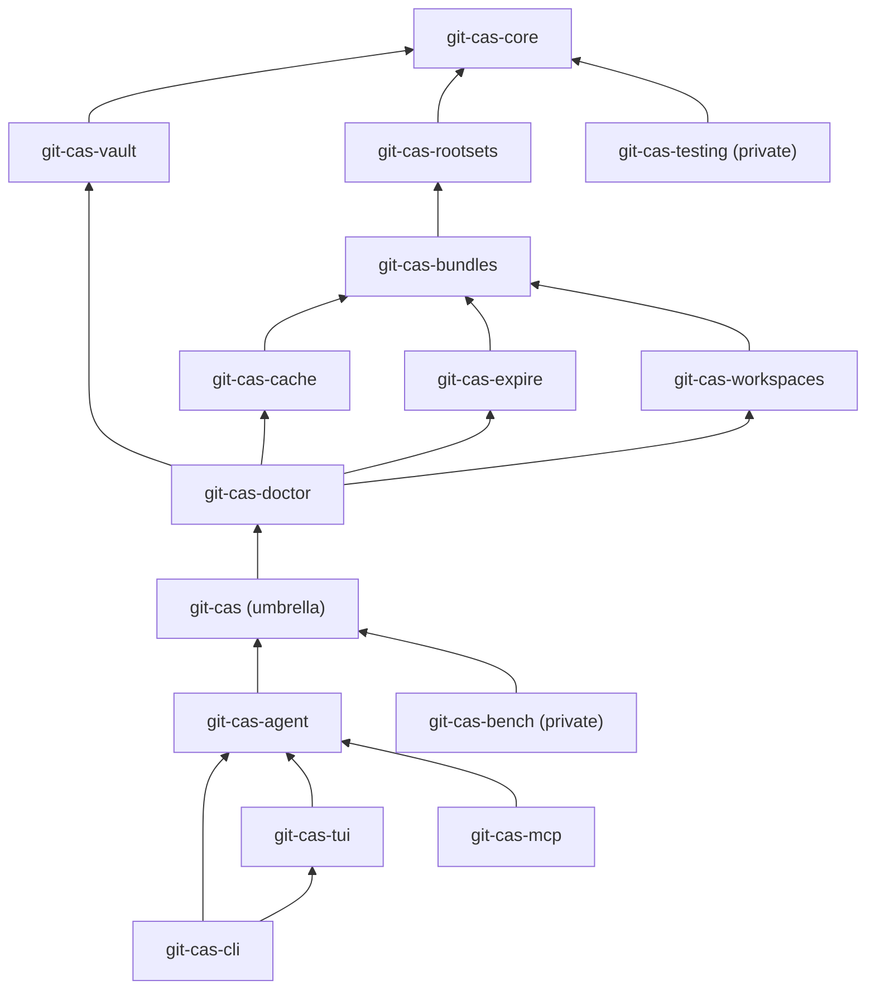
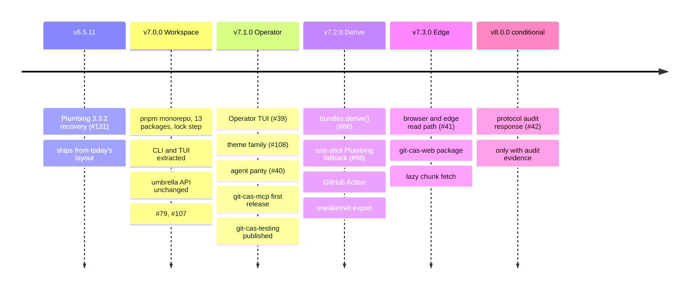

# INFRA-0062 - Monorepo Workspace and Package Split

This is a planning report, written as a METHOD design doc so it can become
the v7.0.0 goalpost without being rewritten. It covers four things:

1. how to turn `git-cas.git` into a pnpm workspace of lock-step versioned
   packages;
2. which files go where, and in what order to move them so every PR stays
   green;
3. a release roadmap for the resulting ecosystem, reconciled against the open
   GitHub issues and milestones;
4. ideas worth turning into `type:idea` issues.

Every claim about the current code is anchored to a file or command at
`c02c87ee`. Nothing in this document is tracked work until it has a GitHub
Issue (see [Tracker Disposition](#tracker-disposition)).

## Linked Issue

- https://github.com/git-stunts/git-cas/issues/133 — goalpost
  "v7.0.0 Cleave: Monorepo workspace and package split", with one
  `type:slice` sub-issue per row of
  [Implementation Slices](#implementation-slices).

## Linked Tracker

- Milestone: `v7.0.0` — **Cleave** (retitled from the protocol-audit
  placeholder on 2026-10-02; the audit response moved to `v8.0.0` — **Day
  Zero**)
- Goalpost issue: https://github.com/git-stunts/git-cas/issues/133
- Slice issues: [#134](https://github.com/git-stunts/git-cas/issues/134)
  slice 0 · [#135](https://github.com/git-stunts/git-cas/issues/135) slice 1 ·
  [#136](https://github.com/git-stunts/git-cas/issues/136) slice 2 ·
  [#137](https://github.com/git-stunts/git-cas/issues/137) slice 3 ·
  [#138](https://github.com/git-stunts/git-cas/issues/138) slice 4 ·
  [#139](https://github.com/git-stunts/git-cas/issues/139) slice 5 ·
  [#140](https://github.com/git-stunts/git-cas/issues/140) slice 6 ·
  [#141](https://github.com/git-stunts/git-cas/issues/141) slice 7 ·
  [#142](https://github.com/git-stunts/git-cas/issues/142) slice 8 ·
  [#143](https://github.com/git-stunts/git-cas/issues/143) slice 9 ·
  [#144](https://github.com/git-stunts/git-cas/issues/144) slice 10
- Related open issues: [#39](https://github.com/git-stunts/git-cas/issues/39),
  [#40](https://github.com/git-stunts/git-cas/issues/40),
  [#79](https://github.com/git-stunts/git-cas/issues/79),
  [#107](https://github.com/git-stunts/git-cas/issues/107),
  [#108](https://github.com/git-stunts/git-cas/issues/108),
  [#131](https://github.com/git-stunts/git-cas/issues/131)

## Design Type

- [x] Runtime/API
- [ ] Storage/substrate
- [x] Migration/release
- [x] CLI/operator
- [x] Docs/public guidance
- [x] TUI/visual surface
- [x] Test/tooling

## Decision Summary

Convert the repository into a pnpm workspace. Split the current single
package into thirteen published packages plus two private ones, all sharing
one version number, one tag, one changelog, and one release workflow. Keep
`@git-stunts/git-cas` as the umbrella package with today's three entrypoints
unchanged so git-warp and other consumers need only a version bump. Move the
`git-cas` binary to `@git-stunts/git-cas-cli`, which is the one breaking
change and the reason this ships as v7.0.0. Extract the CLI and TUI first so
the Operator TUI work (#39, #107, #108) proceeds inside its own package while
the domain split continues underneath it.

## Sponsored Human

James. Owns the package map, the milestone retitling, the npm trusted
publisher setup for new package names, and the go/no-go on each slice.

## Sponsored Agent

Claude. Owns the design doc, the RED tests for workspace invariants, the
mechanical moves, import rewrites, and keeping the Node/Bun/Deno matrix green
through every slice.

## Hill

A library consumer who runs `pnpm add @git-stunts/git-cas` gets no terminal
UI framework in their dependency tree, every `@git-stunts/git-cas-*` package
in their lockfile carries the same version, and the TUI can be changed,
tested, and released without touching storage code. `git-warp` upgrades by
changing one caret range.

## Current Truth

Measured at `c02c87ee` (branch `tui-improvements`, identical to `main`):

| Fact | Evidence |
| --- | --- |
| One package, `@git-stunts/git-cas@6.5.10`, three entrypoints (`.`, `./service`, `./schema`) | `package.json` `exports`, `jsr.json` `exports` |
| 180 source files, 26,479 lines including `index.js` | `find src -name '*.js' \| wc -l`; `cat index.js $(find src -name '*.js') \| wc -l` |
| 12,329 lines under `bin/`: TUI 6,238; agent 2,574; CLI and shared 3,517 | `wc -l` over `bin/ui/dashboard*.js bin/ui/blocks bin/ui/shaders ...` |
| Facade `index.js` is 1,120 lines; `index.d.ts` is 1,995 lines with 146 exports | `wc -l index.js index.d.ts`; `grep -c '^export' index.d.ts` |
| Four `@flyingrobots/bijou*` packages are runtime dependencies of the library | `package.json` `dependencies` |
| `@flyingrobots/bijou-tui-app` is declared but never imported | `grep -rn tui-app src bin` returns nothing; `createFramedApp` comes from `@flyingrobots/bijou-tui` (`bin/ui/dashboard.js:5-15`) |
| `@git-stunts/vault` is only used by a dynamic import in the CLI | `bin/passphrase-source.js:209` |
| Domain never imports infrastructure | `grep -rn infrastructure src/domain` returns nothing |
| 199 test files import `src/` paths directly; 45 import `index.js` | `grep -rl "from '.*src/" test \| wc -l` |
| 2,194 unit tests pass in 13 s; lint is clean | `npm test`; `npx eslint .` (run 2026-10-02) |
| git-warp imports only `@git-stunts/git-cas` (97 sites) and `@git-stunts/git-cas/service` (8 sites) | `grep -rho "@git-stunts/git-cas[^'\"]*" ~/git/git-stunts/git-warp/{src,bin,test}` |
| git-warp uses `bundles`, `pages`, `assets`, `publications`, `caches`, `workspaces`, `expiringSets`; it does not use the vault | `grep -rhoE "cas\.(assets\|pages\|...)" ~/git/git-stunts/git-warp/src` |
| pnpm 10.30.0, Bun 1.2.19 and Deno 2.8.1 all resolve `workspace:*` from a `package.json` `workspaces` field | spike in the session scratchpad, 2026-10-02; three runtimes printed `app sees core-ok` |
| Open PRs: 0. Open issues: 12. Plumbing 3.3.2 (prerequisite for #131) is not yet on npm; latest is 3.3.1 | `gh pr list`; `gh issue list`; `npm view @git-stunts/plumbing version` |
| Bijou (`flyingrobots/bijou`) is already a lock-step monorepo of ten packages at 7.2.0 | `gh api repos/flyingrobots/bijou/contents/packages` |

The domain services already fall into clean clusters. The import graph of
`src/domain/services/*.js` has no cycles between the clusters below, and only
two cross-cluster edges that are not strictly downward (`RepositoryDoctor`
reaches into vault and cache; `ExpiringSetRegistry` and `CacheSetRegistry`
take `bundles` and `pages` for their index storage).

## Problem

Three problems, in the order they hurt:

1. **The library ships a terminal UI.** `@flyingrobots/bijou`,
   `bijou-node`, `bijou-tui` and `bijou-tui-app` are runtime dependencies of
   a storage library. `git-warp` and every other consumer installs them and
   never calls them.
2. **The TUI cannot be worked on in isolation.** `bin/ui/dashboard.js`
   (1,418 lines) and `bin/ui/dashboard-cmds.js` (1,607 lines) share a
   package, a test runner, a lint config, a release cadence and a `files`
   list with the storage engine. Issue #107 already asks for the cockpit to
   be split by workspace boundary; doing that inside a 26k-line package is
   harder than doing it inside a 6k-line one.
3. **Scope is invisible in the package boundary.** Root sets, cache sets,
   expiring sets, staging workspaces, bundles, the doctor and the vault are
   seven distinct capabilities with seven ref namespaces, presented as one
   API. A consumer cannot tell what they depend on, and a reader cannot tell
   where the core ends.

## Scope

- pnpm workspace at the repository root; `packages/*` layout.
- Thirteen published packages and two private ones (see
  [Package Map](#package-map)).
- Lock-step versioning: one `version`, one `vX.Y.Z` tag, one `CHANGELOG.md`,
  one release workflow publishing every package.
- Umbrella `@git-stunts/git-cas` keeps `.`, `./service` and `./schema`
  entrypoints with identical exports.
- `git-cas` binary moves to `@git-stunts/git-cas-cli`.
- New `@git-stunts/git-cas-agent` library holding the headless command
  executor that the CLI, TUI and MCP server share.
- New `@git-stunts/git-cas-mcp` server.
- Repository guard tests (docs, release truth, planning surfaces) relocated
  to a root `test/repo/` suite.
- Release verifier, CI, Dockerfile, hooks and JSR validation updated for
  per-package packing.

## Non-Goals

- No storage format, ref layout, manifest schema or encryption change.
- No API change to the umbrella beyond removing `bin`.
- No TUI redesign in this cycle; #39 and #108 land in v7.1.0 inside the
  extracted package.
- No changesets or per-package independent versions. Lock step is the
  point.
- No move to TypeScript sources. Packages stay JavaScript with `.d.ts`
  companions and `@ts-self-types`.
- No JSR publication in the release workflow. Dry-run validation stays,
  per package, as today.

## Runtime / API Contract

### Package Map

Directories are `packages/<package-name>` to match the Bijou convention and
so `grep` for a package name finds its directory.

| Package | Layer | What moves in | Lines (approx) | Depends on | Published |
| --- | --- | --- | --- | --- | --- |
| `@git-stunts/git-cas-core` | 0 | `CasService`, `KeyResolver`, `ConvergentEncryption`, `ChunkRepository`, `StorePipeline`, `RestorePipeline`, `PrefetchWindow`, `Semaphore`, `CompressionStreams`, `ManifestRepository`, `GitTreeBuilder`, `ManifestTreeService`, `RecipientService`, `IntegrityVerifier`, `ManifestDiff`, `RedactingObservability`; all of `src/domain/strategies`, `encryption`, `schemas`, `outcomes`, `bytes`, `encoding`, `errors`; `src/domain/helpers` and `src/helpers`; all of `src/ports`; all of `src/infrastructure` except `GitRepositoryInspectionAdapter`; value objects `Chunk`, `Manifest`, `Oid`, `Slug`, `EncryptionMetadata`, `StoreEncryptionConfig`; `src/package-version.js` | 10,900 | `@git-stunts/plumbing`, `@git-stunts/alfred`, `cbor-x`, `zod` | yes |
| `@git-stunts/git-cas-vault` | 1 | `VaultService`, `VaultPersistence`, `VaultMetadataCodec`, `VaultTreeCodec`, `VaultPrivacyIndex`, `VaultStateCache`, `VaultKeyVerifier`, `VaultMutationRetryPolicy`, `rotateVaultPassphrase`, `buildKdfMetadata` | 2,500 | core | yes |
| `@git-stunts/git-cas-rootsets` | 1 | `RootSet`, `RootSetRegistry`, `RootSetPersistence`, `RootSetMetadataCodec`, `RootSetTreeCodec`, `RootSetRetryPolicy`; value objects `RootSetRef`, `RetentionWitness`, `CollectionNamespace`; helpers `isCanonicalCollectionKey`, `assertCanonicalTimestamp` | 1,500 | core | yes |
| `@git-stunts/git-cas-bundles` | 2 | `AssetService`, `PageService`, `BundleService`, `BundleDescriptorCodec`, `BundleBatchPlanner`, `BundleFanoutBuilder`, `StagedTarget`, `StagingEvidence`, `BoundedWriteWavePersistence`, `forkCasPersistence`, `RetentionService`, `PublicationService`; handle and `Staged*` value objects; `handleTarget`; a new `ApplicationHandleResolver` extracted from `index.js` `#resolveApplicationRoot` and `#openApplicationHandle` | 4,400 | core, rootsets | yes |
| `@git-stunts/git-cas-cache` | 2 | `CacheSet`, `CacheSetRegistry`, `CacheIndex`, `CachePolicyEnforcer`, `CacheCandidateHeap`, `CacheMetadataCodec`, `CacheAcquisitionRegistry`, `CacheAcquisitionInventory`; `Cache*` value objects | 2,300 | core, rootsets, bundles | yes |
| `@git-stunts/git-cas-expire` | 2 | `ExpiringSet`, `ExpiringSetRegistry`, `ExpiringSetIndex`, `ExpiringSetMetadataCodec`; `Expiring*` value objects | 1,200 | core, rootsets, bundles | yes |
| `@git-stunts/git-cas-workspaces` | 3 | `StagingWorkspace`, `StagingWorkspaceRegistry`, `WorkspaceCompoundAdmission`, `WorkspaceCompoundScope`, `WorkspaceDescriptorCodec`, `WorkspaceRef` | 1,900 | core, rootsets, bundles | yes |
| `@git-stunts/git-cas-doctor` | 3 | `RepositoryDoctor`, `RepositoryInspectionPort`, `GitRepositoryInspectionAdapter` | 1,000 | core, vault, rootsets, cache, expire, workspaces | yes |
| `@git-stunts/git-cas` | 4 | `ContentAddressableStore` composition root; re-exports of every public symbol; `./service` and `./schema` entrypoints | 400 after extraction | all of the above | yes |
| `@git-stunts/git-cas-agent` | app | `bin/agent/protocol.js`, `input.js`, `commands/*`, `passphrase-source.js`; `bin/credentials.js`, `bin/config.js`, `bin/restore-output-target.js`; data halves of `bin/ui/vault-report.js` (`buildVaultStats`, `inspectVaultHealth`) and `bin/ui/vault-list.js` (`matchGlob`, `filterEntries`) | 4,000 | git-cas, `@git-stunts/vault` | yes |
| `@git-stunts/git-cas-cli` | app | `bin/git-cas.js`, `actions.js`, `io.js`, `build-version.js`; renderers `progress`, `encryption-card`, `manifest-view`, `heatmap`, `history-timeline`, `passphrase-prompt`, `formatTable`, `formatTabSeparated`; the `git-cas` bin; `build-info.json` stamping | 3,500 | agent, git-cas, tui, `commander` (exact), `@flyingrobots/bijou`, `bijou-node` | yes |
| `@git-stunts/git-cas-tui` | app | `bin/ui/dashboard.js`, `dashboard-cmds.js`, `dashboard-view.js`, `blocks/*`, `shaders/*`, `components/*`, `context.js`, `theme.js`, `repo-treemap.js`, `store-wizard.js`, `merkle-dag.js`; exports `launchDashboard()` and `createDashboardPage()`; optional `git-cas-tui` bin | 6,200 | agent, git-cas, `@flyingrobots/bijou`, `bijou-node`, `bijou-tui` | yes |
| `@git-stunts/git-cas-mcp` | app | new: stdio MCP server whose tools map one-to-one onto agent commands | new | agent, `@modelcontextprotocol/sdk` | yes |
| `@git-stunts/git-cas-bench` | private | `test/benchmark/*.bench.js`, `scripts/diagnostics/*`, committed baselines from TR-003 | 1,000 | git-cas, testing | no |
| `@git-stunts/git-cas-testing` | private at first | `test/helpers/MemoryPersistenceAdapter.js`, `MemoryRefAdapter.js`, `crypto*.js`, `property.js` | 500 | core | later (see Cool Ideas) |

Three naming notes:

- `git-cas-bundles` holds assets and pages too. Bundles are the top-level
  structure and assets and pages are what bundles contain, so the name reads
  correctly from the outside. `git-cas-handles` is the alternative if the
  first README draft makes "bundles" feel wrong.
- `git-cas-agent` is not in the original list. It exists because
  `bin/agent/commands/index.js` already is the headless executor: it imports
  the facade and two data helpers and nothing from `commander` or Bijou. Both
  the CLI and the MCP server need exactly that module. Keeping it inside the
  CLI would force the MCP server to depend on `commander` and the TUI stack.
- `ErrorCodes` stays in core as one registry. Error codes are part of the
  agent protocol and must be globally unique; a per-package registry would
  need a merge step and a uniqueness test for no gain.

### Dependency Graph



Edges are "depends on". Transitive edges are omitted. The graph is a DAG;
pnpm's isolated `node_modules` layout turns every undeclared edge into a
runtime `ERR_MODULE_NOT_FOUND`, which is the cheapest boundary enforcement
available. A repo test asserts the graph explicitly as well (see
[Tests To Write First](#tests-to-write-first)).

### Ref Namespaces by Package

| Ref prefix | Owner |
| --- | --- |
| `refs/cas/vault` | vault |
| `refs/cas/rootsets/*` | rootsets |
| `refs/cas/caches/*`, `refs/cas/cache-acquisitions/*` | cache |
| `refs/cas/expiring/*` | expire |
| `refs/cas/workspaces/*` | workspaces |
| caller-allowlisted application refs | bundles (`PublicationService`) |

Source: `grep -rho "refs/cas/[a-z-]*" src index.js bin`.

### Public Surface Compatibility

- `@git-stunts/git-cas` keeps `exports` `.`, `./service`, `./schema`. The
  146 type exports in `index.d.ts` become re-exports from the owning
  packages. `test/types/public-api-compatibility.ts` keeps targeting the
  umbrella.
- Deep imports (`@git-stunts/git-cas/src/...`) were never possible because
  `exports` is a map. No consumer loses a path.
- `bin/git-cas.js` and `bin/agent/*` import five `src/` modules directly
  (`Manifest`, `Slug`, `errors/index.js`, `createGitPlumbing`). `Manifest`
  and `ErrorCodes` are already exported from `index.js:92` and `index.js:36`.
  `Slug` and `createGitPlumbing` become public umbrella exports in slice 2.
- `formatVersion` written into manifests comes from
  `src/package-version.js`. That file moves to core and is rewritten by the
  version script, so every manifest still records the lock-step version.

### Versioning and Release Contract

- Root `package.json` is `private: true` and holds the single `version`.
  `scripts/release/version.js <X.Y.Z>` writes that version into every
  `packages/*/package.json`, every `packages/*/jsr.json`, and
  `packages/git-cas-core/src/package-version.js`. A repo test fails if any
  two differ.
- Intra-workspace dependencies use `workspace:*`. `pnpm pack` rewrites that
  to the exact published version, so a consumer's lockfile shows
  `@git-stunts/git-cas-core@7.0.0` pinned exactly, never a caret. That is
  the "no guessing" property made mechanical.
- Publishing: `pnpm -r pack` into a `dist/` directory, then `npm publish
  <tarball> --access public --provenance` per tarball under the existing OIDC
  job. `npm publish` alone does not rewrite `workspace:*`, which is why the
  pack step must be pnpm's. Each new package name needs a one-time trusted
  publisher registration on npmjs.com before its first release; the first
  publish of thirteen names is a human step for James.
- One annotated tag `vX.Y.Z`, one GitHub Release, one `CHANGELOG.md` using
  Keep a Changelog with a bold package tag at the start of each bullet
  (`**[tui]**`, `**[core]**`). Conventional commit scopes match package
  directory suffixes (`feat(tui): ...`).
- JSR: `jsr.json` per package, `@ts-self-types` per entrypoint, dry-run per
  package in the release verifier. Publication stays outside the workflow,
  as today.

### Toolchain Contract

| Concern | Today | After |
| --- | --- | --- |
| Package manager | pnpm 10, no `packageManager` field | pnpm 10 with `packageManager` pinned in root `package.json`; `pnpm-workspace.yaml` listing `packages/*` |
| Test runner | vitest 2.1.9 with `vitest.workspace.js` (unit, integration, benchmark) | vitest 3 with `test.projects` in the root config, one project per package plus `repo` for guard tests; `vitest.workspace.js` is deprecated in vitest 3 |
| Lint | one `eslint.config.js` at root | unchanged location; per-package overrides only where the CLI already needs `no-console` off |
| Type check | `tsconfig.checkjs.json` includes `index.js`, `src/**`, `bin/**` | root tsconfig with `references` to one tsconfig per package; `deno check` keeps targeting the umbrella `index.d.ts` |
| Docker | `COPY package.json pnpm-lock.yaml` then `pnpm install`; Bun and Deno stages `COPY package.json` then `bun install` / `deno install` | `COPY pnpm-workspace.yaml package.json pnpm-lock.yaml packages/*/package.json` first for layer caching, then the tree. Bun and Deno read `workspaces` from the root `package.json`; verified in the spike with Bun 1.2.19 and Deno 2.8.1 |
| Hooks | `scripts/hooks/pre-commit` runs lint; `pre-push` runs lint and unit tests | unchanged scripts; root `pnpm test` fans out to every project. Current unit suite is 13 s, far under the 120 s pre-push ceiling |
| Release verifier | 14 stages in `scripts/release/verify.js` | same stages plus: per-package `npm pack --dry-run`, per-package JSR dry-run, a packed-consumer smoke test that installs the umbrella and CLI tarballs into a temporary project and runs a store/restore round trip and `git-cas --version` |
| Build stamping | `scripts/stamp-build.js` writes root `build-info.json` | writes `packages/git-cas-cli/build-info.json`; only the CLI reads it (`bin/build-version.js`) |

## User Experience / Product Shape

For a library consumer:

```sh
pnpm add @git-stunts/git-cas            # everything, as today, minus the TUI stack
pnpm add @git-stunts/git-cas-core       # just the CAS pipeline
```

For an operator:

```sh
pnpm add -g @git-stunts/git-cas-cli     # git-cas binary, includes the dashboard
git-cas vault dashboard                 # unchanged
```

For an agent host:

```sh
npx @git-stunts/git-cas-mcp             # stdio MCP server over the same commands
git-cas agent <<< '{"command":"vault.list"}'   # JSONL, unchanged
```

`UPGRADING.md` gains a v6 to v7 section with exactly one action: install
`@git-stunts/git-cas-cli` if you used the binary.

## Data / State Model

No change. Chunks, manifests, trees, vault commits, root-set generations,
cache indexes, expiring markers and workspace descriptors keep their formats.
`formatVersion` in new manifests becomes `7.0.0`, which existing readers
treat as optional metadata.

## Architecture / Anti-SLUDGE Posture

- The facade sheds the application-handle resolver (about 80 lines of domain
  logic at `index.js:482-561`) into `git-cas-bundles`. After extraction the
  umbrella is a composition root and a re-export list.
- Three packages (cache, expire, workspaces) share one pattern: a Registry,
  an Index, a MetadataCodec and a RootSet-backed ref. The split makes the
  repetition visible; the `defineCollection()` idea below is the follow-up
  that removes it.
- No package may import another package's `src/` internals. Each package's
  public surface is its `exports` map. This is enforced by pnpm and by the
  boundary test.

## Cost / Residency Posture

- Consumer install size for `@git-stunts/git-cas` drops by the Bijou family
  (four packages and their transitive tree). CLI install size is unchanged.
- Thirteen tarballs per release instead of one. Publishing is automated;
  the cost is wall-clock in the release job.
- Lock step means a TUI-only fix republishes core with no code change. That
  is the intended trade: exact pins and zero compatibility arithmetic.

## Git Substrate Impact

None at runtime. In the repository: `git mv` for every move so `git log
--follow` and `git blame -C` keep working. One mechanical commit per slice
moves files; a separate commit in the same PR rewrites imports, so review
diffs stay readable.

## Compatibility / Migration Posture

| Change | Breaking | Consumer action |
| --- | --- | --- |
| `bin` removed from `@git-stunts/git-cas` | yes | install `@git-stunts/git-cas-cli` |
| Bijou removed from the library dependency tree | no (nobody could import it through git-cas) | none |
| New packages exist | no | optional adoption |
| Umbrella exports | unchanged | bump to `^7.0.0` |
| Stored data | unchanged | none |

git-warp's 105 import sites need no edit (verified: all are the root or
`/service` entrypoint).

## Error Contract

Unchanged. `ErrorCodes` stays one registry in core; the umbrella re-exports
it from the same import path.

## Security / Trust / Redaction Posture

- trust boundary: unchanged; the CLI and agent still resolve passphrases via
  `@git-stunts/vault` or files, and that code moves to `git-cas-agent`.
- authority or capability checked: unchanged.
- secret-bearing values: unchanged; `RedactingObservability` stays in core
  and the umbrella wraps observers exactly as `CasService.#init` does today.
- redaction behavior: unchanged.
- log/report behavior: unchanged.
- abuse or replay concern: the MCP server exposes store, restore and vault
  mutation to any MCP host that can spawn it. It inherits the agent
  protocol's credential-source validation and must refuse inline passphrases
  in tool arguments the same way `bin/agent/input.js` `validateCredentialSources`
  does. That is a RED test in slice 9.
- supply chain: `@modelcontextprotocol/sdk` is MIT licensed, compatible with
  Apache-2.0. Thirteen npm trusted publishers must be registered; the release
  workflow keeps `id-token: write` and no stored tokens.

## Lower Modes

Not applicable to the repository layout. The TUI package inherits #107 and
#108, which own lower-mode and `NO_COLOR` behavior.

## Accessibility Posture

Not applicable to the repository layout. Linear reading order of the docs is
preserved: each package gets a short README that links back to the root
guides rather than duplicating them.

## User-Facing Text / Directionality

Package READMEs and `UPGRADING.md` only. No new UI strings.

## Agent Inspectability / Explainability Posture

- `git-cas-agent` is the inspectable contract: `protocol.js` and
  `input.js` define the request and response shapes, and `commands/index.js`
  `executeAgentCommand` is the one dispatch point.
- `git-cas-mcp` lists its tools through MCP `tools/list`; each tool
  description names the agent command it wraps, so an agent can cross-check
  the two surfaces.
- The TUI consumes the same executor, which means an operator watching the
  Operations pane and an agent reading JSONL see the same events.

## Linked Invariants

- [I-001](../../invariants/I-001-determinism-trust-and-explicit-surfaces.md):
  explicit surfaces. Package boundaries make every surface a declared
  `exports` map.
- [I-002](../../invariants/I-002-application-storage-ownership.md):
  application storage ownership. The `bundles`, `cache`, `expire` and
  `workspaces` packages map one-to-one onto the ownership boundaries that
  invariant already names.
- New invariant proposed in slice 1: every published package in this
  workspace carries the same version, and every intra-workspace dependency is
  `workspace:*`.

## Design Alternatives Considered

### Option A: Two packages (library and CLI)

Move `bin/` to `@git-stunts/git-cas-cli`, leave everything else.

- Fixes problem 1 (Bijou in the library) and most of problem 2.
- Does not fix problem 3. The 26k-line library stays one unit; the domain
  clusters stay implicit.
- Rejected as the end state, but it is slices 1 and 2 of the chosen plan.
  If the domain split stalls, this is a stable place to stop.

### Option B: Separate repositories per package

- Matches how `plumbing`, `alfred` and `vault` are organised today.
- Lock step across repositories is a discipline, not a mechanism; the
  current `git-warp` worktrees pinning `^5.3.2`, `^6.5.1`, `^6.5.5` and
  `^6.5.9` show how fast separate repos drift.
- Cross-package refactors (the handle resolver moving from the facade into
  bundles) become multi-repo PRs.
- Rejected.

### Option C: Monorepo with independent versions (changesets)

- Standard tooling, per-package changelogs.
- Reintroduces the compatibility matrix the lock-step rule exists to
  eliminate; `git-cas-cache@2.3.1` with `git-cas-rootsets@2.1.0` is exactly
  the guessing James ruled out.
- Rejected.

### Option D: Monorepo, lock step, umbrella preserved (chosen)

- One version, one tag, one changelog, one workflow.
- Umbrella shields consumers so the domain split can be incremental.
- Bijou already runs this way at 7.2.0 across ten packages, so the pattern
  is proven in this ecosystem.

### Option E: Keep the binary in the umbrella as a thin shim

- Avoids the major bump by having `@git-stunts/git-cas` keep a `bin` that
  dynamically imports the CLI.
- The shim needs the CLI as a dependency to work, which drags the TUI stack
  back into the library tree. As an optional dependency it fails for
  operators who installed the umbrella for the binary.
- Rejected.

## Decision

Option D. Ship it as **v7.0.0** because removing `bin` from the umbrella is a
breaking change for operators.

That collides with the existing `v7.0.0` milestone ("Protocol break only if
audit evidence requires it", issue #42, `status:blocked`). Proposed
resolution, for James to confirm:

- retitle milestone `v7.0.0` to "Monorepo workspace and package split";
- create milestone `v8.0.0 (conditional)` with the current v7.0.0 description
  and move #42 into it.

Semver does not reserve majors for protocol breaks, and #42 is explicitly
evidence-gated with no evidence yet, so the number is free.

Extraction order is top-down for the apps and bottom-up for the domain: the
CLI, TUI and agent come out first so the operator TUI work has a home, then
core, then the layered domain packages, then the doctor, leaving a thin
umbrella.

## Proof Surface

- actual surface under test: the published tarballs, the workspace
  manifests, the import graph, and the Node/Bun/Deno runtime matrix.
- first RED test: `test/repo/workspace-lockstep.test.js` asserting that every
  `packages/*/package.json` has the same `version` and that every
  `@git-stunts/git-cas-*` dependency is `workspace:*`. It fails today because
  `packages/` does not exist.
- required witness command: `pnpm -r pack --pack-destination dist && node
  scripts/release/verify.js` on the slice 10 branch, plus the Docker matrix
  for Node, Bun and Deno.
- non-acceptable proof: documentation that describes the layout, or a
  passing unit suite on one runtime only.

## Implementation Slices

Each slice is one PR against `main`, green on lint, unit, Docker matrix and
the release verifier before merge. Numbers are in dependency order; 2 and
3 may run in parallel on separate branches because they touch disjoint
directories.

| # | Slice | Unblocks | Notes |
| --- | --- | --- | --- |
| 0 | Pre-flight on the current layout: remove the unused `@flyingrobots/bijou-tui-app` dependency; add `packageManager`; upgrade vitest to 3 and move `vitest.workspace.js` into `test.projects`; add `test/repo/` and move the fourteen `test/unit/docs/*` guards, `test/unit/scripts/*` and `test/unit/package/*` there | everything | No layout change. `@flyingrobots/bijou-tui-app` removal is a dependency change in a git-stunts repo and needs James's explicit yes |
| 1 | Workspace scaffold: root becomes a private workspace; `git mv` the whole current package to `packages/git-cas/`; update Dockerfile, CI, hooks, verifier, `tsconfig.checkjs.json`, `jsr.json` exclude list; write `workspace-lockstep.test.js` and `package-boundaries.test.js` RED then GREEN | 2, 3 | Largest mechanical diff. One commit for moves, one for path rewrites |
| 2 | Extract `git-cas-agent`, `git-cas-cli`, `git-cas-tui` from `packages/git-cas/bin`; promote `Slug` and `createGitPlumbing` to umbrella exports; umbrella drops `bin` and the Bijou dependencies; add the lib-tree test (umbrella tarball closure contains no `@flyingrobots/*`) | #39, #40, #107, #108 can start | After this lands, TUI work proceeds in `packages/git-cas-tui` on its own branches |
| 3 | Extract `git-cas-core`; move `platform-boundary.test.js` into core's suite | 4 | 199 test files change import paths; do it with `git mv` of the matching test directories |
| 4 | Extract `git-cas-vault` and `git-cas-rootsets` | 5 | Independent of each other; one PR each |
| 5 | Extract `git-cas-bundles` including the new `ApplicationHandleResolver` pulled out of `index.js` | 6 | The facade loses its only domain logic |
| 6 | Extract `git-cas-cache`, `git-cas-expire`, `git-cas-workspaces` | 7 | One PR each; all depend on 5 |
| 7 | Extract `git-cas-doctor`; umbrella becomes composition root plus re-exports | 8, 10 | Target: `packages/git-cas/index.js` under 400 lines |
| 8 | `git-cas-bench` (private) from `test/benchmark` and `scripts/diagnostics`; `git-cas-testing` (private) from `test/helpers` | 9 | Bench baselines from TR-003 move with it |
| 9 | `git-cas-mcp`: RED tests for `tools/list` parity with `executeAgentCommand`, a store/restore round trip over stdio, and refusal of inline passphrases; then implement | v7.1.0 | Ships at 7.0.0 if ready, otherwise 7.1.0 without blocking the split |
| 10 | Release train: per-package pack and JSR dry-runs in the verifier; packed-consumer smoke test; npm trusted publisher registration for every new name; `UPGRADING.md` v6 to v7; package READMEs; root README front door rewrite; `CHANGELOG.md` 7.0.0 | tag `v7.0.0` | #79 (worktree bootstrap) fits here: each linked worktree now needs a full workspace install |

## Tests To Write First

- [ ] `test/repo/workspace-lockstep.test.js`: all `packages/*/package.json`
      and `jsr.json` share one `version`; all intra-workspace deps are
      `workspace:*`; `packages/git-cas-core/src/package-version.js` matches.
- [ ] `test/repo/package-boundaries.test.js`: parse every `import` in every
      package and assert it resolves to a declared dependency or a relative
      path inside the same package; assert the declared graph equals the DAG
      in this document.
- [ ] `test/repo/umbrella-exports.test.js`: `@git-stunts/git-cas` `exports`
      is exactly `.`, `./service`, `./schema`; the set of named exports from
      `.` is a superset of the v6.5.10 set (snapshot captured before slice 1).
- [ ] `test/repo/library-dependency-tree.test.js`: `pnpm pack` the umbrella,
      install it into a temp dir, assert no `@flyingrobots/*` package is
      present.
- [ ] `test/repo/packed-consumer.test.js`: install the umbrella and CLI
      tarballs into a temp project; run a store/restore round trip through
      `import '@git-stunts/git-cas'`; run `git-cas --version` and `git-cas
      agent` with a `vault.list` request.
- [ ] `packages/git-cas-mcp/test/tools-parity.test.js`: every command name
      accepted by `executeAgentCommand` has a tool, and vice versa.
- [ ] `packages/git-cas-mcp/test/credential-sources.test.js`: inline
      passphrase in tool arguments is refused with the same error code as the
      agent CLI.
- [ ] Existing suites move with their code; no test is deleted or skipped.

## Acceptance Criteria

- [ ] `pnpm install && pnpm test && pnpm lint` green at root on Node 22.
- [ ] Docker matrix green for Node, Bun and Deno on unit and integration.
- [ ] `node scripts/release/verify.js` passes with per-package stages.
- [ ] `@git-stunts/git-cas@7.0.0` tarball has no `bin`, no Bijou in its
      dependency closure, and the same named exports as 6.5.10 plus `Slug`
      and `createGitPlumbing`.
- [ ] `@git-stunts/git-cas-cli@7.0.0` installs globally and `git-cas vault
      dashboard` launches.
- [ ] git-warp `main` passes its suite against the packed umbrella with only
      a `^7.0.0` bump.
- [ ] `UPGRADING.md`, `README.md`, `ARCHITECTURE.md` (dependency direction
      and layer model sections), `STATUS.md`, `BEARING.md`, `CHANGELOG.md`
      reflect the new layout.
- [ ] Milestones and issues updated per
      [Tracker Disposition](#tracker-disposition).

## Validation Plan

Per slice: `pnpm lint`, `pnpm test`, `docker compose run --build --rm
test-{node,bun,deno}`, integration on all three, `node
scripts/release/verify.js`. Slice 10 adds the packed-consumer smoke test and
a manual global install of the CLI tarball on macOS.

## Playback / Witness

- [`site/index.html`](./site/index.html) is a static, scroll-driven explainer
  of this design for a reader with no prior knowledge of git-cas: twenty
  chapters, thirteen full-viewport d3 scenes driven by GSAP (ScrollSmoother,
  ScrollTrigger, SplitText, DrawSVG, MotionPath), eight color families each
  with a light and a dark palette (hues taken from `docs/git-cas-*-loop.svg`,
  every text pair audited at WCAG AA), and a Light / Dark / System mode
  switch. Where WebGPU is available, `site/vault.js` adds a 3D layer: the
  12,582,912-byte example file as 3,072 voxels, a SHA-256 ring, and a compute
  pass that runs the exact Buzhash / FastCDC boundary math from
  `src/infrastructure/chunkers/CdcChunker.js` over the whole file next to
  fixed 256 KiB cuts. Without WebGPU the SVG site stands alone. Serve the
  directory with any static server (scripts load from cdnjs; no build step).
- `docs/design/0062-monorepo-workspace/witness/` will hold: the pre-slice-1
  export snapshot, the verifier report from the slice 10 branch, the
  packed-consumer test output, and the git-warp suite run against the packed
  umbrella.

## Risks

- **Import churn.** 199 test files and all of `src/` change import paths.
  Mitigation: `git mv` whole directories per cluster so paths change
  predictably; one cluster per PR.
- **Docs guard tests.** `test/unit/docs/*` hard-code root paths and the
  `files` list. Mitigation: relocate to `test/repo/` in slice 0 before any
  file moves, so slice 1 updates expectations once.
- **Release surface.** Thirteen trusted publishers and thirteen first
  publishes. Mitigation: the packed-consumer test exercises the tarballs
  before any publish; first publishes can go out as `7.0.0-rc.1` under a
  `next` dist-tag to validate the OIDC path.
- **Docker layer caching.** Bun and Deno stages must see the whole workspace
  to resolve `workspace:*`. Verified in the spike; the Dockerfile change is in
  slice 1.
- **Lock step over-publishing.** Every release publishes every package.
  Accepted; it is the stated goal.
- **Milestone collision.** v7.0.0 is currently reserved for #42. Needs
  James's decision before the goalpost issue is filed.
- **Parallel TUI work.** If TUI PRs land against `packages/git-cas-tui`
  while slice 3 rewrites `src/` imports, conflicts are confined to the
  umbrella's export list. Keep slice 2 small and merge it before any TUI
  branch is cut.

## Follow-On Debt

- `cbor-x` pulls an optional native build (`cbor-extract`). A later
  `git-cas-codec-cbor` package would let core drop it. Not in this cycle.
- `RepositoryDoctor` (771 lines), `BundleService` (1,100), `VaultService`
  (986) and `bin/ui/dashboard-cmds.js` (1,607) are oversized; the split makes
  them visible per package but does not shrink them.
- The `CasService` constructor signature is a single 300-character line;
  Prettier is configured but evidently not run on `src/`.
- Cache, expire and workspaces repeat the Registry/Index/MetadataCodec
  pattern; see `defineCollection()` under Cool Ideas.

## Tracker Disposition

Filed on 2026-10-02 after James approved the codenames. Release codenames
follow the v5 tradition (`Locksmith`, `Carousel`, `Prism`): the milestone
title stays the bare version string, the codename leads the description and
the `CHANGELOG.md` heading.

**Milestones**

| Milestone | Codename | Done |
| --- | --- | --- |
| `v6.5.11` | **Plumbing** | #131 ships from the current layout; description updated |
| `v7.0.0` | **Cleave** | retitled from the protocol-audit placeholder; goalpost #133 and slices #134–#144 filed; #79 moved here |
| `v7.1.0` | **Bridge** | renumbered from `v6.6.0`; #39, #40, #107, #108 keep their home |
| `v7.2.0` | **Scion** | created; #86 and #98 moved here |
| `v7.3.0` | **Glimpse** | renumbered from `v6.7.0`; #41 keeps its home |
| `v8.0.0` | **Day Zero** | created; #42 moved here with its evidence-gated description |
| `v6.4.1` | — | left as is. #38 and #46 look complete (evidence in `docs/design/0045-v6-1-bounded-residency` and `docs/releases/`); closing them is a separate triage call for James |

**Issues**

- Goalpost #133 `type:goalpost` with eleven `type:slice` sub-issues
  (#134–#144), one per row of Implementation Slices, each carrying its RED
  tests.
- The unused `@flyingrobots/bijou-tui-app` removal is folded into slice 0
  (#134).
- The twelve Cool Ideas below are deliberately **not** filed yet; James
  wants to skim them first. They become `type:idea` + `lane:cool-ideas`
  issues on request.

Global agent instructions say cool ideas go under
`docs/method/backlog/cool-ideas/`; this repository's `docs/method/process.md`
retires that directory and routes ideas to GitHub Issues via
`.github/ISSUE_TEMPLATE/idea.yml`. The repository rule wins; the ideas are
listed here for promotion, not filed as cards.

## Ecosystem Roadmap

Current truth: `v6.5.10` shipped 2026-08-24. Twelve open issues, no open
PRs. The downstream consumer that drives most requirements is git-warp
19.1.0 (`^6.5.10`).



| Release | Theme | Contents | Exit evidence |
| --- | --- | --- | --- |
| v6.5.11 | Recovery | #131: adopt Plumbing ≥ 3.3.2, closed-pipe `mktree` recovery, packed-consumer tests. Consider pulling #98 in since both concern Plumbing session capability | release verifier 14/14; git-warp #923 unblocked |
| v7.0.0 | Workspace | Slices 0–10 of this doc; #107 lands naturally during TUI extraction; #79 lands with the workspace tooling | acceptance criteria above |
| v7.1.0 | Operator | #39 Operator TUI, #108 theme family, #40 agent parity (now "CLI is a renderer over `git-cas-agent`"), `git-cas-mcp` GA, `git-cas-testing` published | TUI witnesses per #39; MCP tools parity test; git-warp uses `git-cas-testing` in at least one suite |
| v7.2.0 | Derive | #86 `bundles.derive()` with structural sharing of unchanged fanout; GitHub Action; `git-cas export --bundle` | command-count benchmark from #86 in `git-cas-bench`; Action used by this repo's own release job |
| v7.3.0 | Edge | #41: read-only persistence adapter that does not spawn `git`; `git-cas-web`; lazy chunk fetch via promisor remotes; the scaling doc with measured clone and repack numbers | one browser restore of a vault entry; scaling doc with numbers |
| v8.0.0 | Conditional | #42 only if audit evidence requires a protocol break | audit finding on file before any work starts |

## Cool Ideas

Candidates for `type:idea` issues. Each names the package it would live in.

1. **Publish `git-cas-testing`.** `MemoryPersistenceAdapter`,
   `MemoryRefAdapter`, deterministic crypto, a fake clock and fast-check
   arbitraries for manifests and handles. git-warp's suites spawn real `git`
   for things that only need the port contract. (`git-cas-testing`)
2. **One executor, three transports.** CLI flags, JSONL and MCP tools all
   call `executeAgentCommand`. The TUI's Operations pane becomes a fourth
   client of the same executor, which makes a remote TUI over an SSH pipe a
   transport change rather than a rewrite. (`git-cas-agent`)
3. **MCP resources, not just tools.** Expose `git-cas://vault/<slug>` and
   `git-cas://manifest/<oid>` as readable resources and `doctor` as a tool,
   with a "diagnose this repository" prompt. (`git-cas-mcp`)
4. **Sneakernet export.** `git-cas export --bundle out.bundle` wraps
   `git bundle create` over `refs/cas/*`; `git-cas import` verifies every
   manifest integrity hash before moving refs. The README's offline pitch
   becomes a command. (`git-cas-cli`, `git-cas-doctor`)
5. **Lazy chunk fetch.** With `git clone --filter=blob:none` the repo is
   small; restore fetches chunk OIDs on demand from the promisor remote.
   Answers the clone-size question nobody has written down yet, and produces
   the scaling document with real numbers. (`git-cas-core`, new
   `git-cas-remote`)
6. **GitHub Action.** `git-stunts/git-cas-action` stores build artifacts
   into `refs/cas` instead of `actions/upload-artifact`, so artifacts travel
   with every mirror of the repository. Dogfood it in this repo's release
   job. (new repository)
7. **Signed generations.** Sign vault and root-set commits with Git's SSH
   signing (`gpg.format=ssh`) and verify in `doctor`. Provenance for
   artifacts with no new infrastructure. (`git-cas-vault`,
   `git-cas-rootsets`, `git-cas-doctor`)
8. **Asymmetric recipients.** X25519 envelope recipients alongside
   passphrase-derived KEKs, so a team vault needs no shared secret. Node's
   WebCrypto has X25519; Bun and Deno support must be verified first.
   (`git-cas-core` `KeyResolver`, `git-cas-vault`)
9. **`defineCollection()` kit.** Cache sets and expiring sets are two
   instances of one Registry/Index/MetadataCodec/RootSet pattern. A kit in
   `git-cas-rootsets` lets a consumer define a lease set or quota ledger in
   a hundred lines, and shrinks `git-cas-cache` and `git-cas-expire`.
   (`git-cas-rootsets`)
10. **Compiled CLI binaries.** `bun build --compile` and `deno compile`
    targets for `git-cas-cli` attached to each GitHub Release, for operators
    without a JavaScript runtime. (`git-cas-cli`, release workflow)
11. **Wire-format spec and schema package.** `schema.json` already exists at
    the root. Generate JSON Schemas from the Zod definitions for manifests,
    handles and the agent protocol, publish them as `git-cas-schema`, and
    write the one-page wire format document that a Rust or Go reader would
    need. Matches the "Versioned Schemas" leaf in `VISION.md`.
    (`git-cas-core`, new `git-cas-schema`)
12. **Dedup preview in the TUI.** "What would storing this path save?" runs
    CDC over a directory, matches chunk hashes against the repository, and
    shows reuse before anything is written. Uses the bench harness.
    (`git-cas-tui`, `git-cas-bench`)

## Done Does Not Mean

- The Operator TUI (#39) is redesigned. It is relocated.
- The MCP server is feature-complete. v7.0.0 needs parity with the agent
  command list, nothing more.
- Any storage, ref or protocol format changed.
- The oversized services listed under Follow-On Debt were refactored.
- JSR publication joined the release workflow.

## Retrospective

To be written after slice 10 merges. Questions to answer: did the
top-down-apps, bottom-up-domain order hold; how many PRs did the import
churn actually take; did any consumer need a change beyond the version bump.
